# 호국영웅전 (護國英雄傳)

> 임진년, 영웅들이 다시 일어선다.

현재 기본 전장은 **고정 시점의 2.5D 일러스트**입니다. 투명 캐릭터·건물 그림을 실제 3D 지면에 배치해 전투·성장·저장·협동에 연결했습니다. 영웅 8명, 유산 10종, 왜군 22종과 사계절의 전장 25곳을 사용합니다.

유산은 **기본·2·3단계·최종 A/B 전용 외형 50개**를 사용하며, 모든 단계에서 높이 **1.2칸의 작은 크기**를 유지합니다. 강화는 장식·깃발·등불·주요 장비로 구분합니다. 화염·물결·서리·치유·참격·빛·학익진·합격기에는 그림 효과를 적용했고, 출격 거북선·전령도 같은 화풍으로 표시합니다.

현재 구현·검증·남은 작업과 GitHub 반영 기준은 [프로젝트 리뷰](docs/PROJECT_REVIEW.md)에 기록합니다. 상위 작업 폴더의 `호국영웅전_PROJECT_REVIEW.md`도 함께 갱신합니다. 완료한 작업 단위마다 같은 브랜치에 커밋·푸시하고 원격 반영을 확인합니다.

[최신 그림 가이드](docs/ART.md) · [비기·합격기 전용 그림·최신 검증](docs/TACTIC_ART.md) · [주변 소품 배치·최신 검증](docs/SCENERY_LAYOUT.md) · [영웅 16기술·최신 검증](docs/SKILL_SIGNATURES.md) · [보행·공격 복귀·로컬 협동 검증](docs/MOTION_REFINEMENT.md) · [새 물가·그림 수면·최신 검증](docs/WATER_REFINEMENT.md) · [계절 수목·최신 검증](docs/SEASONAL_SCENERY.md) · [연속 도로·새 지면 검증](docs/TERRAIN_REFINEMENT.md) · [영웅 128포즈·검증](docs/HERO_DIRECTIONAL_ART.md) · [병력 448포즈·검증](docs/COMBAT_DIRECTIONAL_ART.md) · [의상 256포즈·검증](docs/SKIN_DIRECTIONAL_ART.md) · [유산 강화 그림·검증](docs/TOWER_STAGE_ART.md) · [공용 스킬 그림·검증](docs/PAINTED_EFFECTS.md) · [음소거 게임 실행](http://localhost:8080/?mute=1)

이순신의 전장용 16포즈는 다른 영웅의 부드러운 톤에 맞춘 v2로 교체했습니다. 남색 망토·활·화살통으로 권율의 붉은 망토·창·방패와 구분합니다. [같은 크기 비교와 적용·검증](docs/YI_TONE_REFINEMENT.md)

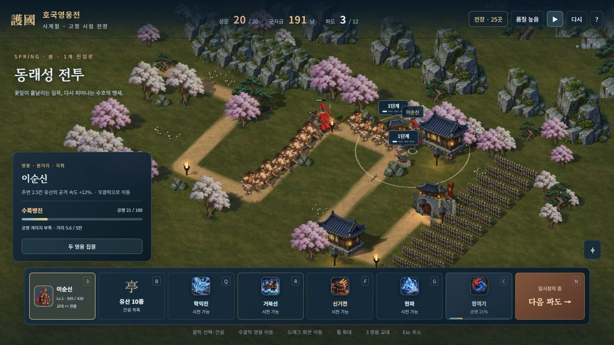

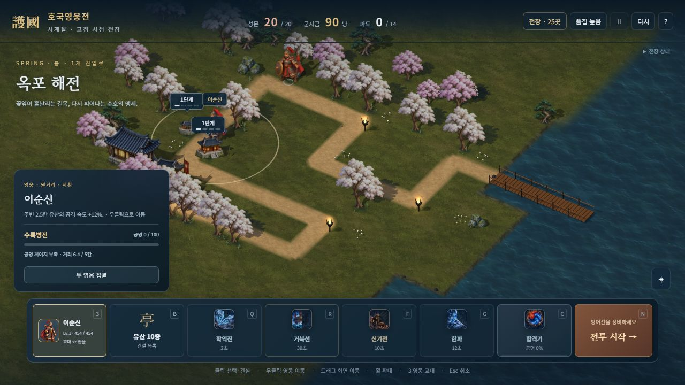

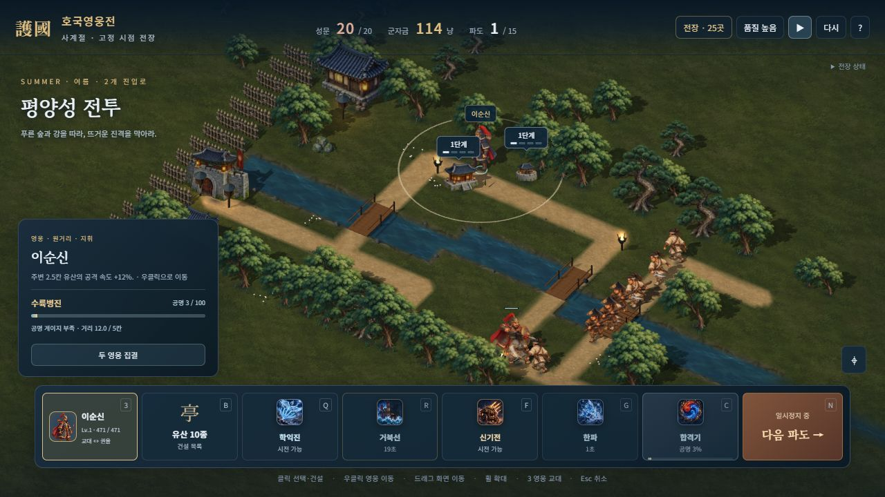

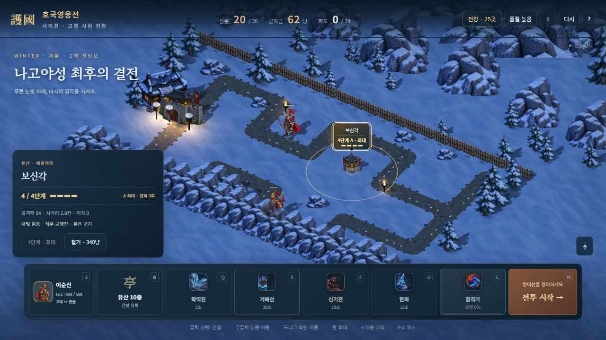

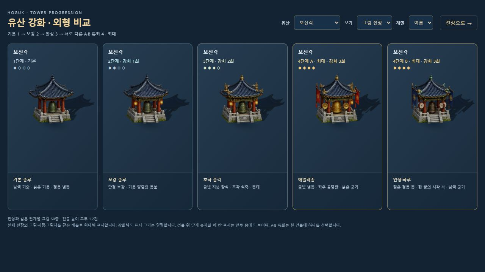

기본 영웅 8명의 **128포즈**에 일반 왜군 10종·적장 12명·아군과 이동체 6종의 **448포즈**를 추가했습니다. 네 방향의 준비·이동 두 자세·공격을 사용하며, 전령·거북선의 마지막 네 자세는 예비 전투 준비 그림입니다. [영웅 비교](http://localhost:8080/dev/3d-hero-pose-review.html)와 [병력 비교](http://localhost:8080/dev/3d-combat-pose-review.html)에서 확인할 수 있습니다. 특수 의상 16종에도 같은 톤의 256포즈를 추가해 전체 전장 준비 그림은 832개입니다. [의상 비교](http://localhost:8080/dev/3d-skin-pose-review.html?mute=1)에서 기본·특수·금빛 의상을 나란히 볼 수 있습니다. 최신 통합의 자동 검사 201개와 새 효과 16개의 픽셀 검사, 실제 전투·모바일 표시·두 빌드를 통과했습니다. 단일 HTML은 41,326,617바이트이며 방향 시트 52장·새 지면 3장·수목 1장·물 그림 1장·기술 시트 4장을 각각 한 번 포함합니다. [검증 결과와 정확한 범위](docs/TACTIC_ART.md)

영웅 기술·궁극기 16개에 각각 다른 그림 모티프를 연결했습니다. 실제 학익진 범위, 거북선 항적, 자격루, 낙성우·마늘 투사체, 의병·목책의 생성 위치와 번개 착탄을 사용합니다. 기존 기술 아이콘 디자인은 유지하고 두 시트를 WebP로 압축해 배포 용량을 줄였습니다. 비기 8개·전용/일반 합격기 11개·참격에도 별도 그림을 연결했습니다. [실제 명령으로 기술 36개 비교](http://localhost:8080/dev/3d-effect-review.html?mute=1)에서 사계절·정지·병력 표시를 바꿀 수 있습니다.

길은 연속 메시와 자연스러운 가장자리로 교체했고 풀·흙·눈·다져진 길 재질의 반복을 줄였습니다. 물·다리·건설 자리는 유지합니다. [실제 사계절 비교](http://localhost:8080/dev/3d-season-review.html?mute=1)에서 확인할 수 있습니다. 봄 꽃나무·여름 활엽수·가을 단풍 두 종류씩 총 6개도 실제 전장에 연결했습니다. 모바일 영웅 이름표의 화면 넘침도 수정했습니다. 강과 바다에는 낮고 투명하게 끝나는 연속 물가와 차분한 그림 수면을 연결했고, 외곽 물도 화면 밖까지 연장했습니다. 발걸음은 실제 이동 거리로 두 걸음과 접지를 연결하고 공격 복귀·피격·사망을 다듬었습니다. 로컬 2인 조작과 전투 수치는 유지합니다. 숲의 높낮이·한옥 주변 짐·등불 배치도 다듬었습니다. 새 중간 그림을 더한 긴 주기, 자유 곡선 지도·메뉴 초상화 톤과 실제 기기별 검증은 남아 있습니다. 이전 관절 모델·재질 개발 이력은 [정식 3D 통합](docs/3D_FULL_GAME.md), [전체 개선](docs/POLISH_RELEASE.md), [조형](docs/SCULPTED_MODELS.md), [지형 재질](docs/PAINTED_ENVIRONMENTS.md), [영웅](docs/HERO_MODELS_AND_MOTION.md), [적군](docs/ENEMY_MODELS_AND_MOTION.md), [캐릭터 재질](docs/CHARACTER_SURFACES.md)에 보존합니다. 해당 문서의 화면·검사 수·성능 수치는 각 작업 당시의 기록입니다.

별도의 [자유 전장](http://localhost:8080/3d.html?mute=1)은 해금·지원 수치를 바꾸는 미술/전투 비교용입니다. 이 화면의 F·G·C 조작과 별 기록은 정식 캠페인과 구분됩니다. [미리보기 조작](docs/3D_CAMPAIGN.md)

한국의 위인이 영웅으로, 한국의 문화유산이 타워로 등장하는 **협동 타워 디펜스**입니다.
부산진에서 노량까지, 임진왜란 7년의 전장 25곳을 따라 왜군을 막아냅니다. 마지막 전장의 최종 파도에는 도요토미 히데요시가 등장해 은신 병력을 부릅니다.
혼자서는 두 영웅을 지휘하고, 둘이서는 한 화면(로컬) 또는 방 코드(온라인)로 함께 싸웁니다.

일러스트 아트 업데이트: 영웅 8명, 왜군 22종, 아군·이동체 6종, 유산 10종과 주변 소품을 같은 입체 애니메이션풍으로 교체했습니다. 25개 전장은 기존 길·건설 위치를 따라 새 지형 재질과 소품을 조립합니다. 타이틀·메뉴에도 같은 전장 그림을 사용합니다.

서버 실행 후 [새 그림 미리보기](http://localhost:8080/dev/art-review.html)에서 영웅 의복, 왜군, 유산 단계·특화, 모든 전장을 확인할 수 있습니다. 그림 구조와 추가 방법은 [그림 가이드](docs/ART.md)에 정리했습니다.

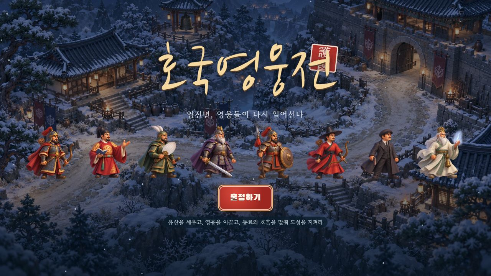
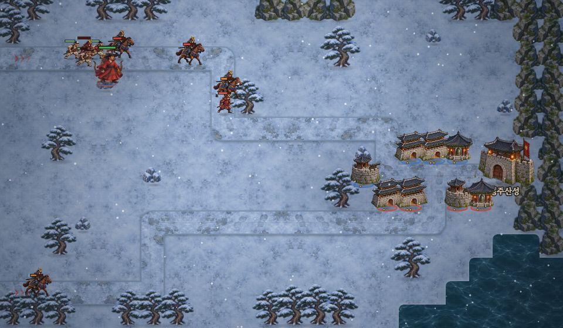

이하 기존 플레이 화면은 일러스트 교체 전의 기록입니다.

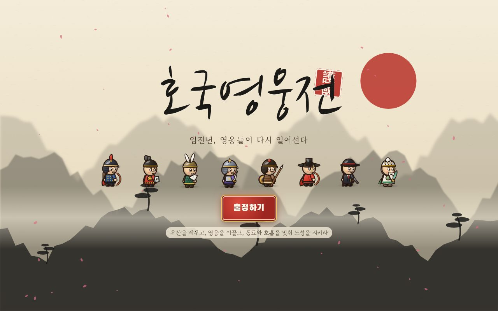

| 전투 | 합격기 |
|---|---|
| 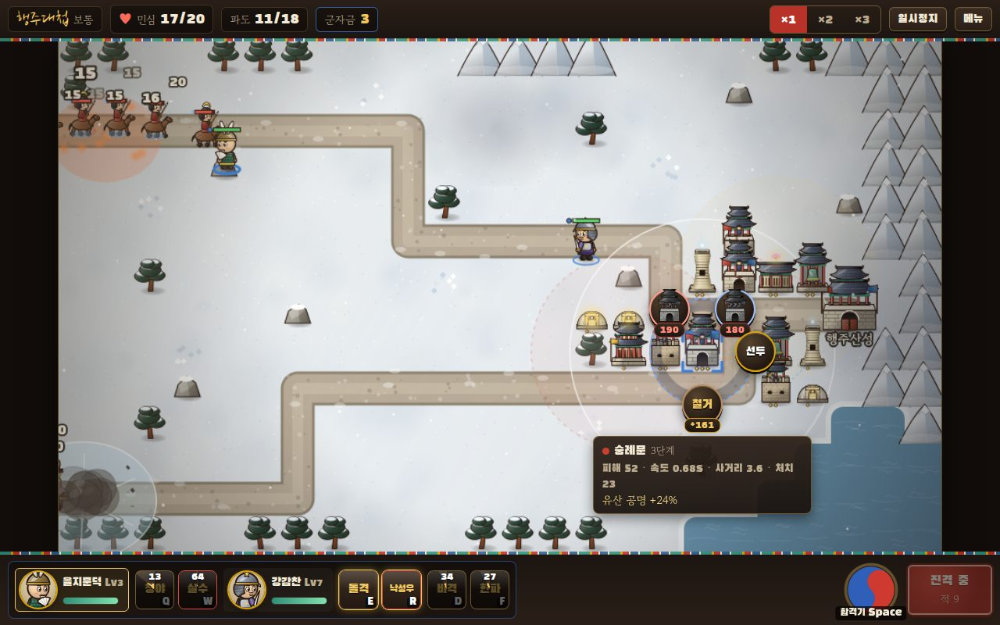 | 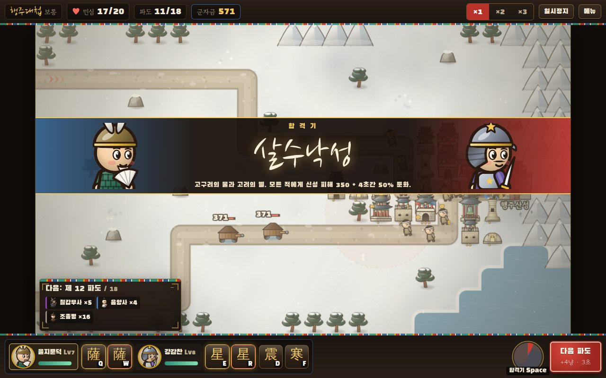 |
| **진영** | **출정 지도 (5장 25전장)** |
| 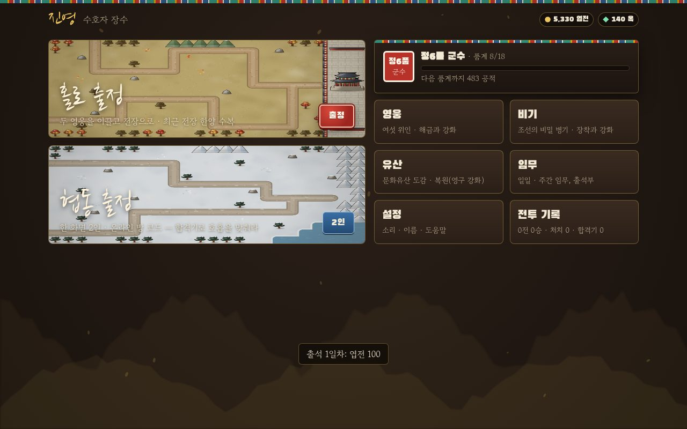 | 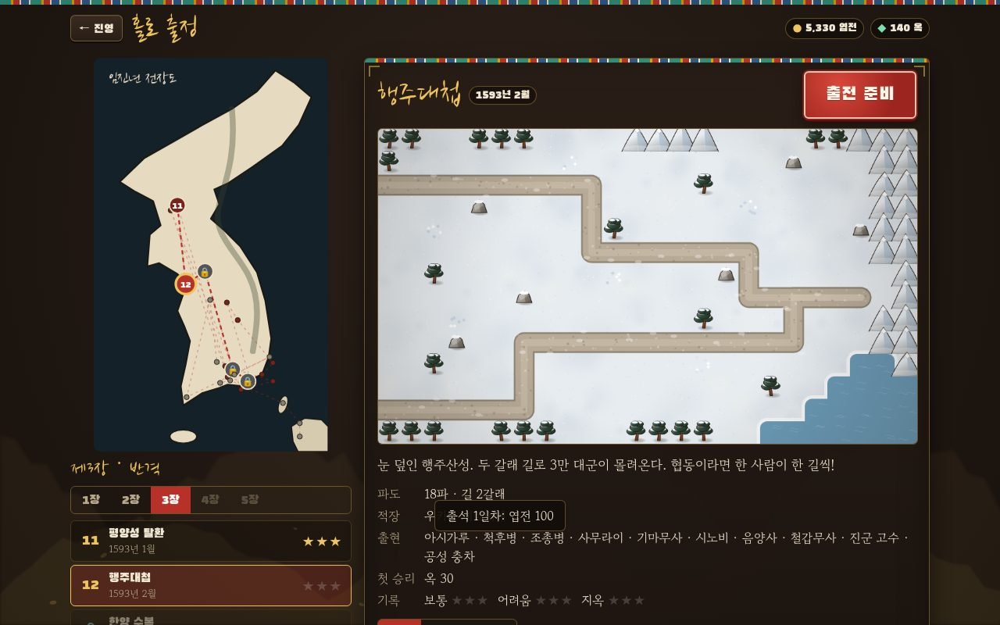 |
| **최종 적장 도요토미 히데요시** | **영웅** |
| 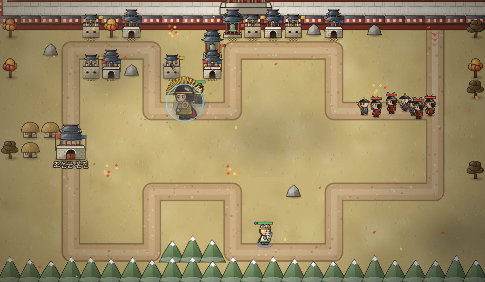 | 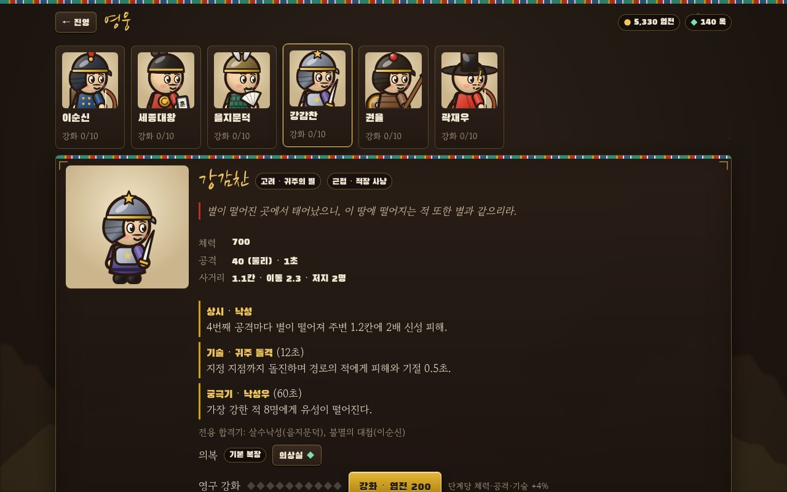 |

## 바로 하기

필요한 것은 **Node.js 18 이상** 하나뿐입니다. 설치할 패키지는 없습니다.

```bash
node server/server.js        # 또는 npm start
```

터미널에 나오는 주소(기본 `http://localhost:8080`)를 브라우저로 여세요.
기본 실행은 이 컴퓨터에서 접속하는 주소로 열립니다. 같은 와이파이의 친구와 온라인 협동을 하려면 PowerShell에서 다음처럼 실행하고, 터미널의 `같은 네트워크` 주소로 접속하세요.

```powershell
$env:HOST = "0.0.0.0"
node server/server.js
```

다시 이 컴퓨터에서만 사용하려면 `HOST`를 `127.0.0.1`로 지정합니다.

서버 없이 파일 하나로 열고 싶다면 `npm install` 후 `npm run build`하고 `dist/hoguk.html`을 여세요. 3D 엔진과 그림을 파일 안에 담습니다. 일반 서버 실행은 포함된 번들을 사용하므로 패키지가 필요하지 않습니다.
이 파일에서는 혼자 하기와 로컬 협동이 되고, 온라인 협동만 서버가 필요합니다.

## 무엇이 들어 있나

| 구분 | 내용 |
|---|---|
| 영웅 8명 | 이순신 · 세종대왕 · 을지문덕 · 강감찬 · 권율 · 곽재우 · **안중근**(권총 저격) · **단군왕검**(번개 · 마늘 던지기) |
| 유산 타워 10종 | 숭례문 · 수원화성 · 보신각 · 첨성대 · 해인사 · 석굴암 · 경복궁 · **남한산성**(병사로 길 막기) · **석빙고**(얼리기) · **불국사**(최대 체력 비례, 갑옷 무시) — 3단계 + 두 갈래 특화 = 50가지 형태, 영구 복원 30단계 |
| 왜군 22종 | 졸병 3 · 정예 5 · 중장 2 · 적장 11명(고니시 · 가토 · 와키자카 · 우키타 · 이시다 · 소 요시토시 · 구로다 · 도도 · 구키 · 구루시마 · 시마즈) · 최종 적장 **도요토미 히데요시** |
| 비기 8종 | 신기전 · 봉수 경보 · 의병 소집 · 비격진천뢰 · 군량 보급 · 천자총통 · 동의보감 · 동장군 한파 (2개 장착) |
| 전장 25곳 | 5장 구성: 임진년의 봄 → 바다와 성 → 반격 → 정유재란 → 최후의 결전 (부산진 · 명량 · 노량 … 나고야성), 총 440여 파도 |
| 난이도 3단계 | 보통 · 어려움 · 지옥 (이전 난이도를 깨면 해금) |
| 메타 성장 | 품계 18단계 · 엽전/옥 · 영웅·비기·유산 영구 강화 · 일일 임무 3개 · 주간 임무 4개 · 7일 출석부 |
| 옥 상점 | 보급품 4종(산삼 · 군량 궤짝 · 화차 일제사격 · 빙설 부적) · 영웅 의복 16벌 · 임무 교체 · 영웅 바로 해금 |

## 우리 게임만의 킥

1. **합격기(合擊技)** — 두 영웅이 싸울수록 태극 모양 **공명 게이지**가 찹니다. 가득 차면 두 영웅을 5칸 안에 모으고 합격기를 발동합니다.
   협동에서는 **두 사람이 2.5초 안에 함께 눌러야** 합니다(호흡 맞추기). 조합마다 전용 합격기가 있습니다:
   이순신+세종 「성군과 성웅」, 을지문덕+강감찬 「살수낙성」, 권율+곽재우 「의병 궐기」 등 10종 + 기본 「호국 합격」.
2. **유산 공명** — 같은 계열(궁궐 · 사찰 · 성곽과학)의 **서로 다른** 유산이 2칸 안에 있으면 1종당 공격력 +12%.
   "숭례문 옆에 보신각, 그 옆에 경복궁"처럼 배치 자체가 퍼즐이 됩니다. 건설 전 미리보기로 공명선이 보입니다.
3. **왜군 전술 카드** — 3파도부터 왜군이 전술(야습, 철갑 행렬, 기마 돌격, 음양 결계…)을 **미리 공개**합니다.
   대비책을 세워 한 명도 놓치지 않으면 **전술 파훼** 보너스 군자금을 받습니다.

그 밖에: **스무 판에 한 번꼴(5%)** 나타나 "급보요, 급보!" 외치며 성으로 달려와 두 사람 모두에게 100~500냥을 주는 조선 전령, 거북선이 길을 거슬러 돌진하는 이순신의 궁극기, 하늘에서 한글 자모가 쏟아지는 세종의 「훈민정음」,
계절마다 다른 전장(벚꽃, 반딧불이, 눈), 가야금·장구·징으로 합성한 국악풍 배경음.
맞으면 번쩍이며 찌그러지는 적, 만화풍 불꽃·연기·파편으로 터지는 포탄, 뒤로 튕겨 구르는 쓰러짐으로 타격감을 살렸습니다. 화면 흔들림은 합격기·적장 처치 같은 큰 순간에만 쓰고, 설정에서 끔 / 약하게 / 보통을 고를 수 있습니다.

## 협동할 때 서로 가리지 않게

- 건설·강화 메뉴는 큰 창이 아니라 **칸을 둘러싼 작은 원형 고리**입니다. 버튼 사이로 전장이 보입니다.
- 3D에서는 건설·강화 고리가 카메라를 따라가고, 주변 유산에 가려진 영웅을 주인 색 실루엣으로 표시합니다. 평면 모드는 메뉴 아래의 영웅을 창 위에 다시 그립니다.
- 전장에는 "1P / 2P" 글씨를 띄우지 않고 **색으로만** 구분합니다(1P 청 · 2P 홍). 글씨가 고리 버튼과 건설 자리를 가렸기 때문입니다.
- 각자 손대는 칸은 자기 색 모서리로 표시되고, 2P가 고르는 유산은 빨간 점선 사거리로 미리 보입니다.

## 조작

| 입력 | 동작 |
|---|---|
| 클릭 | 빈 터: 유산 건설 · 유산: 정보/강화/특화/철거 · 영웅: 선택 |
| 우클릭 / 길 클릭 | 선택한 영웅 이동 (터치: 길게 누르기) |
| Q W / E R | 1번 / 2번 영웅의 기술 · 궁극기 (마우스 위치에 시전) |
| D F | 비기 1 · 2 |
| Z X C V | 보급품 (옥 상점에서 산 산삼 · 궤짝 · 화차 · 부적) |
| Space | 합격기 |
| N | 다음 파도 바로 부르기 (안 눌러도 첫 파도 30초, 이후 18초 뒤 자동 · 둘째 파도부터 남은 시간만큼 보너스) |
| G | 핑 (협동) |
| Esc | 군막(메뉴) |
| 드래그 / 휠 / 시점 버튼 | 화면 이동 / 확대·축소 / 기본 시점 (그림 모드는 회전 고정) |
| 건설 터 / 영웅 집결 | 건설 가능 위치 표시 / 같은 길목으로 이동 명령 |

**로컬 협동**은 한 사람은 마우스만, 다른 사람은 키보드만 씁니다.

| 1P (마우스만) | 2P (키보드만) |
|---|---|
| 클릭: 건설 · 강화 · 특화 · 철거 | `← ↑ → ↓` 영웅 이동 |
| 우클릭(또는 길 클릭): 영웅 이동 | `A` 기술 · `S` 궁극기 (적이 몰린 곳 자동 조준) |
| 기술·비기 버튼 → 지점 클릭: 시전 | `D` `F` 비기 1 · 2 |
| 태극 버튼: 합격기 | `E` 발밑에 건설/강화 (←→ 고르고 `E` 확정, `Q` 취소) |
| 출정 버튼: 다음 파도 | `Space` 합격기 · `W` 다음 파도 |
| 초록 보급 버튼: 보급품 | |

## 개발 도구

```bash
npm test                              # 자체 점검 (결정성, 스냅샷 왕복, 명령 검증, 임무 로직)
npm run build:3d                     # 소스 변경 후 정식 게임·자유 미리보기·모델 비교 번들 갱신
npm run test:3d                      # 영웅 조형·동작·재질·지형·발사·조준·밀집 표시 검증 41개
npm run test:enemies                 # 적군 22종·기병·충차·실제 전투 신호·게스트 표시 회귀 12개
npm run test:fixed-art               # 고정 시점·그림 자원·영웅·유산 50외형 검증 15개
npm run test:hero-art                # 영웅 128포즈 경계·원본/배포 알파 검사
npm run test:combat-art              # 병력 448포즈·전장 로딩·실제 이벤트·자원 정리 13개
npm run test:combat-assets           # 병력 28시트의 혼입·누락·중복·외곽·알파 검사
npm run test:effects                 # 스킬 그림·실제 이벤트·장판·자원 수명 검증 8개
npm run test:scenery                 # 26지도×사계절 소품 발 범위·등불·실제 조립·협동 검사 8개
npm run test:tactics                 # 비기·합격기·참격 실제 명령·협동·수명 검사 8개
npm run test:tactic-assets           # 새 20모티프 경계·혼입·누락·알파 검사
npm run test:signatures              # 영웅 전용 16기술·실제 명령·범위·자원 수명 검증 12개
npm run test:signature-assets        # 효과 16개 경계·혼입·누락·알파 검사
npm run test:campaign                # 세션·보상·저장·의복·입력·단계·상태 표시 검증 16개
npm run test:release                 # 실제 Session 150전투 완주 보고서
npm run test:final-battle            # 최대 강화·정상 명령으로 최종 전장 지옥 재현
npm run test:progression -- --seeds=2 --attempts=12 # 실제 수입·구입으로 보통 캠페인 완주
npm run test:paid-final              # 동일한 실제 성장 기록의 최종 전투 전략 18개 비교
npm run balance                       # 봇이 모든 전장 × 난이도 × 모드를 자동 플레이
node tools/balance.mjs s3 hard coop   # 한 판을 파도별 로그와 함께
node tools/towerlab.mjs armored 3     # 유산별 '군자금 100냥당 DPS' 측정
node tools/heromatrix.mjs s5 normal   # 영웅 2인 조합 28가지 평가
npm run build                         # dist/hoguk.html 단일 파일 빌드
```

자세한 설계와 밸런스 근거는 [docs/GAME_DESIGN.md](docs/GAME_DESIGN.md), [docs/BALANCE.md](docs/BALANCE.md)에, 영웅 그림 파일을 만들어 넣는 방법(규격 · 프롬프트)은 [docs/ART.md](docs/ART.md)에 있습니다.

## 구조

```
index.html, styles/main.css     화면 골격과 스타일 (푸른 환경광 + 따뜻한 금빛 강조)
src/data/                        모든 수치: 영웅·유산·왜군·비기·합격기·전술·전장·임무
src/sim/                         시뮬레이션 (순수 JSON 상태, 시드 난수, 명령 기반) + 봇 + 스냅샷
assets/illustrated/              캐릭터·건물·소품·지형 그림과 생성 프롬프트
src/render/                      그림 아틀라스, 지도 조립, 유닛 동작, 전투 이펙트
src/3d/, assets/3d/               3D 지형·관절 모델·재질·효과·정식 렌더러와 로컬 번들
src/ui/                          화면(타이틀·진영·출정·로비·도감·임무·결과)과 전투 HUD
src/meta/                        저장(localStorage), 임무·출석
src/net/, server/server.js       온라인 협동 (의존성 없는 WebSocket 방 중계)
src/audio/                       WebAudio 합성 효과음·배경음
tools/                           밸런스 시뮬레이터, 자체 점검, 빌드
```

온라인 협동은 **호스트 권한 방식**입니다. 호스트가 시뮬레이션을 돌리고 초당 15회 압축 스냅샷을 보내며,
참가자는 명령(건설·이동·기술)만 보냅니다. 참가자가 나가면 호스트가 그 영웅과 유산을 넘겨받아 계속 싸웁니다.

## 역사에 관하여

게임은 임진왜란(1592~1598)의 실제 전투와 인물을 소재로 한 창작물입니다. 영웅의 기술과 적장의 능력은 게임을 위한 각색이며,
시대가 다른 위인(고조선의 단군왕검, 고구려의 을지문덕, 고려의 강감찬, 대한제국의 안중근)이 한자리에 모이는 것도 설정입니다.
대마도 정벌 · 현해탄 상륙전 · 나고야성 최후의 결전은 "만약 조선이 반격했다면"을 그린 가상 전장입니다.
