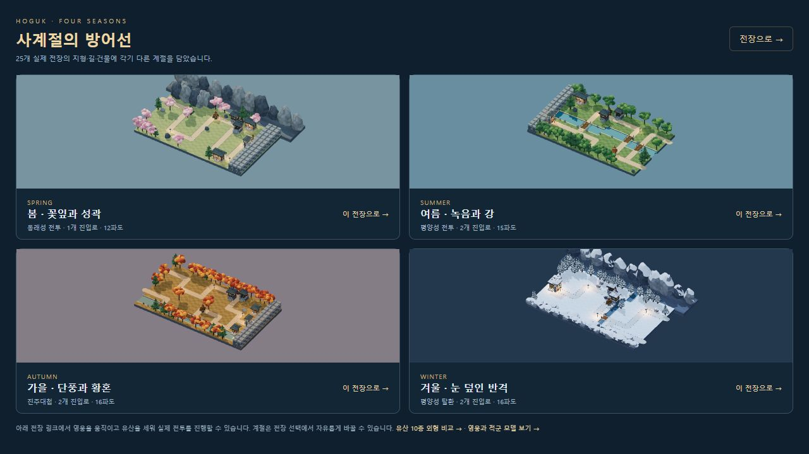
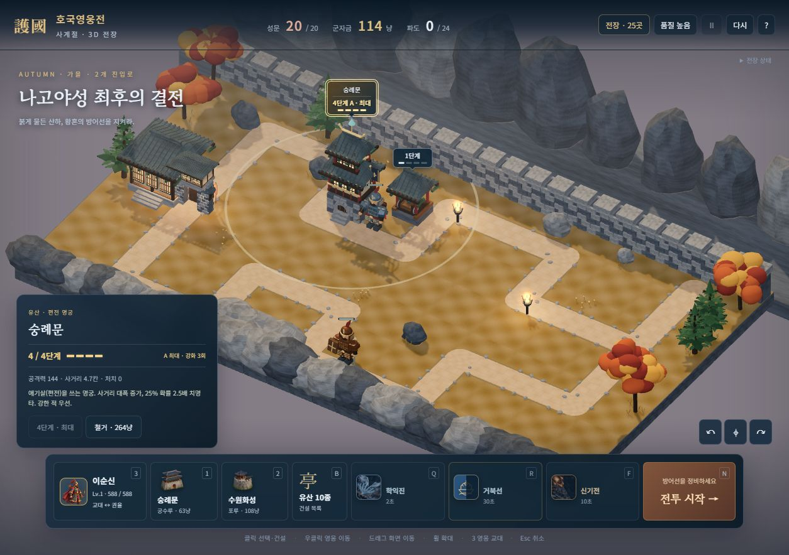
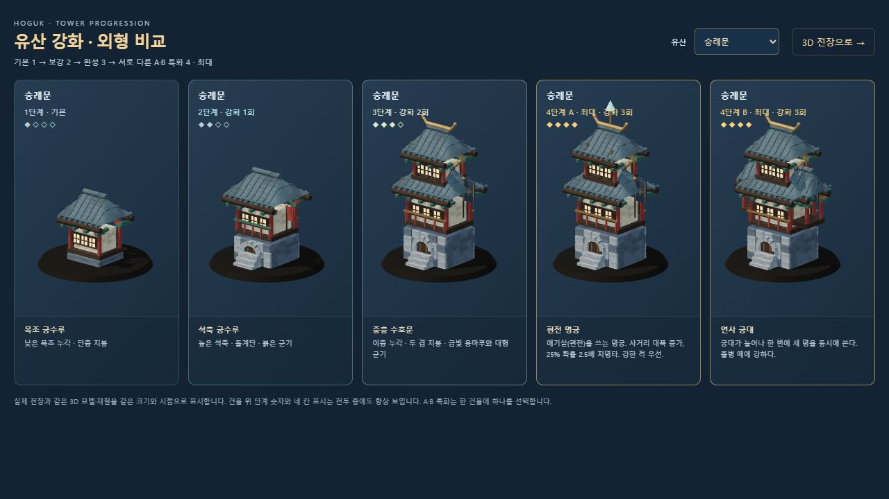
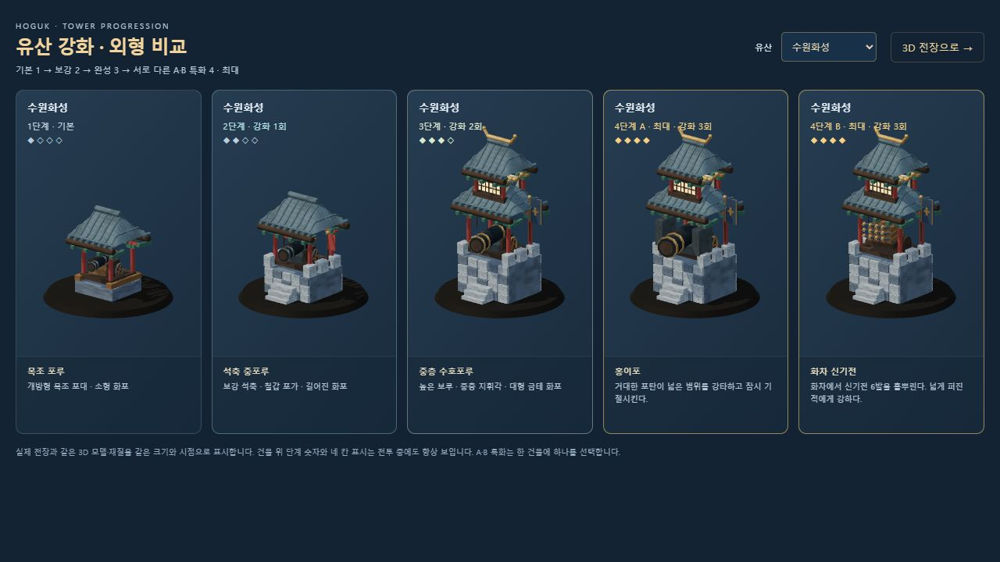
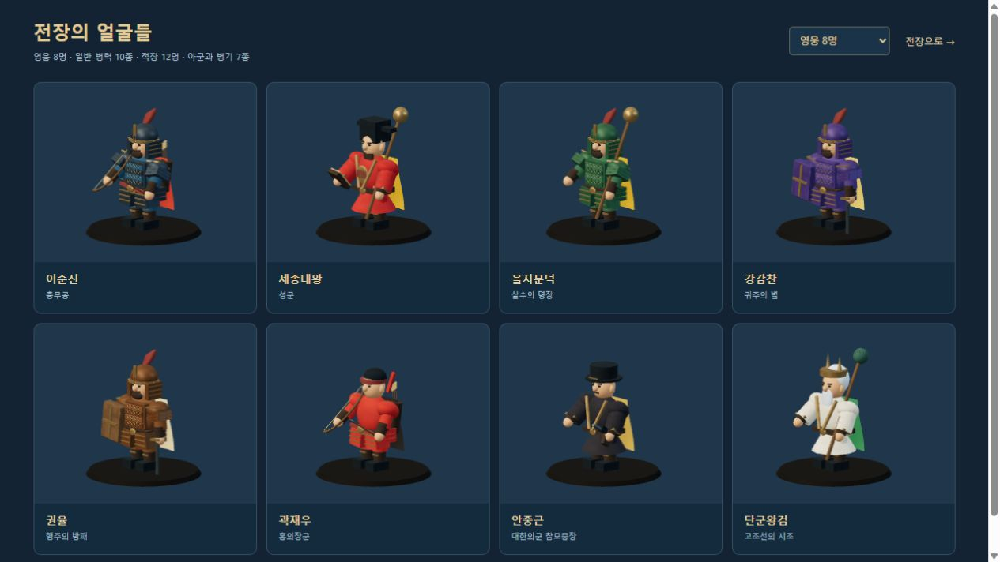
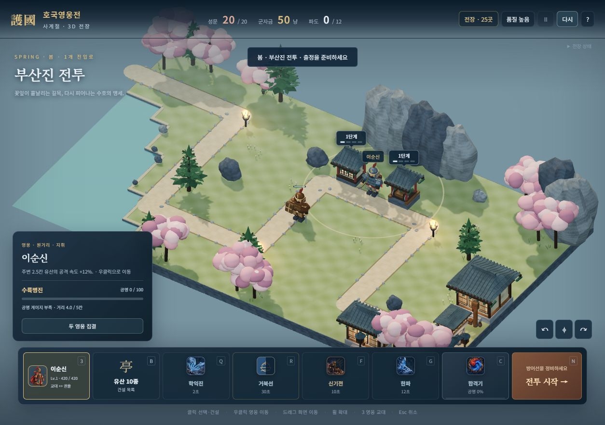
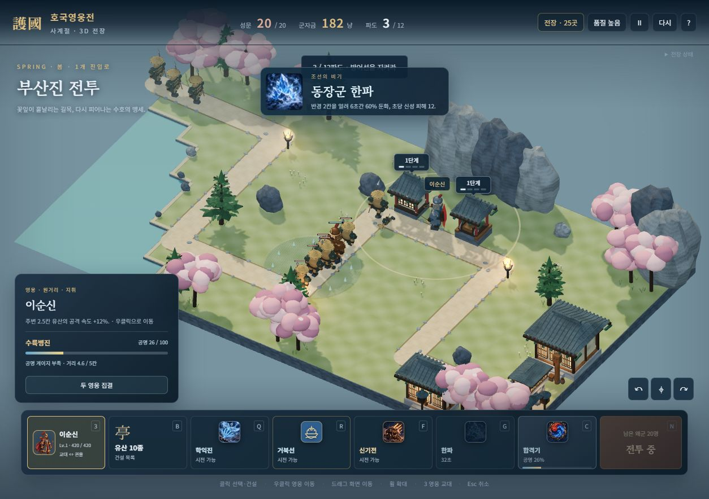
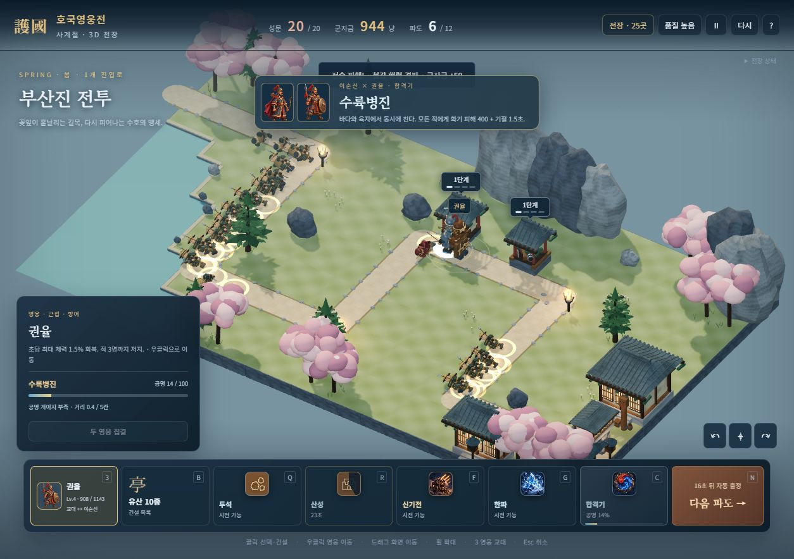
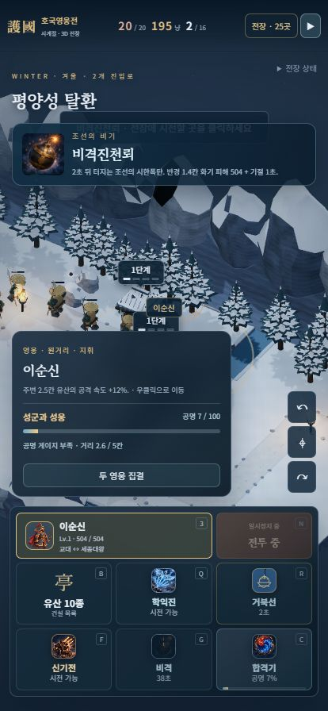

# 호국영웅전 · 사계절 3D 자유 전장 미리보기

이 문서는 별도 `3d.html` 미리보기의 조작과 지원·별 기록을 설명합니다. **정식 게임은 [첫 화면](http://localhost:8080/)에서 출정하며 기본 3D, 프로필 성장·보상·로컬/온라인 협동을 모두 연결합니다.** 정식 게임 조작·검증은 [3D_FULL_GAME.md](3D_FULL_GAME.md)를 보세요.

`node server/server.js` 실행 후 [자유 전장](http://localhost:8080/3d.html)을 엽니다. 타이틀의 **3D 전장 자유 미리보기** 링크로도 들어갈 수 있습니다.



## 구현 범위

- 기존 25개 전장의 24×14 지도, 모든 진입로·건설 가능 칸·강·바다·다리를 실제 3D 지형으로 조립합니다. 한옥·성벽·돌길·나무·바위·장승·항아리·등불을 배치하고 계절에 따라 잎·땅·지붕·날씨·조명 재질을 바꿉니다.
- 영웅 8명, 일반 왜군 10종, 적장 12명, 의병·승병·수비병·기마·목책·거북선·전령의 실제 입체 모델과 이동·공격·피격·쓰러짐을 연결했습니다. 캐릭터와 건물은 코드로 만든 관절·조립 모델입니다.
- 기존 시뮬레이션의 전장별 파도·군자금·사거리·피해·상태 효과·건설·철거·승패를 사용합니다. 장착 비기는 8종 중 서로 다른 최대 2개를 F·G에 편성하며 재사용 시간이 독립적입니다. 영웅은 서로 다른 최대 2명을 지휘합니다.
- 유산 10종 모두 기본 세 단계와 두 특화 외형, 총 50개 모델이 있습니다. 3단계에서 A/B 중 하나를 고르면 표시상 4단계 최대가 됩니다. 원본 엔진은 `level=3`과 별도 `branch`를 유지합니다.
- 투사체·화포 반동·신기전·학익진·한글·번개·얼음 영역·화염 영역·소환 군사·목책·거북선·광선 효과를 실제 전투 이벤트에 연결했습니다. 학익진 전용 그림, 영웅 기술·궁극기 16개, 비기 8종·합격기 문양의 일러스트를 사용합니다.
- 실제 공명 게이지와 두 영웅 사이 거리를 표시합니다. 공명 100, 두 영웅 생존, 거리 5칸 이내에서 C로 합격기를 시전하며 전용 10종과 일반 합격기가 적용됩니다. 집결 버튼은 동일한 실제 길의 인접 목적지에 두 영웅의 이동 명령을 보냅니다.
- 조준 시 영웅기 사정거리, 돌진 폭, 의병 배치 위치와 목책 위치를 미리 표시합니다. 시전 명령에는 원래 클릭 좌표를 보내 엔진의 거리·길 보정을 한 번만 적용합니다. 비격진천뢰 등의 낙하 공격은 남은 시간에 따라 줄어드는 지면 예고를 표시합니다. 표적이 있는 천자총통·합격기 포탄의 방사 피해 반경은 실제 0.8칸입니다.
- 전장 선택, 영웅·비기·계절 설정, 유산 10종 건설 목록, 강화·특화·철거, 일시정지·재시작, 승패·다음 전장과 별 기록이 있습니다. 세로 화면에서도 명령창과 강화 선택을 사용할 수 있습니다.

## 계절 배치

기본 배치는 실제 역사적 날씨를 재현하는 것이 아니라 게임의 분위기와 전장 구성을 위한 미술 설정입니다. 전장 선택의 **전장 계절**에서 어떤 지도든 원하는 계절로 바꿀 수 있습니다.

| 계절 | 기본 전장 | 표현 |
|---|---|---|
| 봄 | 부산진·동래성·상주·옥포·대마도 | 연녹색 땅, 분홍 꽃나무와 꽃잎, 밝은 조명 |
| 여름 | 탄금대·사천 해전·평양성 전투·한산도·진주성 2차·칠천량·남원성·현해탄 | 짙은 녹음, 잔디와 강·바다, 따뜻한 햇빛 |
| 가을 | 부산포·진주대첩·한양 수복·직산·명량·사천 왜성·순천·나고야성 | 주황·붉은 단풍, 마른 땅과 낙엽, 황혼 |
| 겨울 | 평양성 탈환·행주·울산성·노량 | 눈 덮인 지붕·나무·바위, 눈발, 푸른 환경광과 따뜻한 등불 |

## 강화 표시

**1 / 4단계 · 기본(강화 0회) → 2 / 4단계(1회) → 3 / 4단계(2회) → 4 / 4단계 · A 또는 B 최대(3회)**입니다. 건물 위 숫자·진행 칸·특화 문구를 항상 표시하고, 선택 창에 다음 외형·비용·실제 피해·사거리를 보여줍니다. 최대 단계는 금색으로 바뀌며 더 강화하거나 다른 특화로 바꿀 수 없습니다.







## 조작

| 조작 | 동작 |
|---|---|
| 클릭 / 터치 | 영웅·유산 선택, 건설·기술 표적 지정. 터치에서는 영웅 선택 후 빈 땅을 눌러 이동 |
| 우클릭 | 선택한 영웅 이동 |
| 3 / 영웅 버튼 | 두 영웅 교대 |
| 1·2 / B | 숭례문·수원화성 빠른 건설 / 유산 10종 목록 |
| Q / R / F / G | 현재 영웅기 / 궁극기 / 첫 비기 / 둘째 비기 |
| C / 두 영웅 집결 | 합격기 발동 / 두 영웅에게 인접 목적지 이동 명령 |
| N / Space | 출정·다음 파도 / 일시정지 |
| 드래그 / 휠 / 시점 버튼 | 화면 이동 / 확대 / 카메라 회전·복귀 |
| Esc | 건설·기술 조준 취소 |

## 출정 지원과 저장

전장 선택의 **전장별 출정 지원**은 원본 캠페인에서 기대하는 성장치를 해당 전투에만 적용합니다. 초반은 낮고 후반은 높으며 실제 적용 수치를 선택 화면에 표시합니다. 원본 적의 체력·파도와 시작 군자금은 그대로입니다. 지원을 끄면 영구강화 0으로 도전할 수 있습니다.

이 자유 미리보기의 별 기록은 브라우저의 `hoguk3d.campaign.v1`에 저장하며 정식 프로필·재화·해금·강화와 분리합니다. 미리보기는 싱글 전투용이고, 정식 첫 화면에서는 3D로 온라인/로컬 협동·진영 성장·상점·임무를 사용할 수 있습니다. 원본 엔진이 자유 이동을 사용하므로 지형을 돌아가는 새 길찾기는 포함하지 않습니다. 집결도 같은 이동 규칙을 사용하며 순간이동하거나 공명을 채우지 않습니다.

영웅이 초기 유산 지붕에 가려지지 않도록 자동 건설 위치에 1.2칸 간격을 둡니다. 따라서 시작 군자금과 건설 가능 칸은 같지만, 2D의 개별 건물 배치와 전술 결과가 동일하다고 보장하지 않습니다. 전령 모델은 비교 화면에 포함하며 이번 3D 전투에서는 무작위 전령 보상 이벤트를 끕니다.

## 비교와 검증

[사계절 비교](http://localhost:8080/dev/3d-season-review.html) · [유산 50개 모델](http://localhost:8080/dev/3d-tower-review.html) · [전체 캐릭터](http://localhost:8080/dev/3d-roster-review.html)는 실제 전투에서 사용하는 모델·지형을 그립니다.



```bash
node tools/build-3d.mjs
node tools/test-3d.mjs
node tools/selftest.mjs
```

3D 검증 25개와 기존 자체 점검 13개가 통과했습니다. 25개 지형·모델의 정점과 변환, 실제 강화·특화 비용·최대 표시, 첫 틱 전 수치·사거리, 기술 조준, 소환물, 효과 정리와 실제 전투 종료를 확인합니다. 추가 검증은 두 슬롯의 독립 시전·기존 한 슬롯 호환·사망 중 동의보감 부활, 원래 클릭 좌표 전달, 25개 지도 집결 이동, 영웅 28조합의 전용·일반 합격기와 실패 조건, 시한폭탄의 실제 지연과 착탄 예고 정리를 포함합니다.

경로 선택 오류를 수정한 기본 봇으로 25개 전장을 끝까지 진행한 최근 결과는 20승 5패이며, 모든 전장의 쉬운 승리를 보장하는 검증은 아닙니다. 이 실행에서는 적장 11종 출현과 모든 전투의 승패 반환을 확인했습니다. 정식 게임의 별도 150전투·최종 전장 검증은 [정식 3D 게임 기록](3D_FULL_GAME.md)에 정리했습니다.

앞선 브라우저 검증에서는 최대 강화 A/B, 의병·목책 소환과 한파 시전, 계절 변경, 지원 끄기, 414×896 화면의 출정·건설·특화 조작을 확인했습니다. 당시 전장 교체를 반복한 뒤 같은 전장의 GPU 지오메트리 개수는 120으로 돌아왔으며, 계절 표면 캐시 두 개를 제외한 자원 누적이나 콘솔 오류는 없었습니다. 표시 수치·특화 단계·소환 첫 프레임·조명 자원·영웅 가림 문제는 GPT 아스트라 xhigh 검토를 거쳐 수정했습니다.

두 비기 추가 후 PC 브라우저에서 F·G의 독립 재사용, 집결·교대, 실제 전투로 공명 100을 모은 뒤 C 수륙병진 시전을 확인했습니다. 새 그림과 합격기 성공 배너는 실제 시전 화면입니다. 조준 좌표 이중 보정과 천자총통 방사 반경은 GPT 아스트라 xhigh 검토로 발견하고 회귀 검증과 함께 수정했습니다.

최종 PC 재시작 두 번 뒤 s1 준비 화면의 GPU 지오메트리는 초기와 같은 124개, 텍스처 16개이며 콘솔 오류는 없습니다. 414×896에서는 비기 중복 선택 차단, 영웅 조합 변경, G 비격진천뢰 시전과 F 독립 준비 상태, 한 비기·한 영웅 편성 시 G 숨김과 C 비활성화를 확인했습니다. 명령창과 선택 창은 겹치지 않으며 가로 넘침도 없습니다.









비기 그림은 내장 imagegen 도구로 제작한 [3×3 이미지 아틀라스](../assets/3d/art/skills-atlas-v1.png)입니다. [최종 제작 프롬프트](../assets/3d/art/skills-atlas-v1.prompt.txt)를 함께 저장했습니다. 코드는 CSS 배경 좌표로 각 칸을 사용합니다.

Three.js와 게임 번들은 `assets/3d/`에 포함되어 외부 CDN 없이 서버에서 실행합니다. 개발 빌드는 설치된 `esbuild`와 `three`를 사용합니다. 기존 6파도 겨울 체험판은 `3d.html?stage=winter3d`에 유지했습니다.
