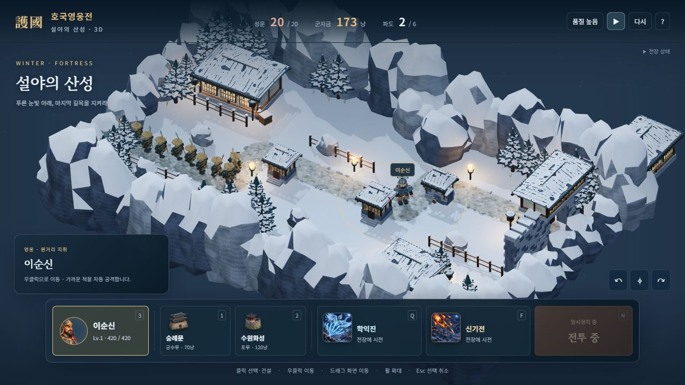
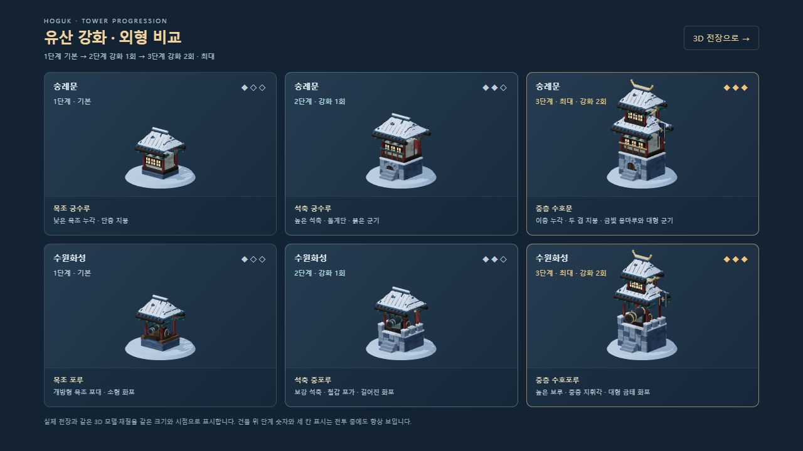
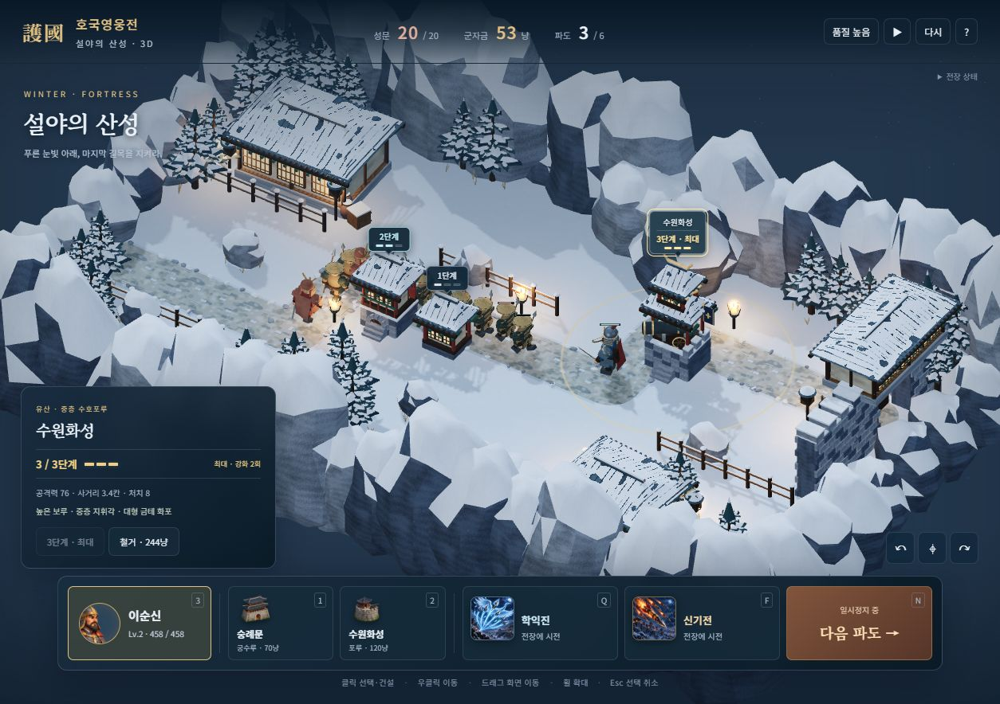
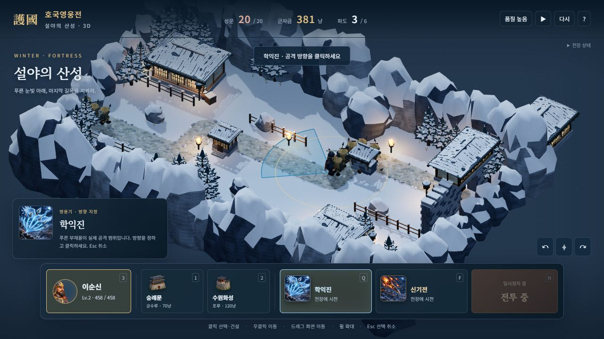
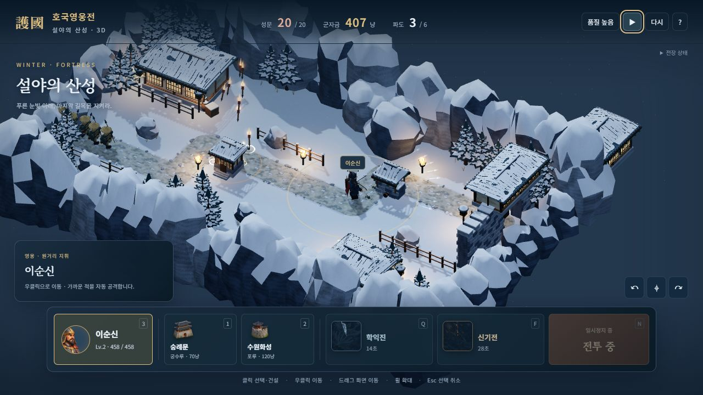
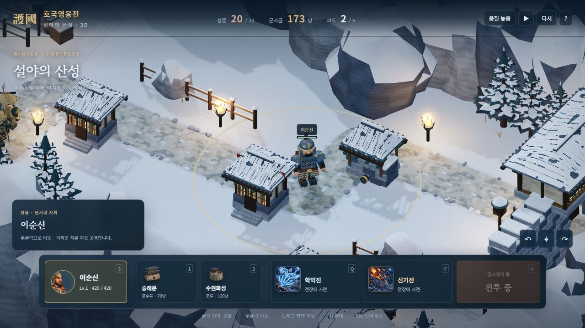

# 설야의 산성 · 3D 첫 전장

이 문서는 2026-10-09의 첫 겨울 체험판 기록입니다. 현재 25개 사계절 전장·전체 영웅·유산 특화로 확장한 내용은 [3D 캠페인 가이드](3D_CAMPAIGN.md)에 있습니다.

`node server/server.js` 실행 후 <http://localhost:8080/3d.html?stage=winter3d>로 접속하면 아래의 기존 6파도 체험판을 열 수 있습니다. 기본 <http://localhost:8080/3d.html>은 새 사계절 캠페인입니다.



## 2026-10-09 유산 강화 외형 구분

숭례문·수원화성의 세 단계 모델을 각각 다르게 만들었습니다. 전체 크기만 확대하던 방식 대신 석축, 누각, 지붕 층수, 군기, 화포와 포가 구조가 단계에 따라 달라집니다. 세 단계는 **1단계 기본(강화 0회) → 2단계(강화 1회) → 3단계 최대(강화 2회)**입니다.

| 유산 | 1단계 기본 | 2단계 보강 | 3단계 최대 |
|---|---|---|---|
| 숭례문 | 낮은 목조 궁수루, 단층 지붕 | 높아진 석축, 성문·돌계단, 난간·붉은 군기 | 이층 누각, 두 겹 지붕, 금빛 용마루·대형 군기 |
| 수원화성 | 개방형 목조 포대, 소형 화포 | 보강 석축·총안, 철갑 포가·길어진 화포 | 높은 보루, 중층 지휘각, 대형 금테 화포·대형 군기 |



서버 실행 후 [단계별 외형 비교](http://localhost:8080/dev/3d-tower-review.html)에서 같은 모델·재질을 직접 확인할 수 있습니다. 비교 화면은 전장과 같은 `towerModel()`을 사용합니다.

- 모든 지어진 유산 위에 단계 숫자와 세 칸 표시를 계속 띄웁니다. 최대 단계는 금색과 **최대** 문구를 함께 사용합니다. 카메라 회전·확대 시 실제 모델의 지붕 높이를 따라가며 글자 크기를 유지합니다. 단계 표시를 클릭하거나 키보드로 선택할 수도 있습니다.
- 선택 창에는 `현재 / 최대 단계`, 정확한 강화 횟수, 다음 강화의 외형 변화, 비용을 표시합니다. 최대 단계에서는 강화 버튼을 비활성화합니다. 건설·스킬 조준 중에는 단계 표시가 전장 클릭을 가로채지 않습니다.
- 강화 때 회전·반동 화포를 포함해 실제 모델을 교체하고, 철거·재시작 시 모델과 단계 표시를 정리합니다. 화포의 포신이 조준 방향으로 함께 회전하도록 고쳤습니다. 높아진 포구와 궁수루에서 발사해 기존 시뮬레이션 표적 좌표에 도달하도록 투사체의 입체 경로도 연결했습니다.
- 세로 화면에서 스킬 그림의 인라인 배치가 하단 명령창을 과하게 키워 강화 버튼을 덮던 문제를 수정했습니다. 414px 화면에서 최대 강화까지 클릭하고 선택 창과 하단 명령창이 겹치지 않는 것을 확인했습니다.



강화 비용·피해·사거리와 최대 3단계라는 체험판 범위는 그대로입니다. 캠페인의 분기 특화는 아직 3D 모델 범위에 포함하지 않습니다.

## 2026-10-09 모델·재질·스킬 개선

- 바위는 높이별로 변형한 입체 표면으로 다시 만들었습니다. 눈은 위를 향한 바위 면을 따라 놓이고, 바위와 눈의 법선을 따로 다듬습니다. 소나무는 방사형 가지·톱니 모양 잎·가지 위 눈으로 교체했습니다.
- 목재 결, 돌의 요철, 천의 직조, 금속의 잔흠집에 각각 색상·범프 텍스처를 적용했습니다. 작은 결정적 DataTexture로 생성하므로 외부 텍스처 다운로드가 없습니다. Three.js RoomEnvironment를 PMREM으로 변환한 약한 환경 반사를 더해 금속이 어둡게 묻히는 문제를 줄였습니다. 최대 확대 배율도 높여 가까이서 볼 수 있습니다.
- 한옥에는 곡면을 따라가는 실제 기와 골, 불규칙한 눈 틈, 단청 받침과 서까래, 고드름을 추가했습니다. 성벽 돌은 모서리를 다듬고 포루에 바퀴·금속 테를 넣었습니다. 돌길은 모서리를 둥글게 연결하고 눈 얼룩·발자국·수레 자국·마른 풀을 추가했습니다.
- 이순신·아시가루·사무라이의 갑옷 모서리, 연결 끈, 어깨 겹판, 투구 테와 장식, 삿갓 살을 다듬었습니다. 이순신은 붉은 띠·여러 갈래 술·등의 화살통을 추가했습니다.
- 학익진·신기전 전용 일러스트를 **내장 image_gen**으로 새로 생성했습니다. [원본 크기 그림과 버튼 그림](../assets/3d/art/), [생성 프롬프트](../assets/3d/art/prompts.json)를 함께 저장했습니다. 영웅 초상과 유산 버튼은 기존 일러스트에서 추출했습니다.
- 학익진은 영웅 기준 4.2칸·반각 0.72라디안의 실제 피해 부채꼴을 미리 보여줍니다. 실제 `cone` 이벤트에 화살 세례와 영웅의 시선 방향을 연결했습니다. 신기전은 반경 1.6칸의 표적, 입체 로켓 화살·불꽃·착탄 불티를 표시합니다. 쿨다운 덮개·큰 선택 그림·시전 알림도 연결했습니다.
- 동시에 살아 있는 착탄 효과를 64개로 제한하며 만료·재시작 때 전용 지오메트리와 재질을 정리합니다.







## 구현 범위

- Three.js 0.186.1 / WebGL2로 실제 입체 모델을 그립니다. 배경 그림이나 빌보드 캐릭터를 세워둔 방식이 아닙니다.
- 겨울 전장 1곳, 영웅 이순신 1명, 왜군 아시가루·사무라이 2종, 숭례문·수원화성 2종, 6개 파도입니다.
- 설송, 돌길, 절벽, 한옥, 성문, 울타리, 항아리, 등불·화로, 눈발, 따뜻한 조명, 실시간 그림자가 있습니다.
- 캐릭터는 코드로 만든 3D 모델이며 어깨·다리 관절, 활·창·칼, 갑옷, 망토가 있습니다. 걷기·호흡·공격·피격 반동·쓰러짐을 적용합니다.
- 기존 `src/sim/`의 실제 이동·사거리·피해·처치·건설·강화·스킬·승패 계산을 사용합니다. 3D 화면의 클릭을 지면으로 역투영해 같은 명령을 전달합니다.
- 숭례문·수원화성이 기본 배치됩니다. 추가 건설, 3단계 강화, 철거, 영웅 이동, 학익진과 신기전, 일시정지와 재시작을 사용할 수 있습니다.
- 회전·확대·이동 가능한 사선 카메라와 품질 전환, 터치 대응 조작을 제공합니다.

## 조작

| 입력 | 동작 |
|---|---|
| 전투 시작 / N | 첫 파도 또는 다음 파도 출정 |
| 클릭 | 영웅·유산 선택 |
| 우클릭 | 이순신 이동 |
| 1 / 2 | 숭례문 / 수원화성 선택 후 빈 땅을 클릭해 건설 |
| 3 | 이순신 선택 |
| Q / F | 학익진 / 신기전 선택 후 전장을 클릭해 시전 |
| Space | 일시정지 / 계속 |
| Esc | 선택·건설·시전 취소 |
| 드래그 / 휠 | 화면 이동 / 확대·축소 |
| 오른쪽 드래그 / ↶ ↷ 버튼 | 카메라 회전 |
| ⌖ | 카메라 원위치 |

터치에서는 영웅을 선택한 뒤 빈 땅을 누르면 이동합니다. 한 손가락 드래그로 화면을 이동하고 두 손가락으로 확대·회전합니다. 세로 화면의 원위치는 영웅을 중심으로 잡습니다. 내장 브라우저의 좁은 기본 화면(414px)에서 영웅이 화면 안에 있고 명령 버튼이 넘치지 않는 것을 확인했습니다. 모바일 기기의 성능 검증은 별도입니다.

## 현재 한계

참고 이미지의 색감·시점·겨울 분위기를 목표로 한 **플레이 가능한 3D 버전**입니다. 이번에 모델과 재질을 다듬었지만 모델은 여전히 절차적으로 제작한 형태입니다. 전문 모델러가 제작한 얼굴·복식·리깅이나 참고 이미지의 고밀도 아트 품질에 도달한 상태는 아닙니다. 세밀한 얼굴 표정, 개별 캐릭터 애니메이션 클립, 베이크된 조명·노멀·AO 맵은 향후 아트 제작 범위입니다. 새 스킬 그림은 현재 3D 전장에서 사용하는 학익진·신기전 두 종류입니다.

전투는 평면 좌표를 유지합니다. 절벽은 장식이며 높이 차이에 따른 사거리·낙하·경로 탐색은 없습니다. 전체 25개 전장과 다른 영웅·적·유산의 3D화, 궁극기, 분기 특화, 온라인 협동 연결은 이 체험판 범위에 포함하지 않습니다. 체험 결과는 기존 캠페인 저장·재화·해금에 반영하지 않습니다.

WebGL2와 그래픽 가속이 필요합니다. 이 버전은 서버로 실행하며, 기존 `dist/hoguk.html`의 단일 파일 배포에는 포함하지 않습니다. 기존 단일 HTML은 2D 게임입니다.

## 개발과 확인

```bash
pnpm install
pnpm run build:3d
pnpm run test:3d
node tools/selftest.mjs
node server/server.js
```

`src/3d/scenario.js`가 전투 데이터를, `models.js`가 입체 모델·관절을, `tower-visuals.js`가 단계 이름·외형·최대 단계 정보를, `tower-labels.js`가 건물 위 단계 표시를, `surfaces.js`가 표면 텍스처를, `effects.js`가 스킬 조준·전투 효과를, `world.js`가 장면·카메라·조명·클릭 처리를, `main.js`가 전투와 UI 연결을 담당합니다. `3d.html`과 `styles/3d.css`가 UI입니다.

`tools/build-3d.mjs`는 Three.js와 실행 코드를 `assets/3d/game.js`에 묶고, 단계 비교용 `assets/3d/tower-review.js`도 빌드합니다. `node tools/build-3d.mjs`로도 직접 실행할 수 있습니다. 실행 시 외부 CDN 모듈이나 모델 파일을 가져오지 않습니다. 온라인 글꼴은 네트워크가 없으면 시스템 글꼴로 대체됩니다. Three.js의 MIT 라이선스는 `assets/3d/THREE-LICENSE.txt`에 포함합니다.

정적 지형과 각 관절의 단단한 부분은 재질별로 병합해 드로우콜을 줄입니다. 캐릭터 사망·유산 강화/철거·재시작 시 전용 GPU 자원을 정리합니다. 품질 낮음은 실시간 그림자를 끄고 해상도 배율을 줄입니다. 실제 FPS는 그래픽카드·브라우저·해상도와 병력 수에 따라 달라집니다.

3D 점검은 지도·경로·군자금 명령, 캐릭터·건물·여러 바위·소나무의 모든 정점 속성의 유효성, 관절 움직임, 3D 투영 왕복, 두 유산의 여섯 단계 모델 실루엣·금속 장식·포신 변화, 실제 강화 비용과 최대 단계의 일치, 최대 유산의 포구·화살 발사 높이와 착탄 좌표, 스킬 피해, 부채꼴 안팎의 실제 피해와 조준 도형 일치, 효과 상한과 자원 정리, 6개 파도의 실제 엔진 진행과 승리를 확인합니다.

검증 결과: 3D 점검 11개와 기존 점검 13개 통과. 봇의 실제 전투는 6파 승리, 처치 105, 성문 10/20으로 종료했습니다. 내장 브라우저에서 두 유산 모두 1→2→3단계 강화, 비용 차감, 최대 버튼 비활성화, 철거 후 표시 제거, 재시작, 새 건설, 시점 회전 시 표시 추적을 확인했습니다. 유산 3개·적 17명인 실제 전투에서 약 60 FPS, 1457 draw calls, 1179k triangles가 표시되었습니다. 그림자 렌더링을 포함한 해당 테스트 환경의 측정값이며 모바일 기기의 성능 측정은 하지 않았습니다.

환경 반사 생성 시 이 PC의 브라우저에서 PMREM 셰이더의 부동소수점 정밀도 경고(X4122)가 기록되었습니다. 렌더링 오류는 없었고 모델·조준·스킬 비행과 착탄은 실제 화면에서 확인했습니다.
