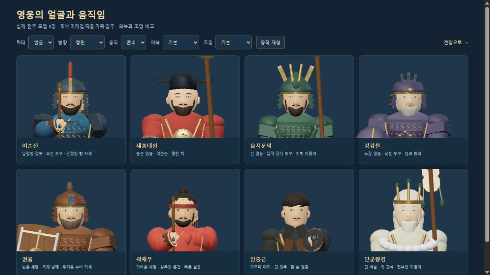
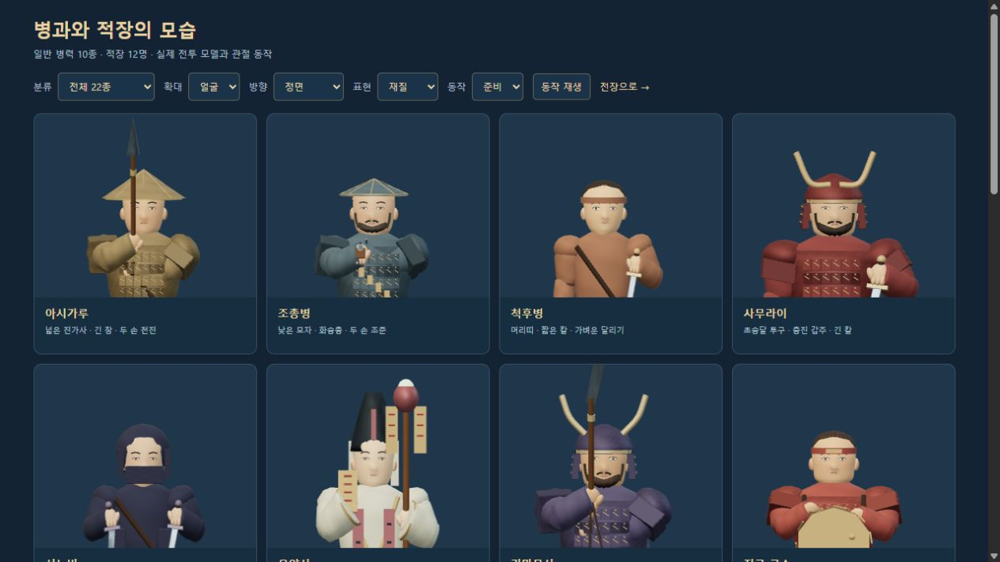
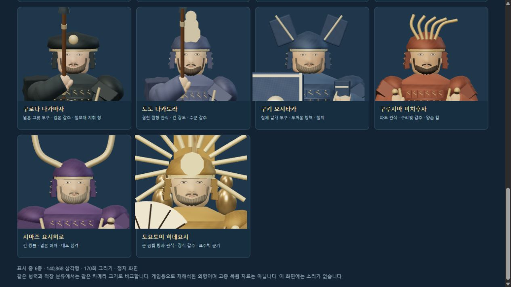
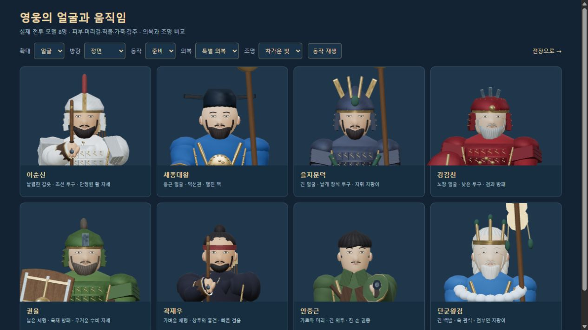
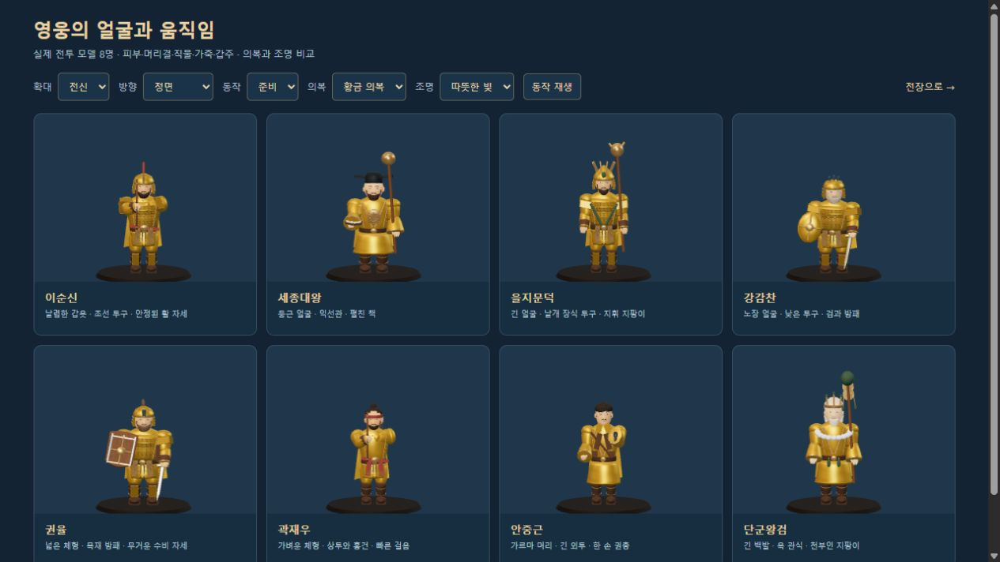
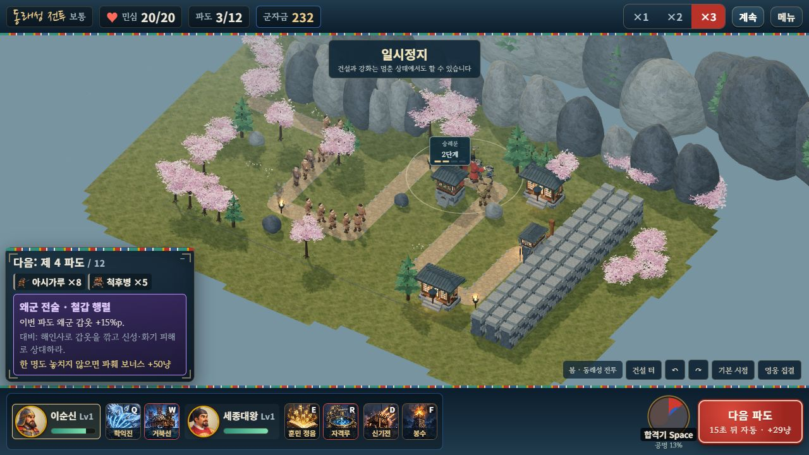
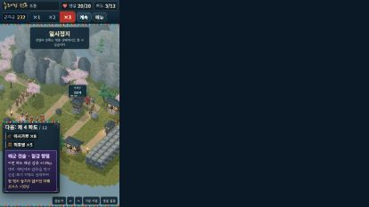
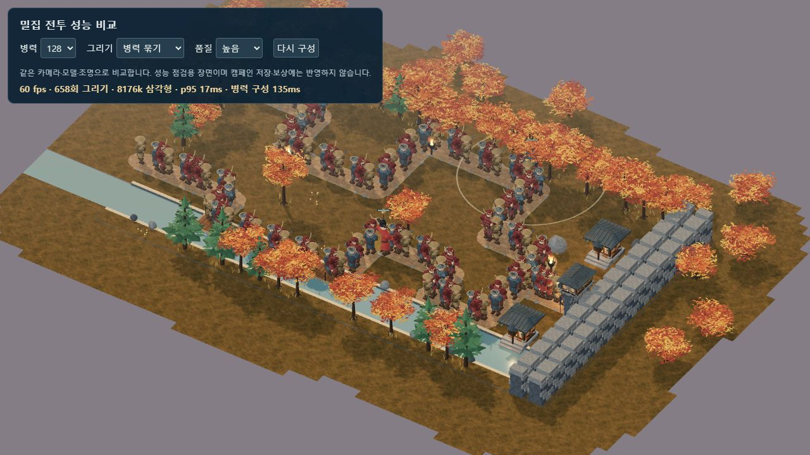

# 캐릭터 얼굴·모발·복식 재질 · 2026-10-10

영웅 8명, 인간형 적 21종, 아군 4종의 얼굴과 공통 재질을 다듬었습니다. 정식 게임·단일 HTML·자유 전장·비교 화면이 같은 모델을 사용합니다. 기존 기록의 음악과 효과음은 모두 0입니다.

[얼굴·의복·조명 비교](http://127.0.0.1:8080/dev/3d-hero-review.html) · [정식 게임](http://127.0.0.1:8080/dist/hoguk.html?mute=1) · [검증 데이터·파일 해시](CHARACTER_SURFACE_VALIDATION.json)



## 변경

눈·입·눈썹을 인물별 얼굴 곡면에서 계산해 배치했습니다. 볼·눈두덩·코·턱을 하나의 연속 얼굴 메시로 조형하고, 얇은 눈꺼풀과 아몬드 형태의 눈을 사용합니다. 피부에는 볼·코의 온기와 눈가·턱의 약한 색 변화를 넣었습니다. 얼굴 밖으로 튀어나온 별도 코·턱 구체는 제거했습니다.

피부·모발·직물·갑주·가죽에 각각 다른 색·거칠기·요철 맵을 적용했습니다. 피부의 광택을 줄이고, 모발의 세로 결, 미세한 직물 짜임, 가죽 입자, 금속의 두드린 표면과 모서리 색 변화를 구분합니다. 캐릭터의 신발·허리띠·손목 보호구도 같은 가죽 재질을 사용합니다. 주변 건물과 지형의 공용 재질은 이 변경의 대상이 아닙니다.

모든 색상과 의복은 **128×128 RGBA 텍스처 15개**를 공유합니다. 원본 픽셀 데이터는 합계 960KiB이며 밉맵·환경 텍스처·GPU 내부 저장량은 별도입니다. 색 맵은 sRGB, 요철·거칠기는 선형 데이터로 구분합니다. 공유 맵과 원본 조형은 캐릭터가 사라질 때 해제하지 않고, 개별 의복의 복제 재질과 소유한 메시만 해제합니다.

수염을 턱선을 따르는 곡면과 가는 결로 바꾸고, 안중근의 머리는 연속된 모발 덮개와 그 표면에 붙인 빗은 결로 구성했습니다. 적장과 일반 병력·아군에도 개별 피부·모발·수염 팔레트를 적용했습니다. 전투 수치·해금·재화·의복 효과는 바꾸지 않았습니다.





## 의복과 조명

영웅 비교 화면에서 기본·특별·황금 의복과 기본·따뜻한 빛·차가운 빛을 선택할 수 있습니다. 기존 확대·회전·보행·공격 진행 조절도 유지합니다. 의복 16종을 장착해도 피부와 머리의 재질을 보존합니다.





## 검증

| 검사 | 결과 |
|---|---|
| 자체 점검 | 14개 통과 |
| 3D 모델·전장·관절·전투·자원 | 41개 통과 |
| 정식 세션·저장·협동·의복·표시 | 15개 통과 |
| 적 모델·실제 사격·타격·치유·빙결 | 12개 통과 |
| 새 얼굴·재질·모발·의복 공유 자원 | 7개 통과 |
| 합계 | **89개 통과**, 최종 얼굴 수정 뒤 전체 재실행 |
| 얼굴 33종 | 유효한 정점·단위 법선·인덱스, 면적 0 삼각형 없음, 위아래 마감 중심 보존 |
| 눈 표면 연결 | 실제 병합 모델을 raycast하여 눈 렌즈 정점과 얼굴의 간격 -0.001~0.012 이내 확인 |
| 모발 | 이마·정수리 피부 비침 없음, 모든 세로 정점 열의 높이 순서·뒤쪽 UV 이음 법선 일치 |
| 공유 자원 | 공통 텍스처 15개, 원본 상자·얼굴 불변, 의복 16종 복제와 실제 전장 해제 경로 확인 |
| 영웅 비교 | 8명 얼굴, 특별·황금 의복 각 8종, 두 조명, 공격 준비/방출·후면 보행 확인 |
| 적군 비교 | 일반 병력 10종·적장 12명 전체를 세 번 스크롤해 확인 |
| 브라우저 자원 | 의복 기본→특별→황금→기본 전환 후 geometry 368·texture 32·program 4로 초기 값 복원; 화면에 들어오는 메시 수에 따라 중간 geometry 수는 달라짐 |
| 정식 전투 | 기존 이순신·세종 편성, 동래성, 숭례문 건설·2단계 강화, 실제 집결·일반 공격; **3/12파도·민심 20/20·군자금 232에서 정지** |
| 좁은 화면 | 414×896, 문서 폭 414, 가로 넘침 없음, 2단계 배지 65×46·x236.59375/y294.203125 |
| 소리·오류 | 설정의 효과음·배경음 0, 최종 비교·전투·성능 console error/warn 0 |
| 빌드 | 3D 번들·정식 단일 HTML 생성, 원격 스크립트·외부 래스터 경로 없음; 선택 웹 글꼴은 시스템 글꼴로 대체 가능 |

요청에 따라 GPT 아스트라 xhigh 검토를 받았습니다. 얼굴의 마감 중심이 Float32 반올림으로 앞면에 잘못 투영되는 오류와 앞머리 하단의 접힘·뒤쪽 법선 이음을 수정했습니다. 브라우저에서 확인한 앞머리의 피부 비침도 고쳤습니다. 최종 검토에서 세로 역전·뒤집힌 모발 전면 삼각형·UV 이음 법선 차이가 모두 0임을 확인했습니다.





## 성능

Windows Codex 브라우저, 1280×720, 가을 s12 기본 카메라, 이순신·세종 2명과 유산 없는 장면입니다. 아시가루·사무라이·조총병을 섞은 병력 128명, 묶음 표시·높은 품질로 측정했습니다. 다른 전투는 정지, 비교 화면도 정지 상태이며 자동 회귀 검사 종료 후 측정했습니다.

| 병력 | FPS | 프레임 간격 p95 | 그리기 호출 | 삼각형 약 | 병력 초기 동기화 | 전체 준비 |
|---:|---:|---:|---:|---:|---:|---:|
| 128 | 60 | 17ms | 658 | 818만 | 135ms | 1,214ms |

geometry는 323개입니다. 초기 구성 직후 첫 관측에서는 44fps도 있었고, 위 값은 준비 후 여섯 번째 약 1초 구간의 관측값입니다. 측정 화면은 병력 수를 바꾸면 이전 병력의 측정값을 지우며, 새 측정 구간 번호를 DOM에 제공합니다. 짧은 PC 관측이며 실제 휴대폰의 장시간 성능을 검증한 값은 아닙니다.



```bash
node tools/selftest.mjs
node tools/test-3d.mjs
node tools/test-campaign.mjs
node tools/test-enemies.mjs
node tools/test-character-surfaces.mjs
node tools/build-3d.mjs
node tools/build.mjs
node server/server.js
```

이번 재질은 코드로 생성한 작은 맵과 코드로 조형한 메시입니다. 참고 이미지 수준의 전용 고해상도 피부·복식 텍스처, 스킨 웨이트를 사용한 변형 리깅과 제작 애니메이션은 추가 제작 범위입니다. 어려움·지옥의 실제 재화 성장, 사람 플레이 밸런스, 실제 휴대폰, 외부 인터넷 두 기기의 협동 검증도 남아 있습니다. 이 문서의 실제 전투는 부분 진행 검사이며 전체 캠페인 수동 완주를 뜻하지 않습니다. 기존 실제 재화 보통 25전장 완주 기록은 [전체 개선 기록](POLISH_RELEASE.md)에 별도로 있습니다.
