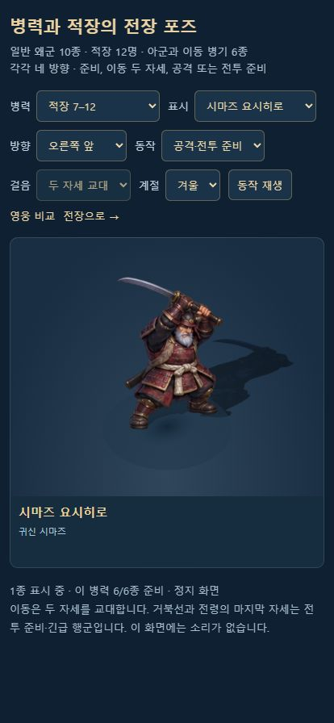

# 병력·적장·이동 병기의 방향별 그림

갱신: 2026-10-11. 사용자 확정 이순신 v2와 다른 기본 영웅의 부드러운 입체 애니메이션풍에 병력을 맞춘 후속 작업이다.

## 적용 범위

일반 왜군 10종, 적장 12명, 의병·수비군·정예 수비군·승병·전령·거북선 6종에 **28시트 × 16 = 448포즈**를 연결한다. 기본 영웅 8명의 128포즈와 합하면 기본 전장 등장 인물·이동체의 준비된 그림은 576포즈다. 영웅 원본·배포 그림·프롬프트·포즈 데이터는 이번 작업에서 변경하지 않는다. 유산의 모든 단계 높이도 1.2칸으로 유지한다.

실제 3D 좌표·깊이·카메라를 사용하는 고정 시점 2.5D 그림이다. 전신 관절 3D 모델을 새로 제작한 작업은 아니다. 각 캐릭터의 무기·갑주·모자·색과 실루엣을 기존 병종 카탈로그에서 가져오고, 밝은 피부·넓은 색면·절제한 금속 하이라이트·차가운 환경광을 확정 영웅 시트에 맞췄다.

| 행 | 자세 | 열 순서 |
|---|---|---|
| 1 | 준비 | 오른쪽 앞 · 오른쪽 뒤 · 왼쪽 뒤 · 왼쪽 앞 |
| 2 | 이동 A | 같은 네 방향 |
| 3 | 이동 B | 같은 네 방향 |
| 4 | 공격·전투 준비 | 같은 네 방향 |

이동은 두 자세를 교대한다. 사격·치유·근접 타격은 기존 시뮬레이션의 동작 신호를 사용한다. 충차에는 통나무 타격을, 북병에는 북을 치는 자세를 사용한다. 전령·거북선은 실제 이동에서 앞의 12포즈를 사용하며, 마지막 네 자세는 긴급 행군·전투 준비용으로 보존한다. 모든 기술마다 여러 장으로 된 독립 공격 애니메이션을 만든 것은 아니다.

## 제작과 저장 경로

**내장 imagegen**으로 생성·편집했다. 참조 역할은 기존 카탈로그의 지정 병종이 정체성, `yi-directions-v2.png`가 화풍·카메라다. 모든 배경은 실제 투명 알파이며 PNG 원본을 보존하고 Sharp로 WebP quality90/alphaQuality100을 인코딩한다. Sharp는 압축과 픽셀 검사에만 사용하며 캐릭터 그림을 다시 칠하거나 경계 픽셀을 지우지 않는다.

| 대상 | 분류 | 최종 자산·원본·생성 프롬프트 |
|---|---|---|
| 아시가루 | 왜군 | [WebP](../assets/3d/fixed/units/ashigaru-directions-v1.webp) · [원본](../assets/3d/fixed/units/source/ashigaru-directions-v1.png) · [최종 프롬프트](../assets/3d/fixed/units/ashigaru-directions-v1.prompt.json) |
| 조총병 | 왜군 | [WebP](../assets/3d/fixed/units/teppo-directions-v1.webp) · [원본](../assets/3d/fixed/units/source/teppo-directions-v1.png) · [최종 프롬프트](../assets/3d/fixed/units/teppo-directions-v1.prompt.json) |
| 척후병 | 왜군 | [WebP](../assets/3d/fixed/units/scout-directions-v1.webp) · [원본](../assets/3d/fixed/units/source/scout-directions-v1.png) · [최종 프롬프트](../assets/3d/fixed/units/scout-directions-v1.prompt.json) |
| 사무라이 | 왜군 | [WebP](../assets/3d/fixed/units/samurai-directions-v1.webp) · [원본](../assets/3d/fixed/units/source/samurai-directions-v1.png) · [최종 프롬프트](../assets/3d/fixed/units/samurai-directions-v1.prompt.json) |
| 시노비 | 왜군 | [WebP](../assets/3d/fixed/units/ninja-directions-v1.webp) · [원본](../assets/3d/fixed/units/source/ninja-directions-v1.png) · [최종 프롬프트](../assets/3d/fixed/units/ninja-directions-v1.prompt.json) |
| 음양사 | 왜군 | [WebP](../assets/3d/fixed/units/onmyoji-directions-v1.webp) · [원본](../assets/3d/fixed/units/source/onmyoji-directions-v1.png) · [최종 프롬프트](../assets/3d/fixed/units/onmyoji-directions-v1.prompt.json) |
| 기마무사 | 왜군 | [WebP](../assets/3d/fixed/units/cavalry-directions-v1.webp) · [원본](../assets/3d/fixed/units/source/cavalry-directions-v1.png) · [최종 프롬프트](../assets/3d/fixed/units/cavalry-directions-v1.prompt.json) |
| 진군 고수 | 왜군 | [WebP](../assets/3d/fixed/units/drum-directions-v1.webp) · [원본](../assets/3d/fixed/units/source/drum-directions-v1.png) · [최종 프롬프트](../assets/3d/fixed/units/drum-directions-v1.prompt.json) |
| 철갑무사 | 왜군 | [WebP](../assets/3d/fixed/units/armored-directions-v1.webp) · [원본](../assets/3d/fixed/units/source/armored-directions-v1.png) · [최종 프롬프트](../assets/3d/fixed/units/armored-directions-v1.prompt.json) |
| 공성 충차 | 왜군 | [WebP](../assets/3d/fixed/units/ram-directions-v1.webp) · [원본](../assets/3d/fixed/units/source/ram-directions-v1.png) · [최종 프롬프트](../assets/3d/fixed/units/ram-directions-v1.prompt.json) |
| 의병 | 아군·이동체 | [WebP](../assets/3d/fixed/units/militia-directions-v1.webp) · [원본](../assets/3d/fixed/units/source/militia-directions-v1.png) · [최종 프롬프트](../assets/3d/fixed/units/militia-directions-v1.prompt.json) |
| 수비군 | 아군·이동체 | [WebP](../assets/3d/fixed/units/guard-directions-v1.webp) · [원본](../assets/3d/fixed/units/source/guard-directions-v1.png) · [최종 프롬프트](../assets/3d/fixed/units/guard-directions-v1.prompt.json) |
| 정예 수비군 | 아군·이동체 | [WebP](../assets/3d/fixed/units/elite-directions-v1.webp) · [원본](../assets/3d/fixed/units/source/elite-directions-v1.png) · [최종 프롬프트](../assets/3d/fixed/units/elite-directions-v1.prompt.json) |
| 승병 | 아군·이동체 | [WebP](../assets/3d/fixed/units/monk-directions-v1.webp) · [원본](../assets/3d/fixed/units/source/monk-directions-v1.png) · [최종 프롬프트](../assets/3d/fixed/units/monk-directions-v1.prompt.json) |
| 전령 | 아군·이동체 | [WebP](../assets/3d/fixed/units/courier-directions-v1.webp) · [원본](../assets/3d/fixed/units/source/courier-directions-v1.png) · [최종 프롬프트](../assets/3d/fixed/units/courier-directions-v1.prompt.json) |
| 거북선 | 아군·이동체 | [WebP](../assets/3d/fixed/units/turtle-directions-v1.webp) · [원본](../assets/3d/fixed/units/source/turtle-directions-v1.png) · [최종 프롬프트](../assets/3d/fixed/units/turtle-directions-v1.prompt.json) |
| 고니시 유키나가 | 왜군 | [WebP](../assets/3d/fixed/units/konishi-directions-v1.webp) · [원본](../assets/3d/fixed/units/source/konishi-directions-v1.png) · [최종 프롬프트](../assets/3d/fixed/units/konishi-directions-v1.prompt.json) |
| 가토 기요마사 | 왜군 | [WebP](../assets/3d/fixed/units/kato-directions-v1.webp) · [원본](../assets/3d/fixed/units/source/kato-directions-v1.png) · [최종 프롬프트](../assets/3d/fixed/units/kato-directions-v1.prompt.json) |
| 와키자카 야스하루 | 왜군 | [WebP](../assets/3d/fixed/units/wakizaka-directions-v1.webp) · [원본](../assets/3d/fixed/units/source/wakizaka-directions-v1.png) · [최종 프롬프트](../assets/3d/fixed/units/wakizaka-directions-v1.prompt.json) |
| 우키타 히데이에 | 왜군 | [WebP](../assets/3d/fixed/units/ukita-directions-v1.webp) · [원본](../assets/3d/fixed/units/source/ukita-directions-v1.png) · [최종 프롬프트](../assets/3d/fixed/units/ukita-directions-v1.prompt.json) |
| 이시다 미쓰나리 | 왜군 | [WebP](../assets/3d/fixed/units/ishida-directions-v1.webp) · [원본](../assets/3d/fixed/units/source/ishida-directions-v1.png) · [최종 프롬프트](../assets/3d/fixed/units/ishida-directions-v1.prompt.json) |
| 소 요시토시 | 왜군 | [WebP](../assets/3d/fixed/units/so-directions-v1.webp) · [원본](../assets/3d/fixed/units/source/so-directions-v1.png) · [최종 프롬프트](../assets/3d/fixed/units/so-directions-v1.prompt.json) |
| 구로다 나가마사 | 왜군 | [WebP](../assets/3d/fixed/units/kuroda-directions-v1.webp) · [원본](../assets/3d/fixed/units/source/kuroda-directions-v1.png) · [최종 프롬프트](../assets/3d/fixed/units/kuroda-directions-v1.prompt.json) |
| 도도 다카토라 | 왜군 | [WebP](../assets/3d/fixed/units/todo-directions-v1.webp) · [원본](../assets/3d/fixed/units/source/todo-directions-v1.png) · [최종 프롬프트](../assets/3d/fixed/units/todo-directions-v1.prompt.json) |
| 구키 요시타카 | 왜군 | [WebP](../assets/3d/fixed/units/kuki-directions-v1.webp) · [원본](../assets/3d/fixed/units/source/kuki-directions-v1.png) · [최종 프롬프트](../assets/3d/fixed/units/kuki-directions-v1.prompt.json) |
| 구루시마 미치후사 | 왜군 | [WebP](../assets/3d/fixed/units/kurushima-directions-v2.webp) · [원본](../assets/3d/fixed/units/source/kurushima-directions-v2.png) · [최종 프롬프트](../assets/3d/fixed/units/kurushima-directions-v2.prompt.json) |
| 시마즈 요시히로 | 왜군 | [WebP](../assets/3d/fixed/units/shimazu-directions-v2.webp) · [원본](../assets/3d/fixed/units/source/shimazu-directions-v2.png) · [최종 프롬프트](../assets/3d/fixed/units/shimazu-directions-v2.prompt.json) |
| 도요토미 히데요시 | 왜군 | [WebP](../assets/3d/fixed/units/hideyoshi-directions-v1.webp) · [원본](../assets/3d/fixed/units/source/hideyoshi-directions-v1.png) · [최종 프롬프트](../assets/3d/fixed/units/hideyoshi-directions-v1.prompt.json) |

모든 생성 원본은 생성 도구의 원래 저장 위치에도 남긴다. 각 `.prompt.json`에는 내장 생성 모드, 참조 파일의 역할, 정확한 최종 프롬프트, 생성 파일명과 버전을 보존한다. 구루시마·시마즈의 v1은 각각 다른 포즈의 가시 픽셀 9개·69개가 직사각형에 섞여 거부됐다. 전체 인물·무기의 배치를 투명 여백 안으로 다시 구성한 v2를 배포하며 v1 원본과 프롬프트도 보존한다. GPT Astra xhigh가 문제 좌표와 수정 방향을 확인했고, v2의 해당 자세 사이 61픽셀·42픽셀 여백과 정체성 유지에도 필수 수정이 없다고 확인했다.

## 경계와 크기

`tools/sprite-pose-inspector.mjs`는 알파16 이상 연결 성분에서 16개 주인공 실루엣을 찾고 행·열을 정렬한다. 실제 표시 임계값에 맞춰 알파41 이상 픽셀의 이웃 혼입·누락·중복과 시트 바깥 경계 접촉을 검사한다. 원본과 배포 파일의 알파도 전부 비교한다. 검사 결과는 [자산 검증 JSON](COMBAT_POSE_ASSET_VALIDATION.json)에 기록한다.

각 포즈를 실제 경계대로 자른 캔버스에 사방 12픽셀 투명 여백을 둔다. 축소·mipmap에서 이웃 포즈가 섞이지 않는다. 같은 병종의 첫 행 중간 높이를 공통 배율로 쓰고, 아래 24%의 알파 가중 발·선체 중심을 원점으로 삼는다. 자세별 망토·칼의 실루엣이 달라져도 픽셀당 배율을 바꾸지 않는다. 기존 표시 높이 1.36칸, 기마병·충차·전령·거북선 1.5칸을 사용한다.

## 전장 로딩과 정리

`src/3d/combat-pose-roster.js`가 해당 전장의 파도와 사용 가능한 전술, 충차 파괴 후 병력, 적장 소환·단계별 증원을 모두 포함한다. 아군 6종은 어느 전장에서도 등장할 수 있어 함께 준비한다. 처음부터 28종 모두를 디코딩해 전역 캐시에 남기지 않는다. 전장을 바꾸면 공통 병종은 유지하고 빠진 병종의 캔버스·GPU 텍스처·공용 재질·지오메트리를 해제한다. 포즈 텍스처는 실제 사용한 자세만 GPU에 올린다. 검증된 포즈 좌표가 있는 시트는 전체 픽셀을 다시 읽지 않는다.

코어 그림과 병력 그림이 모두 준비될 때까지 전투 시간을 기다린다. 일부 방향 그림이 실패하면 해당 병종의 기존 그림으로 돌아가고 다른 캐릭터·전투는 진행한다. 로딩 중 취소하거나 빠르게 다른 전장을 골라도 이전 완료가 현재 전장 카메라·로딩 표시를 바꾸지 않는다. 자유 전장의 키보드와 명령도 로딩 중 궁극기를 소비하지 않게 했다. 이 두 비동기·입력 결함은 문제 발생 후 요청한 GPT Astra xhigh 검토로 찾아 수정했다.

## 확인과 재현

```bash
node tools/combat-pose-assets.mjs
node tools/test-combat-art.mjs
node tools/test-fixed-art.mjs
node tools/test-enemies.mjs
node tools/build-3d.mjs
node tools/build.mjs
```

프롬프트 JSON을 새 버전으로 저장한 뒤 `node tools/combat-pose-assets.mjs --record <id>`로 원본 복사·인코딩·경계를 검사하고, 전체 검토 후 `--write`로 포즈 좌표와 보고서를 갱신한다. 기존 확정 그림 파일을 덮어쓰지 않는다.

[병력 448포즈 비교](http://localhost:8080/dev/3d-combat-pose-review.html)는 일반 왜군·적장 두 묶음·아군, 개별 캐릭터, 네 방향·네 자세, 사계절과 재생·정지를 제공한다. 실제 전장의 `FixedBattleArt.attachUnit/updateUnit`을 사용한다. [밀집 전투 비교](http://localhost:8080/dev/3d-performance-review.html)에는 28종 전부를 준비하는 부하 장면을 추가했다. 두 개발 화면은 캠페인 저장·재화·승패 보상을 변경하지 않는다.

자동 검사와 실제 브라우저 확인은 [최신 검증 JSON](COMBAT_DIRECTIONAL_ART_VALIDATION.json), [브라우저 기록](COMBAT_DIRECTIONAL_ART_BROWSER_VALIDATION.json)에 정리한다. 실제 휴대폰의 발열·메모리·프레임 보증은 이 데스크톱 검증과 구분한다.

이번 변경의 자동 검사는 새 13개를 포함한 **119개**를 통과했다. 영웅 128포즈와 병력 448포즈 모두 원본/배포 알파 및 혼입·누락·중복 검사를 통과했고, 병력 시트의 외곽 접촉도 0이다. 새 배포 그림 합계는 **10,971,904바이트**다. 두 빌드와 **37,104,890바이트** 단일 HTML의 방향 시트 36장 단일 포함을 확인했다.

브라우저에서는 448개 고유 포즈 전환, 사계절·단독·재생/정지, 자유 전장 4파도 진입과 실제 거북선 출격, 부산진→나고야성→부산진의 12→21→12종 준비를 확인했다. 정식 동래성은 영웅과 병종 13종 준비 후 첫 파도 전에 일시정지했다. 비교·정식 화면의 414×896 가로 넘침과 네 검사 화면의 콘솔 경고·오류는 없었다. 28종을 섞은 표시 부하 장면은 왜군 64·128·64명과 아군·이동체 6개를 표시했으며 관측값은 60fps·p95 17ms였다. 이동을 지정한 표시 성능 측정이며 전체 시뮬레이션이나 실제 휴대폰 성능을 보증하는 수치는 아니다.




## 남은 미술 범위

방향별 특별 의복 16종, 더 긴 보행·공격 연결, 기술별 독립 연출, 길 경계·주변 소품의 자연스러운 배치, 실제 기기 성능 검증이 남아 있다. 메뉴 초상화와 선택 평면 모드는 기존 카탈로그를 계속 사용한다.
