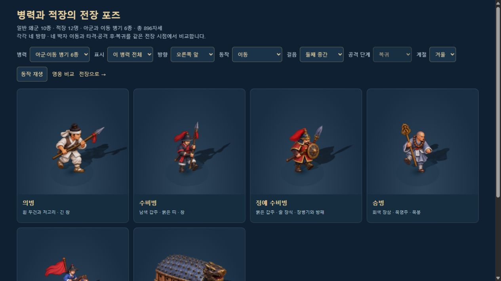
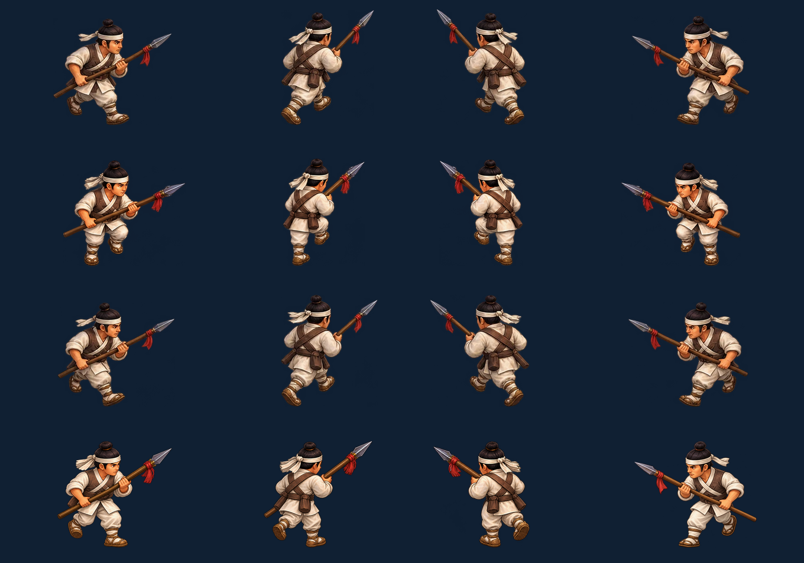

# 적군·아군 병력 중간 동작 원화

2026-10-11. 적군 22종과 아군·이동체 6종에 **28 × 16 = 448장**을 추가했다. 승인된 기존 1,216장은 유지하며, 병력은 총 896자세, 영웅·의상을 포함한 전장 준비 그림은 총 **1,664장**이다. 고정 시점·사계절·높이 1.2칸의 작은 유산과 로컬 2인 협동을 유지한다.

## 실제 적용 범위

| 대상 | 연결한 동작 |
|---|---|
| 일반 왜군 10종·적장 12명 | 네 방향의 준비·네 박자 이동. 기존 길막 교전/사격/지원 신호가 있을 때만 발사/타격 → 공격 후 → 복귀 |
| 의병·수비병·정예 수비병·승병 | 같은 네 박자 이동과 세 공격 자세, 실제 소환 병사의 소유자·공격 시각 사용 |
| 전령·출격 거북선 | 준비와 네 박자 이동, 각각 20자세를 실제 경로에서 사용 |
| 전령·거북선의 나머지 자세 | 기존 준비 공격 4장과 새 공격 후/복귀 8장, 각각 12장은 검토용 예비 원화. 실제 공격 행동을 새로 추가하지 않음 |

각 병종의 기존 걸음 A → 새 중간 A → 기존 걸음 B → 새 중간 B 순서를 실제 이동 거리에 연결한다. 공격은 기존 시뮬레이션의 발사·피해가 발생한 시각부터 자세를 바꾼다. 피해 계산·난수·이동 속도·공격 재사용 시간·소유권·군자금·협동 입력·스냅샷 규칙은 바꾸지 않았다.

일반 진군은 공격 모션 없이 이동하며, 성문에 도착하면 즉시 목숨을 깎고 제거된다. 성문을 때리는 행동이나 새로운 적 공격을 추가하지 않았다. 기존 영웅·소환 병사에게 길이 막힌 근접 교전, 원거리 사격과 회복 지원 신호만 원래 시각에 표시한다.

## 제작과 재현

내장 **imagegen**으로 원화를 제작하고 교정했다. 원본 PNG와 전체 프롬프트는 `assets/3d/fixed/combat-inbetweens/source/`에 보존한다. 단일 컷 참조와 행별 참조는 원본의 정확한 사각형 자르기이며 그림을 다시 그리거나 알파를 지우지 않는다. 교정 전 버전도 제작 기록으로 남긴다. 최종 선택에는 교정/행별 참조를 포함한 97개 소스 시트를 사용했다.

`tools/prepare-combat-inbetween-specs.mjs`가 선택한 칸·배율·발 기준점을 `tools/combat-inbetween-specs.json`에 기록한다. 기존 외형의 기준 높이에 맞춰 **동일 비율 리사이즈**하고 사방 24px 여백으로 포장한다. `tools/combat-inbetween-assets.mjs`는 무손실 WebP 28장과 `src/3d/combat-inbetween-data.js`를 만든다. 실행 시에는 선택 전장에 필요한 병종의 원본·중간 시트만 준비한다.

```bash
node tools/audit-combat-inbetween-sources.mjs
node tools/prepare-combat-inbetween-specs.mjs
node tools/combat-inbetween-assets.mjs --write --preview
node tools/combat-inbetween-assets.mjs
node tools/test-combat-inbetweens.mjs
node tools/build-3d.mjs
node tools/build.mjs
node tools/verify-embedded-art.mjs
```

원본 선택 시트와 최종 448칸의 이웃 혼입·누락·중복·외곽 접촉을 검사한다. 최종 포장 PNG와 배포 WebP의 알파 및 보이는 RGB 차이는 0이다. 생성 원본·참조·포장 PNG는 단일 HTML에 포함하지 않으며 선택된 배포 WebP만 한 번씩 포함한다. 정확한 바이트 수와 제외한 원본 수는 [릴리스 검사](COMBAT_INBETWEEN_RELEASE_VALIDATION.json)에 기록한다.

## 동작·협동 검증

새 검사 **20개**, 기존 회귀 **228개**, 총 **248개 / 18검사군**을 통과했다. 새 검사는 실제 병력 루트의 896자세·그림자·발 기준점, 20/60/120fps 이동 거리, 공격 후/복귀, 은신·정지·기절·사망·총구를 확인한다. 실제 로컬 Session의 양측 입력·두 병영의 비용·병사 소유권·공격 번호·스냅샷도 확인한다. 진군·성문 즉시 누출·기존 길막 교전의 실제 시뮬레이션을 함께 확인했다.

원본과 중간 그림의 완료 순서, 마지막 시트까지 HUD 시계 대기, 선택 로스터·부분 실패·재요청 방지·늦은 이전 요청 폐기·전장 변경 자원 정리·두 전장의 독립 소유·종료 뒤 늦은 완료를 검사했다. 변경 전 솔로/협동 완주 두 판의 전투 이벤트·기존 스냅샷 SHA도 동일하다. 기존 1,216장의 픽셀 검사와 원본/메타데이터·시뮬레이션·입력 파일 불변을 확인했다.

요청한 **GPT Astra xhigh**가 시점·발 교대·무기 손·원점·비동기 자원을 검토했다. 지적된 방향·중복 장비·잘린 끝과 공격 후 칼 손은 해당 원화를 다시 생성해 교정했다. 비교는 새 컷만 서로 맞추는 방식 대신 승인된 기존 A → 중간 A → 기존 B → 중간 B와 실제 타격 → 공격 후 → 복귀 순서를 사용했다.

[자산 검사](COMBAT_INBETWEEN_ASSET_VALIDATION.json) · [20개 실행 검사](COMBAT_INBETWEEN_RUNTIME_VALIDATION.json) · [전체 릴리스](COMBAT_INBETWEEN_RELEASE_VALIDATION.json) · [브라우저 기록](COMBAT_INBETWEEN_BROWSER_VALIDATION.json).

## 화면 확인과 남은 범위

[음소거 병력 비교](http://localhost:8080/dev/3d-combat-pose-review.html?mute=1)에서 전체/단독 표시, 네 방향, 네 걸음, 공격 후/복귀, 사계절과 재생/정지를 비교한다. 각 병종의 실제 원본·추가 자세를 같은 배율로 정리한 비교표는 `docs/screenshots/combat-inbetweens/`에 있다.

브라우저에서 실제 카드 28종의 896자세를 모두 전환하고 사계절·동작 재생/정지·414×896 가로 넘침 없음을 확인했다. 최신 단일 HTML은 로컬 이순신/세종 양측 이동·기술과 첫 적의 진군까지 확인해 목숨 20/20·군자금 156/156·첫 파도에서 일시정지했다. 두 탭 콘솔 경고/오류는 0이며 해금·구매·승패 보상은 발생시키지 않았다. 병영 두 곳의 비용·소유는 자동 Session 검사 범위다. 단일 HTML은 도구의 DOM 크기 한도로 스크린샷·마우스·키보드를 사용했고 `file://` 직접 실행이나 실제 휴대폰 성능을 검증한 범위는 아니다.

배포 WebP 28장은 **25,817,292바이트**다. 단일 HTML **107,972,590바이트**에 방향/중간 시트 104장을 각각 한 번 포함하며 영웅·병력 중간 원화 원본/참조/포장 PNG 256장은 제외한다.





이 작업은 고정 시점의 추가 원화다. 관절 리깅으로 이어지는 긴 애니메이션, 세밀한 옷 문양·장비 비율의 완전한 프레임 일치, 모든 휴대폰/PC의 메모리·발열·프레임 및 외부 네트워크 두 기기 검증은 남은 범위다. 단일 HTML에는 전체 배포 자산이 들어가므로 용량이 커지며, 선택 디코딩과 전체 파일 크기는 구분한다.
