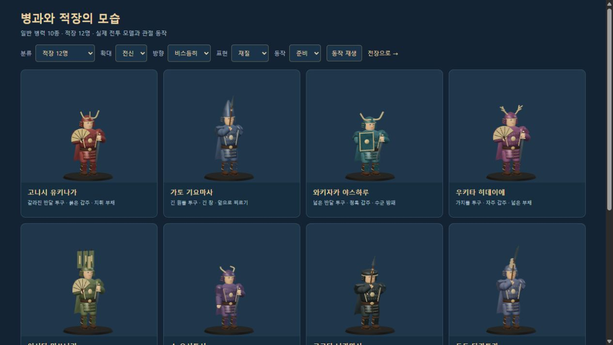
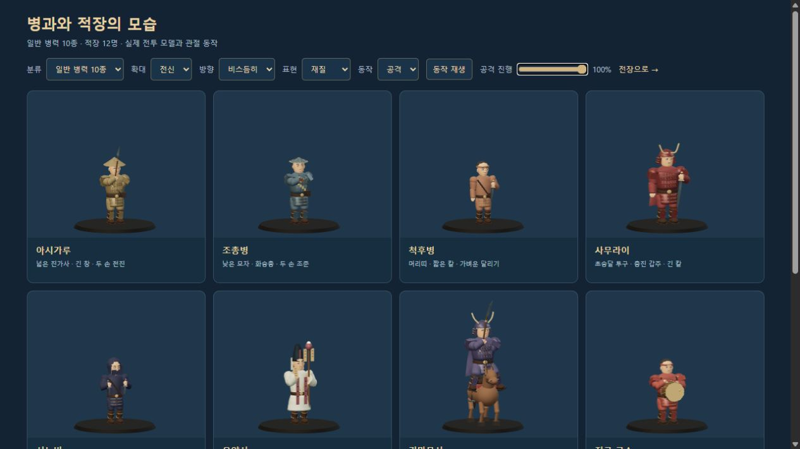
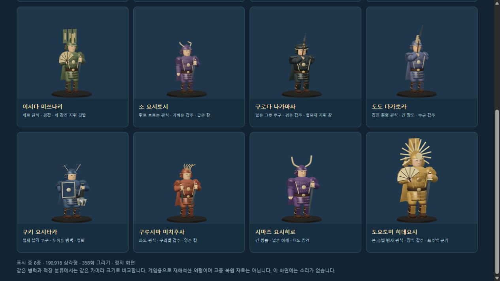
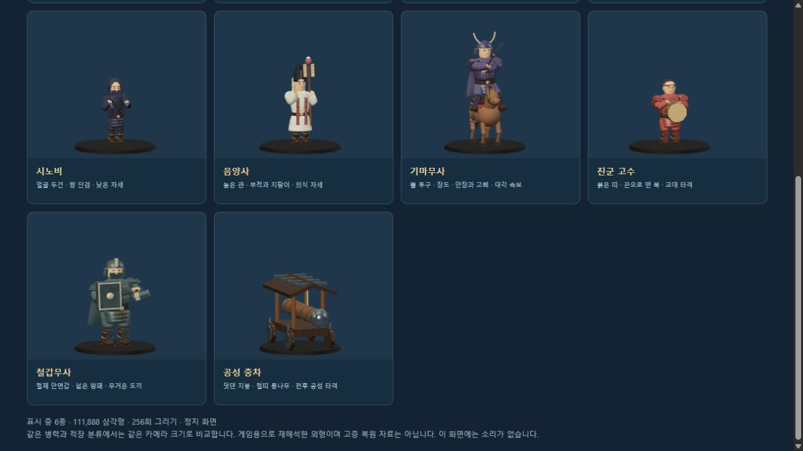
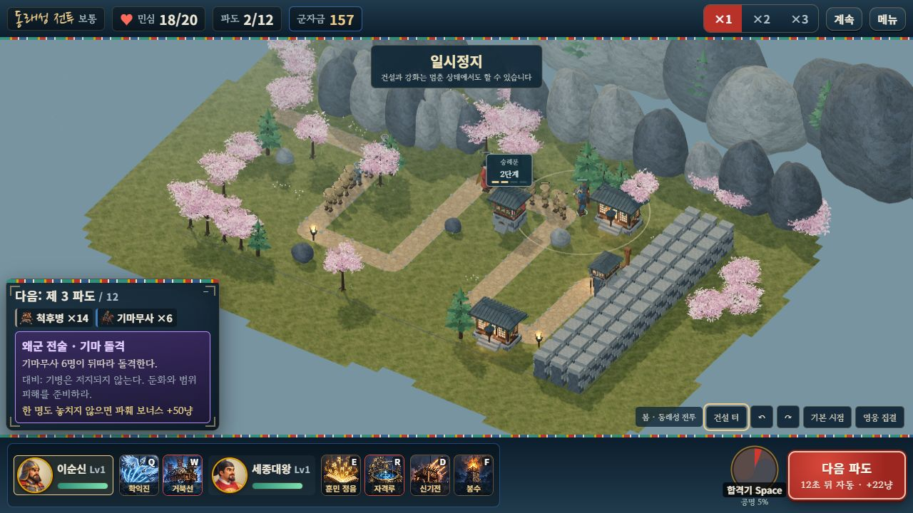
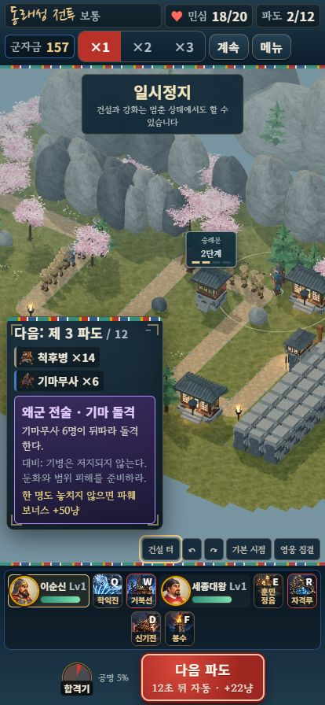
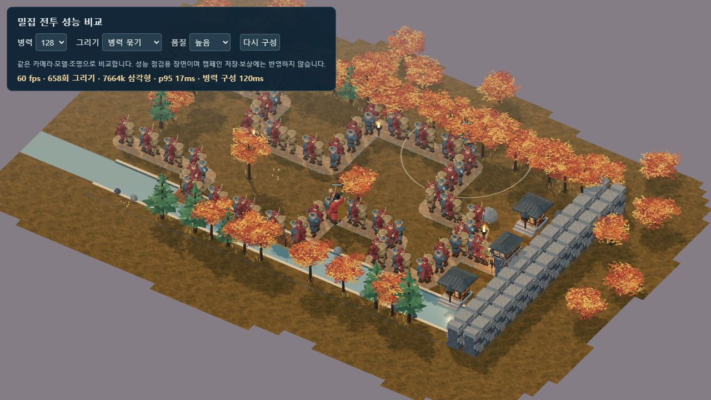

# 병과·적장 조형과 실제 전투 동작 · 2026-10-10

왜군 22종의 외형을 다시 나누고 무기·말·충차의 움직임을 실제 전투에 연결했습니다. 일반 병력 10종과 적장 12명이 서로 다른 체형·투구·장비를 사용합니다. 정식 게임, 단일 HTML, 자유 전장과 비교 화면에 같은 모델을 적용했습니다. 검증 프로필의 음악·효과음은 모두 0입니다.

[적군 확대·회전·동작 비교](http://127.0.0.1:8080/dev/3d-enemy-review.html) · [정식 단일 파일](http://127.0.0.1:8080/dist/hoguk.html?mute=1) · [검증 데이터와 파일 해시](ENEMY_MODEL_VALIDATION.json)

이 문서의 화면·파일 해시·성능은 적군 조형 당시의 기록입니다. 이후 인간형 33종의 피부·모발·직물·갑주·가죽과 곡면 이목구비를 다듬었습니다. 현재 빌드와 자동 검사 **89개**의 결과는 [캐릭터 얼굴·재질 검증](CHARACTER_SURFACES.md)에 있습니다.



## 외형 구분

인간형 21종은 각기 다른 얼굴 곡면을 사용합니다. 갑주·직물·금속의 색과 거칠기를 나누고, 얼굴이 투구·부채·등 깃발에 가리지 않도록 배치했습니다. 같은 병력/적장 분류에서는 같은 카메라 크기로 비교합니다. 게임용으로 재해석한 외형이며 역사 고증을 복원한 모델은 아닙니다.

| 일반 병력 | 구분과 동작 |
|---|---|
| 아시가루 | 넓은 진가사·긴 창, 양손 찌르기 |
| 조총병 | 낮은 모자·탄약 주머니·화승총, 양손 조준·반동 |
| 척후병 | 가벼운 체형·머리띠·짧은 칼, 빠른 보행 |
| 사무라이 | 초승달 투구·층진 붉은 갑주·긴 칼 |
| 시노비 | 얼굴 두건·쌍 단검, 낮은 자세 |
| 음양사 | 높은 관·흰 의복·지팡이·부적, 실제 치유 의식 |
| 기마무사 | 뿔 투구·장도, 안장·등자·고삐와 말의 대각선 속보 |
| 진군 고수 | 붉은 띠·끈으로 맨 북, 교대 타격 |
| 철갑무사 | 큰 체형·안면갑·방패·도끼, 무거운 참격 |
| 공성 충차 | 덧댄 지붕·철띠 통나무, 전후 타격과 바퀴 회전 |



| 적장 | 구별되는 장식과 장비 |
|---|---|
| 고니시 유키나가 | 갈라진 반달 투구·붉은 갑주·지휘 부채 |
| 가토 기요마사 | 긴 원뿔 투구·긴 창 |
| 와키자카 야스하루 | 넓은 반달·청록 갑주·수군 방패 |
| 우키타 히데이에 | 가지뿔·자주 갑주·부채 |
| 이시다 미쓰나리 | 세로 관식·경갑·세 갈래 등 깃발 |
| 소 요시토시 | 뒤로 흐르는 관식·가벼운 갑주·굽은 칼 |
| 구로다 나가마사 | 넓은 그릇 투구·검은 갑주·지휘 창 |
| 도도 다카토라 | 겹친 관식·긴 장도·수군 갑주 |
| 구키 요시타카 | 철제 날개·두꺼운 방패·철퇴 |
| 구루시마 미치후사 | 파도 관식·구리빛 갑주·양손 칼 |
| 시마즈 요시히로 | 긴 쌍뿔·넓은 어깨·대도 |
| 도요토미 히데요시 | 큰 금빛 방사 관식·금색 장식 갑주·표주박 군기 |



## 관절과 전투 연결

영웅과 적이 같은 팔·다리 IK 계산을 사용합니다. 창과 조총의 보조 손은 실제 오른손 무기 소켓의 손잡이를 계산해 붙잡습니다. 비균일 체형 배율·회전·복제에서도 연결을 유지합니다. 지상 인간형 20종에는 발목 보정을 적용하고, 기병은 탑승 자세를 따로 사용합니다.

말의 앞·뒷다리에 무릎과 발굽을 추가했습니다. 대각선 두 다리가 함께 움직이며 발굽은 지면을 디딥니다. 고삐 두 가닥은 실제 왼손과 재갈을 연결하며 기병 피격 반응 뒤에도 끝점을 갱신합니다. 충차의 통나무는 지붕과 분리된 관절이므로 타격 때 앞뒤로 움직입니다. 매 프레임 geometry를 새로 만들지 않고 고정 메시의 변환을 갱신합니다.

근접 타격·조총 사격·성공한 치유에 출처 ID가 있는 시각 이벤트를 연결했습니다. 호스트와 게스트 모두 신호 → 조준·자세 → 실제 포구 효과 순서로 처리합니다. 조총병이 같은 틱에 다른 대상에게 근접 타격하더라도 총격 방향을 우선 보존합니다. 구형 출처 없는 이벤트는 기존 좌표를 사용합니다.

GPT 아스트라 xhigh 검토에서 저지된 적의 동작 타이머가 감소하지 않는 문제, 총격/치유 신호와 첫 프레임 순서, 동시 총격·근접 조준, 피격 때 고삐 분리, 빙결 중 북 타격을 확인해 수정했습니다. 기절 타이머가 음수로 자연 만료돼도 보행이 재개되도록 판정을 맞췄습니다. 북병의 기존 가속 오라와 치유량·공격력·재사용 시간·피해 판정은 유지합니다.



## 검증

| 검사 | 결과 |
|---|---|
| 시뮬레이션 자체 점검 | 14개 통과 |
| 기존 3D 모델·지형·효과·자원 | 41개 통과, 최종 수정 뒤 재실행 |
| 세션·저장·협동·의복·표시 | 15개 통과 |
| 적군 모델·동작·실제 이벤트 회귀 | 12개 통과 |
| 합계 | **82개 통과** |
| 외형 | 22종 설정, 서로 다른 적장 투구 12종·인간형 얼굴 곡면 21종, 유효한 정점·변환 |
| 양손 연결 | 6종 × 48상태에서 실제 무기 손잡이와 보조 손 오차 < 1e-8 |
| 지상 보행 | 20종 × 64프레임, 발바닥 0~.11·디딘 발 < .007·발목 수평 |
| 말·고삐 | 64프레임, 네 발굽 0~.08·대각 접지, 기병 피격 12프레임에서도 고삐 연결 오차 < 1e-8 |
| 실제 엔진 | 반복 근접 타격, 조총 피해·2.2초 간격, 6% 치유·2.5초 중복 제한, 이벤트 JSON 전달 |
| 통합 경로 | 실제 Renderer3D → WinterWorld 첫 스폰 프레임의 포구·조준, 묶음 원본 메시 숨김·신호 만료·리셋 |
| 빙결 해제 | 실제 step으로 양수→음수 만료 후 보행·북 타격 재개, 기존 가속 오라 유지 |
| 비교 화면 | 적장 12·일반 10 전체 확인, 얼굴·전신·실루엣·후면 보행·공격 준비/방출 |
| 기존 영웅 | 최신 번들의 영웅 8명 얼굴 비교 재로딩, console error/warn 0 |
| 자유 전장 | 가을 s12 실제 이동 집결·일반 전투·한파 시전, 4/16파도·성문 6/20에서 정지; 전체 클리어 검사가 아님 |
| 정식 단일 파일 | 기존 저장·이순신/세종 편성, 동래성 전투 진입·일반 공격, 숭례문 건설·2단계 강화. 2/12파도·민심 18/20·군자금 157에서 정지 |
| 모바일 표시 | 414×896·문서 폭 414·가로 넘침 0, 2단계 배지 x236.59375/y294.203125·65×46, 화면 안 배치 |
| 소리·글꼴·오류 | 효과음 0·배경음 0, Black Han Sans 버튼 0, 최종 비교·전투·성능·단일 파일 console error/warn 0 |
| 묶음 빌드 | 3D 번들·14,567,628바이트 단일 HTML 생성, 외부 래스터 경로 참조 0; 선택 웹 글꼴은 시스템 글꼴로 대체 가능 |

이전 실제 재화 성장 138전투와 두 브라우저 온라인 전체 플레이를 이번에 다시 실행하지 않았습니다. 새 적군 이벤트의 JSON 스냅샷 전달과 게스트 표시 순서는 자동 검사에서 확인했습니다. 모바일 검사는 PC 브라우저의 세로 화면 표시 검사입니다.





## 성능과 재현

Windows Codex 브라우저, 1280×720, 가을 s12 기본 카메라, 영웅 이순신·세종 2명·유산 없음, 아시가루·사무라이·조총병 128명을 묶어 표시했습니다. 다른 전투는 일시정지, 비교 화면은 정지 상태였으며 별도 자동 검사 실행 전에 측정했습니다.

| 병력 | 품질 | FPS | 프레임 간격 p95 | 그리기 호출 | 삼각형 약 | 병력 초기 동기화 |
|---:|---|---:|---:|---:|---:|---:|
| 128 | 높음 | 60 | 17ms | 658 | 766만 | 120ms |

지오메트리 323개, 전체 장면 준비 1,123ms였습니다. 짧은 PC 관측값이며 이전 수치와의 성능 향상이나 실제 휴대폰 성능을 보증하는 값은 아닙니다.



```bash
node tools/selftest.mjs
node tools/test-3d.mjs
node tools/test-campaign.mjs
node tools/test-enemies.mjs
node tools/build-3d.mjs
node tools/build.mjs
node server/server.js
```

현재 모델은 코드로 조형한 메시와 관절을 사용합니다. 참고 이미지 수준의 전용 피부·머리 재질, 스킨 리깅과 제작 애니메이션, 실제 휴대폰 장시간 성능, 외부 인터넷 두 기기의 협동, 사람 플레이와 어려움·지옥의 실제 재화 성장 검증은 추가 작업 범위입니다. 단일 HTML은 로컬 서버로 검사했으며 file:// 직접 실행은 이번에 검사하지 않았습니다.
