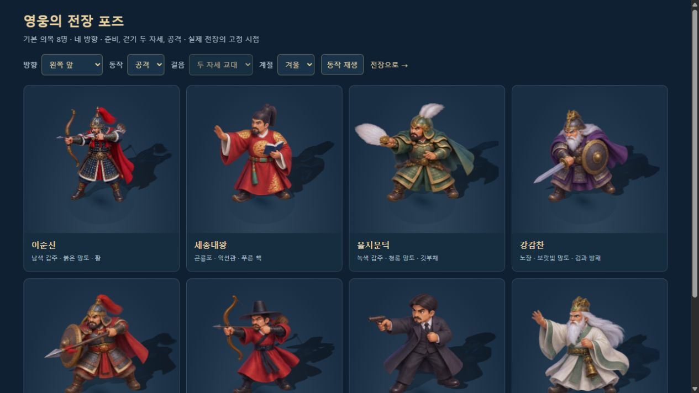

# 기본 영웅 8명의 방향별 전장 그림

2026-10-10. 세종대왕·을지문덕·강감찬·권율·곽재우·안중근·단군왕검에 각각 16포즈, **새 그림 112개**를 추가했다. 기존 이순신과 합쳐 **기본 의복 영웅 8명 × 16 = 128포즈**를 정식 게임과 자유 전장에 연결했다. 건물은 모든 단계에서 높이 1.2칸을 유지한다.



## 표현과 동작 범위

승인된 영웅 시트와 이순신 포즈를 기준으로 차가운 환경광, 주홍·남색·청록·보라·상아빛 옷, 오래된 금색 장비와 부드러운 명암을 맞췄다. 익선관과 책, 깃부채, 검·방패, 창·방패, 갓과 활, 외투와 권총, 백발과 도포 등 영웅별 실루엣을 유지한다.

각 시트는 네 방향 × 준비·걷기 A·걷기 B·공격의 4×4 구성이다. 열은 오른쪽 앞·오른쪽 뒤·왼쪽 뒤·왼쪽 앞 순서다. 실제 카메라의 화면 방향과 영웅의 월드 방향을 비교해 열을 선택하고, 시뮬레이션의 이동·공격 상태로 행을 선택한다. 걷기 자세는 초당 5.5회 교대한다.

걷기는 **두 자세를 교대하는 제한된 프레임 애니메이션**이다. 생성 그림의 모든 영웅이 정확한 좌·우 반대 발걸음을 가진 것은 아니며, 긴 보행 주기나 공격 준비→타격→회수의 연속 동작은 이번 범위에 포함하지 않는다. 특별 의복 16종과 병력·적장은 기존 그림의 색상 변형·좌우 전환을 유지한다. 평면 모드는 기존 영웅 시트를 사용한다.

## 원본·배포 그림·최종 프롬프트

**내장 imagegen의 identity-preserve 생성과 precise-object-edit 수정**으로 제작했다. 기존 영웅 그림은 얼굴·복식 기준, 이순신 시트는 화풍·고정 시점 기준으로 사용했다. 곽재우·안중근·단군은 수정한 을지문덕 시트를 여백 배치 기준으로 추가 참조했다. 원본 PNG를 그대로 보존했고, Sharp는 WebP 인코딩과 픽셀 검사에 사용했다.

| 영웅 | 배포 그림 | 원본 PNG | 최종 프롬프트·수정 이력 |
|---|---|---|---|
| 세종대왕 | [sejong-directions-v1.webp](../assets/3d/fixed/sejong-directions-v1.webp) | [원본](../assets/3d/fixed/source/sejong-directions-v1.png) | [프롬프트](../assets/3d/fixed/sejong-directions-v1.prompt.json) |
| 을지문덕 | [eulji-directions-v2.webp](../assets/3d/fixed/eulji-directions-v2.webp) | [원본](../assets/3d/fixed/source/eulji-directions-v2.png) | [프롬프트](../assets/3d/fixed/eulji-directions-v2.prompt.json) |
| 강감찬 | [gang-directions-v1.webp](../assets/3d/fixed/gang-directions-v1.webp) | [원본](../assets/3d/fixed/source/gang-directions-v1.png) | [프롬프트](../assets/3d/fixed/gang-directions-v1.prompt.json) |
| 권율 | [gwon-directions-v1.webp](../assets/3d/fixed/gwon-directions-v1.webp) | [원본](../assets/3d/fixed/source/gwon-directions-v1.png) | [프롬프트](../assets/3d/fixed/gwon-directions-v1.prompt.json) |
| 곽재우 | [gwak-directions-v1.webp](../assets/3d/fixed/gwak-directions-v1.webp) | [원본](../assets/3d/fixed/source/gwak-directions-v1.png) | [프롬프트](../assets/3d/fixed/gwak-directions-v1.prompt.json) |
| 안중근 | [ahn-directions-v1.webp](../assets/3d/fixed/ahn-directions-v1.webp) | [원본](../assets/3d/fixed/source/ahn-directions-v1.png) | [프롬프트](../assets/3d/fixed/ahn-directions-v1.prompt.json) |
| 단군왕검 | [dangun-directions-v1.webp](../assets/3d/fixed/dangun-directions-v1.webp) | [원본](../assets/3d/fixed/source/dangun-directions-v1.png) | [프롬프트](../assets/3d/fixed/dangun-directions-v1.prompt.json) |

이순신 원본·프롬프트는 기존 [고정 전장 프롬프트 기록](FIXED_BATTLE_ART_PROMPTS.json)에 있다. 을지문덕 v1은 경계 문제를 발견한 제작 이력으로 보존하며 전투에는 **v2만** 사용한다. 새 배포 WebP 7장의 합계는 **2,565,298바이트**, 이순신을 포함한 8장은 **3,094,492바이트**다. 품질 90, alphaQuality 100으로 인코딩했고 원본과 배포본의 알파 차이는 0픽셀이다.

## 경계·크기·그림자 처리

생성 시트는 간격이 완전히 일정하지 않다. 등분으로 자르면 발이나 무기가 잘릴 수 있고, 을지문덕 초기 공격 자세의 사각 경계에는 이웃 부채가 들어왔다. 사용자 요청에 따라 **GPT Astra xhigh**로 검토하고 을지문덕은 imagegen으로 간격을 다시 만들었다.

`tools/hero-pose-assets.mjs`가 알파 연결 영역을 검사해 실제 경계를 기록한다. 여덟 시트 모두 큰 캐릭터 영역 16개이며, 알파 41 이상인 이웃 혼입·누락·중복 픽셀은 0이다. `src/3d/hero-pose-data.js`에 각 포즈의 경계를 명시하고, 런타임에서는 그림마다 **사방 12픽셀의 투명 여백**을 둔 캔버스로 분리한다. 축소 mipmap에 이웃 포즈가 들어가지 않는다.

영웅별 준비 자세의 중앙 높이를 공통 배율로 삼아 망토·부채·공격 보폭 때문에 매번 몸이 커지거나 작아지는 것을 줄였다. 발 위치는 하단 24%의 알파 가중 중심으로 잡고, 넓은 공격 자세 네 곳은 Astra 검토에 따른 양발 바닥 중간 X좌표로 보정했다. 본체·투영 그림자·건물 뒤 실루엣은 포즈의 텍스처와 지오메트리를 함께 바꾼다. 일부 새 영웅 시트만 실패하면 해당 영웅은 기존 그림이나 모델로 대체하고 다른 영웅의 포즈는 유지한다.

## 검증 결과

- 기존 검사와 새 동작 검사를 합쳐 **94개 통과**: 자체 14, 3D 41, 고정 그림 15, 정식 통합 16, 스킬 효과 8.
- 별도 자산 검사: **8개 시트·128포즈**, 이웃 혼입·누락·중복 0, 알파 변경 0. [픽셀 검사](HERO_POSE_ASSET_VALIDATION.json).
- 실제 영웅 루트 8명의 128포즈 선택, 공통 픽셀 배율·발 기준점, 본체/그림자/가림 그림 동기화, 시트 일부 누락과 공유 자원 정리를 자동 검사했다.
- 비교 화면의 조작으로 128포즈를 선택하고 사계절·재생/정지를 확인했다. 실제 자유 전장에서 세종대왕·안중근을 편성해 이동·교대·5파도까지 교전을 확인했다. [실제 전투](screenshots/hero-poses-battle-sejong-ahn.jpg).
- 새 단일 HTML의 정식 동래성에서 기존 편성 이순신·세종대왕을 로딩하고 일시정지했다. `fixedArtStatus=ready`, `heroPoseStatus=ready`, `heroPoseCount=8`을 확인했다. [정식 전장](screenshots/hero-poses-release-battle.jpg).
- 정식 전장과 비교 화면을 414×896에서 확인했다. 가로 넘침은 없었고 비교 화면의 길게 뻗은 부채도 잘리지 않았다. [정식 모바일](screenshots/hero-poses-release-mobile.jpg), [비교 모바일](screenshots/hero-poses-mobile-attack.jpg). 실제 휴대폰 기기 검증은 남아 있다.
- 검사 탭의 콘솔 경고·오류는 0이었다. 기존 사용자 전투는 보존했고 모든 게임 검증은 `mute=1`로 진행했다. 정식 검증에서는 승패 보상을 발생시키지 않았다.
- 서버용 번들과 단일 HTML 빌드 성공. 단일 HTML **22,471,662바이트**에 여덟 포즈 시트를 각각 한 번 포함하는지 확인했다. `file://` 직접 실행은 이번에 검증하지 않았다.

전체 요약은 [HERO_DIRECTIONAL_ART_VALIDATION.json](HERO_DIRECTIONAL_ART_VALIDATION.json)에 있다.

```bash
node tools/hero-pose-assets.mjs
node tools/test-fixed-art.mjs
node tools/build-3d.mjs
node tools/build.mjs
```

원화가 바뀌면 검사 결과를 검토한 뒤 `node tools/hero-pose-assets.mjs --write`로 메타데이터를 갱신한다. PNG에서 배포 그림을 재생성하려면 `tools/prepare-fixed-art.mjs`를 사용한다. 픽셀 분석·인코딩 도구는 Sharp가 필요하다.

## 비교 화면과 다음 작업

서버 실행 후 [영웅 전장 포즈 비교](http://localhost:8080/dev/3d-hero-pose-review.html)에서 방향·동작·걷기 자세·계절을 바꿀 수 있다. 실제 전투와 같은 `FixedBattleArt.attachUnit/updateUnit`을 사용한다. 기존 관절 모델 비교 도구도 보존한다.

다음 미술 범위는 병력·적장·의복의 방향별 그림, 더 자연스러운 보행과 공격 연결, 이동 좌표를 유지한 길 경계·지형 반복 개선이다. 현재 그림의 생성된 복식과 장비는 게임용 양식화 표현이며 정밀 역사 복원 자료로 취급하지 않는다.
