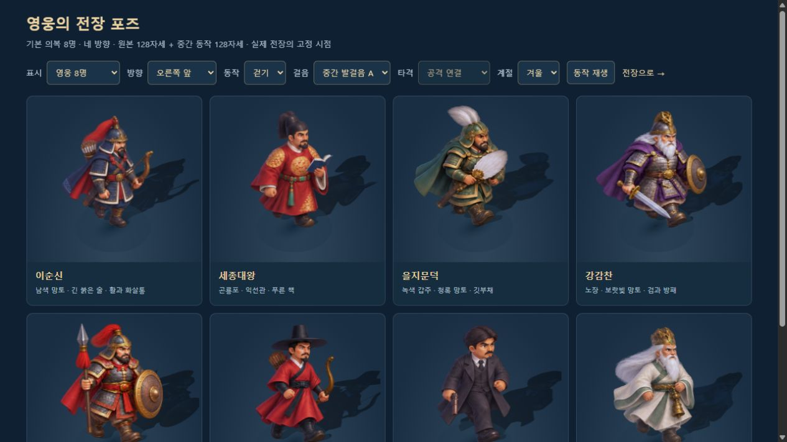
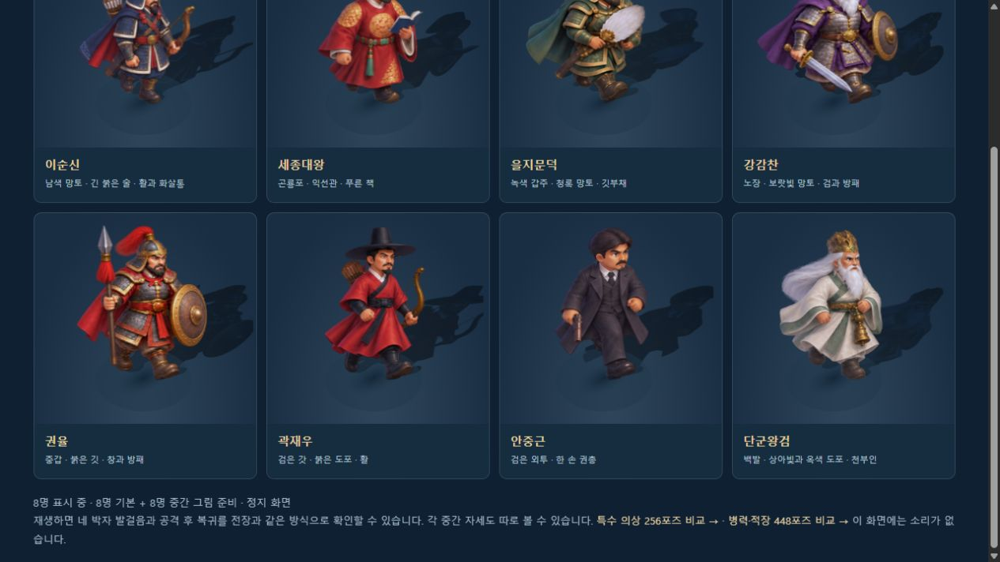
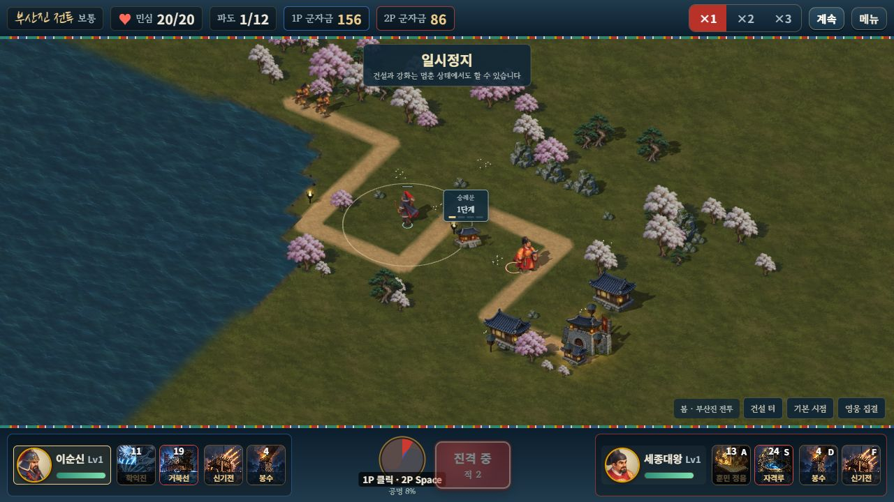
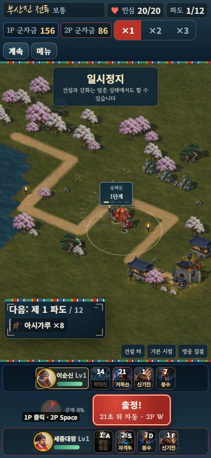

# 기본 영웅 중간 동작 원화

> 이 문서는 기본 중간 128장 작업 당시 기록이다. 이후 특수 의상 중간 256장을 추가해 모든 영웅 외형은 768자세·전체 전장용 준비 그림은 1,216장이 됐다. 최신 범위와 검증은 [특수 의상 중간 원화](SKIN_INBETWEENS.md)를 따른다. 아래 연결된 공통 자산/동작 JSON은 최신 384장/19개 검사로 갱신되며, 당시 224개 검사는 별도 릴리스 JSON에 보존한다.

2026-10-11. 확정된 기본 영웅 8명에 새 중간 자세 128장을 추가했다. 기존 기본 영웅 128장·특수 의상 256장·병력 448장, 총 832장의 원본·배포 그림·좌표는 변경하지 않았다. 현재 전장용 준비 그림은 **960장**이고, 기본 영웅은 한 명당 **네 방향 × 여덟 자세 = 32장**, 총 256장을 사용한다.

## 적용 범위

| 동작 | 실제 그림 순서 |
|---|---|
| 준비 | 기존 준비 자세 |
| 걷기 | 기존 왼발 펼침 → 새 중간 A → 기존 오른발 펼침 → 새 중간 B |
| 공격 | 기존 타격·발사 → 새 타격 후 자세 → 새 복귀 자세 → 준비 또는 이동 |

새 그림은 이순신·세종대왕·을지문덕·강감찬·권율·곽재우·안중근·단군왕검의 **기본 의복**에 적용한다. 이순신은 승인된 v2의 남색 망토·활·화살통을 따르고 권율의 붉은 망토·창·방패와 구분한다. 단군은 기존 천부인과 매달린 방울을 유지한다.

**특수 의상 16종과 병력 28종에는 이번 중간 원화를 적용하지 않았다.** 이들은 기존 준비·두 이동·공격 그림과 거리 기반 동작을 유지한다. 의상 원화가 없는 경우 다른 옷의 중간 그림이 섞이지 않는다. 평면 모드와 메뉴도 앞선 승인 그림을 유지한다. 이번 작업을 전 캐릭터의 긴 프레임 애니메이션 완성으로 간주하지 않는다.

## 원화와 제작 기록

내장 imagegen으로 새 원화를 제작하고, 잘못 나온 발 교대·무기·손·발사 후 활 상태는 원화를 다시 생성해 교체했다. 코드로 팔·발·색·알파 마스크를 그려 고치지 않았다. 최종 픽셀 처리는 개별 경계의 정확한 자르기, 원본별 동일 비율 축소, 투명 여백과 시트 배치다.

| 영웅 | 최종 배포 크기 | 바이트 | 선택한 원화 |
|---|---:|---:|---|
| 이순신 | 1266×1416 | 1,233,742 | v1의 A/복귀, 별도 B와 화살 없는 발사 후 자세 |
| 세종대왕 | 1232×1460 | 1,158,632 | v1의 A, 별도 B, 두 팔을 유지한 타격 후/복귀 |
| 을지문덕 | 997×976 | 586,606 | v1의 A/타격 후/복귀와 별도 B |
| 강감찬 | 1333×1374 | 1,196,386 | 칼 한 자루의 수정 A, 별도 B, v1의 타격 후/복귀 |
| 권율 | 1322×1351 | 1,261,382 | 창·방패 손을 유지한 수정 A, 별도 B, v1의 타격 후/복귀 |
| 곽재우 | 1045×1291 | 888,734 | v1의 A/복귀, 별도 B, 화살 없이 활시위를 놓은 타격 후 |
| 안중근 | 1030×1236 | 685,184 | v1 A 앞쪽 첫 칸 + 수정 A 뒤 두 칸 + 별도 왼쪽 앞 한 장, 별도 B, v1의 타격 후/복귀 |
| 단군왕검 | 1058×1127 | 800,114 | v1의 A/타격 후/복귀와 별도 B |
| 합계 | 8개 무손실 WebP | **7,810,780** | **128개 최종 자세** |

원본 PNG와 각 최종 프롬프트는 [`assets/3d/fixed/inbetweens/source/`](../assets/3d/fixed/inbetweens/source/)에 보존한다. 같은 폴더에 검토용 원화와 사용하지 않은 칸이 포함된 시트도 있다. **파일 전체가 승인된 것은 아니며**, 실제 선택 칸·원본 경계·배율·기준점은 [제작 설정](../tools/inbetween-specs.json)과 [자산 검사](INBETWEEN_ASSET_VALIDATION.json)의 `origins`가 기준이다. 이순신 중간 시트 v2는 보존용으로만 남겼다.

`tools/inbetween-assets.mjs --write --preview`가 선택 칸을 24px 여백으로 묶고 배포 WebP·정적 좌표·검사 JSON·걸음/공격 접촉 비교 그림을 만든다. `--write` 없이 실행하면 저장된 결과와 재현 결과가 같은지 검사한다. 기준 높이는 원래 영웅 준비 자세와 같으며 각 방향의 몸통·머리 위치를 비교해 발 기준점을 보정했다. 발·망토 외곽의 중심을 몸의 중심으로 오인해 좌우로 흔들리는 문제를 줄였다.

새 128장의 이웃 혼입·누락·중복·시트 외곽 접촉·배포 알파 차이·보이는 RGB 차이는 모두 **0**이다. 완전 투명한 픽셀의 숨은 RGB는 동일성 대상이 아니다. 단일 HTML에는 선택한 WebP 8장만 들어가며 원본·폐기 후보·참조 자르기·기계적 포장 PNG 38장은 포함하지 않는지 확인했다.





## 실제 전투 연결

`src/3d/inbetween-data.js`가 추가 네 행의 좌표를 가진다. 원래 네 행 0–3과 새 행 4–7을 함께 사용하므로 기존 포즈 번호와 픽셀은 유지한다. 보행 위상은 실제 이동 거리의 네 구간이며 20·60·120fps에서 같은 거리면 같은 위상이다.

공격은 **실제 타격·발사 시각에 즉시 시작**한다. 공격 지속 시간의 28%까지 기존 발사, 70%까지 타격 후, 이후 지속 시간 + .09초까지 복귀를 사용한다. 새 준비 동작 때문에 피해나 발사를 늦추지 않는다. 전투 명령·피해·투사체·재화·승패 계산은 변경하지 않았다.

선택한 기본 영웅의 추가 시트만 준비한다. 기본 영웅 정체성도 로딩 키에 포함하고, 같은 스냅샷은 준비 Promise를 새로 만들지 않는다. 첫 전투 틱은 코어·병력·의상·중간 그림이 모두 끝날 때까지 기다린다. 게스트는 기다리는 동안에도 후속 스냅샷과 이벤트를 계속 받는다. 전장·영웅 변경 시 살아 있는 영웅과 사망 잔상부터 제거한 뒤 빠진 전용 그림 자원을 해제한다. 이전 요청의 늦은 완료와 종료 후 완료는 새 전장에 붙지 않는다.

기본 영웅 교체·누락 시트·장착 의상 불일치에는 기존 포즈로 대체한다. 같은 영웅을 쓰는 두 플레이어의 개인 재질과 동작 상태도 분리된다. 일시정지 중 늦게 온 공격·체력 감소·기절 신호가 자세를 바꾸던 경계 사례는 표시 상태를 보존하고 재개 때 처리하도록 수정했다.

## 검증

[전체 릴리스 기록](INBETWEEN_RELEASE_VALIDATION.json)에 검사군·기존 전투 SHA·빌드·검토 범위를 함께 남겼다.

- 새 [동작 검사 15개](INBETWEEN_RUNTIME_VALIDATION.json)와 기존 209개, **17개 검사군 224개**를 통과했다. 양측 실제 입력·JSON 소유·같은 영웅 상태 독립·사망/재출전·누락 대체·완료 순서·이전 세대·자원 정리·실제 HUD 첫 틱·게스트 수신을 포함한다.
- 변경 전 기록된 솔로·협동 완주 두 판과 기존 이벤트·피해·수입·승패·스냅샷의 SHA가 같다. 비교에서 제외하는 필드는 이전부터 존재하는 표시 전용 신호뿐이다. `node tools/check-motion-determinism.mjs`로 재현한다.
- Astra xhigh가 미술과 런타임을 검토했다. 지지 발의 반전·팔/칼 중복·창을 든 손·발사 후 활·기준점 지적을 반영했고, 최종 구현의 추가 필수 결함이 없었다. 별도의 두 월드 텍스처 소유 검사도 통과했다.
- [브라우저 기록](INBETWEEN_BROWSER_VALIDATION.json): 비교 화면의 32가지 선택 × 8명 = 256개 DOM 포즈 전환, 실제 네 보행 행과 세 공격 행/준비 복귀, 정지 유지, 사계절을 확인했다. 모든 자세를 한 번 쓴 뒤 265 지오메트리·257 텍스처를 유지했다. 이는 검토 화면의 자원 개수이며 실제 기기의 RAM·성능 보증이 아니다.
- 최신 단일 HTML에서 **로컬 2인**으로 진입해 1P 마우스·2P 방향키 이동, 학익진·훈민정음, 2P E 건설과 개별 자금 **156/86**, 첫 파도의 실제 병력과 중간 걸음 표시를 확인했다. 승패 보상 전 멈췄으며 일반 8080 사용자 저장은 건드리지 않았다.
- 실제 단일 HTML 게임의 **414×896** 표시와 가로 넘침 0, 기본 1280×720 복원을 확인했다. 비교 탭의 작은 화면 변경은 이번 시도에 적용되지 않았다. 두 탭 콘솔 경고·오류는 0이다. 실제 휴대폰·외부 네트워크 확인은 별도 범위다.





두 빌드와 내장 검사를 통과했다. 단일 HTML은 **53,833,851바이트**이며 방향/중간 시트 **60장**, 메뉴 1장·지면 3장·계절 수목 1장·물 1장·기술 시트 4장을 각각 한 번 포함한다. 원본 PNG를 배포에 중복 포함하지 않는다. `dist/`는 Git 제외 생성물이므로 받은 저장소에서 다시 빌드한다.

```bash
node tools/inbetween-assets.mjs
node tools/test-inbetweens.mjs
node tools/check-motion-determinism.mjs
node tools/build-3d.mjs
node tools/build.mjs
node tools/verify-embedded-art.mjs
```

서버 실행 후 [8영웅 256자세 비교](http://localhost:8080/dev/3d-hero-pose-review.html?mute=1)에서 방향·걸음·타격 단계와 재생을 선택할 수 있다. 특수 의상·병력의 추가 중간 원화, 더 긴 동작 주기, 새 흉상은 후속 미술 범위로 남긴다.

구현과 검증 자료는 [`71500dd`](https://github.com/evilmuff0805-create/Td/commit/71500dd613a7b5a3c104db0c664c33e5fedb2847)로 기존 작업 브랜치에 푸시했고, `git ls-remote`로 실제 원격 SHA 일치를 확인했다. 상위 프로젝트 리뷰도 같은 내용으로 갱신했다.
