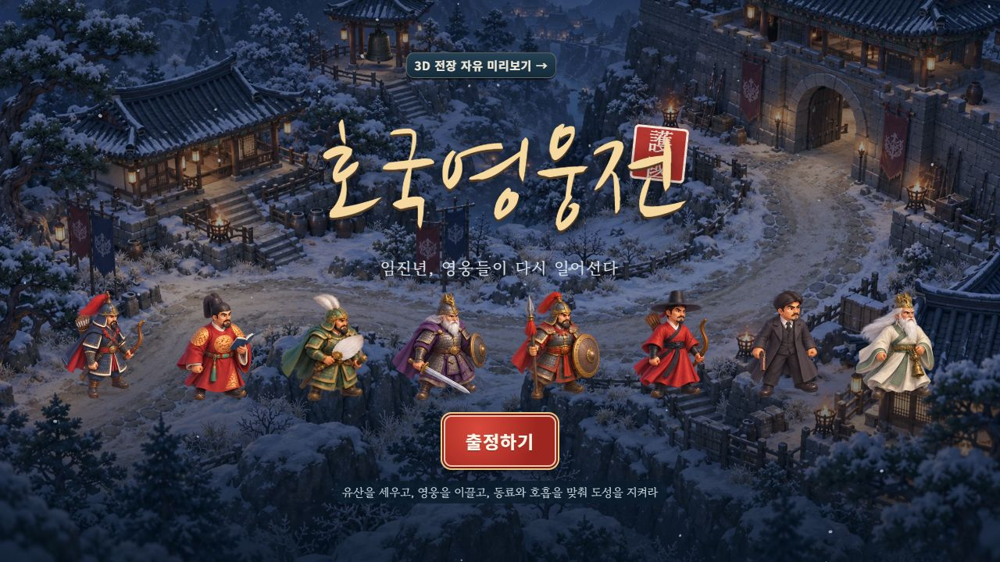
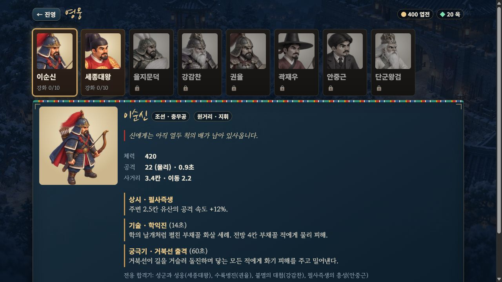
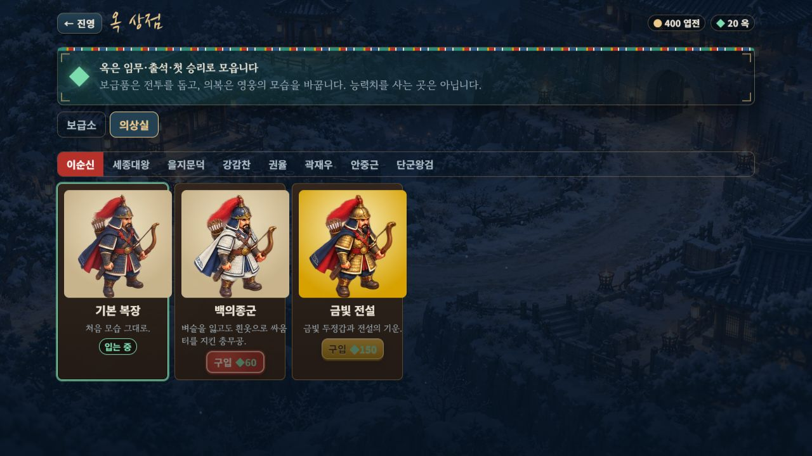
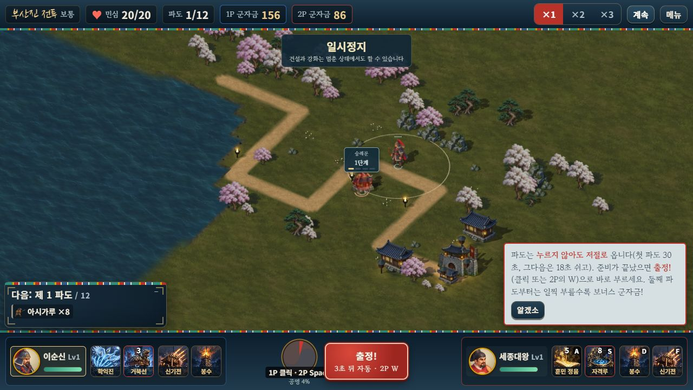
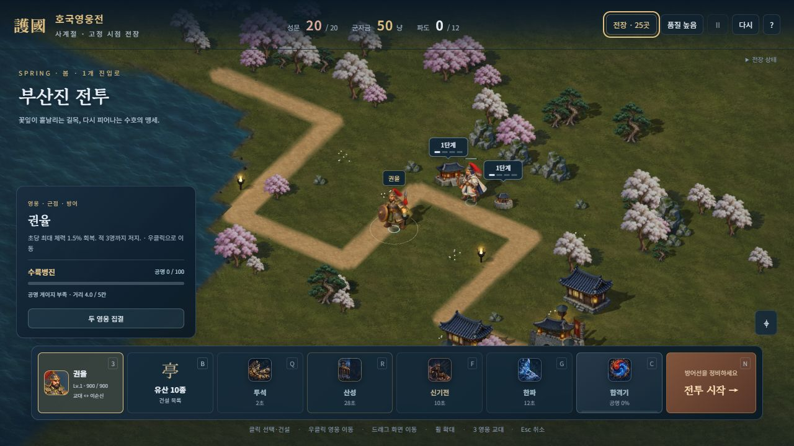

# 메뉴와 전장 영웅의 톤 연결

2026-10-11. 타이틀·영웅 도감·의상실·출전 선택·전투 HUD·평면 모드가 전장에서 확정한 **기본 8명·의상 16종**의 같은 그림을 사용한다. 이순신 v2의 남색 망토·활·화살통과 권율의 붉은 망토·창·방패 구분도 유지한다.

## 적용 방식

각 승인된 방향 시트의 앞쪽 준비 포즈 하나를 잘라 메뉴용 시트로 묶었다. 색상·투명도·원본 픽셀을 바꾸거나 새로 그리지 않았다. 화면에서 전체 방향 시트 24장을 준비하는 대신 메뉴 시트 한 장과 사용한 얼굴 영역을 재사용한다. 얼굴 중심은 24개 포즈에 맞춰 따로 정했고 전신은 원래 발 중심을 따른다.

- 배포 파일: [hero-menu-poses-v1.webp](../assets/illustrated/hero-menu-poses-v1.webp), **1,555,936바이트**.
- 재현: `node tools/hero-menu-assets.mjs --write`. [제작·검사 도구](../tools/hero-menu-assets.mjs).
- 기본 원본·프롬프트: [영웅 방향 그림](HERO_DIRECTIONAL_ART.md), [이순신 v2](YI_TONE_REFINEMENT.md).
- 의상 원본·프롬프트: [특수 의상 방향 그림](SKIN_DIRECTIONAL_ART.md).

초상화는 이 정적 포즈의 얼굴을 확대해서 사용한다. 새 고해상도 흉상이나 추가 방향·중간 동작을 제작한 범위는 아니다. 평면 모드는 기존의 이동·공격 변환을 유지하며 영웅 그림과 의상만 전장 톤에 맞췄다. 평면 배경·병력까지 모두 새 방향 그림으로 전환한 범위도 아니다.

장착 의상이 유효한 영웅에게만 적용되며 상점은 미리보기만으로 의상을 지급하지 않는다. 새 그림을 불러오지 못하거나 크기가 맞지 않으면 기존 기본 그림과 의상 대체 표시를 사용한다. 자유 전장 초상화와 합격기 얼굴도 실제 장착 의상을 따른다.

## 확인 결과

- 24포즈의 보이는 색상 차이·알파 차이 **0**. 원래 크기·발 중심·12px 투명 여백을 유지했다. 원래 832포즈 시트는 변경하지 않았다.
- 새 검사 **8개**와 기존 **201개**, 총 **209개·16군** 통과. 로딩 대기·중복 요청·잘못된 의상·정확한 캔버스 영역·평면 실제 그리기·자유 전장 CSS·누락/크기 오류 대체·프로필 불변을 확인했다.
- 변경 전 솔로·협동 완주 두 판의 피해·기존 이벤트·수입·스냅샷·승패 SHA가 같다. 앞선 표시 전용 `abilityCue`만 비교에서 제외한다.
- 브라우저에서 타이틀 8명, 도감 상세 8명, 의상실 기본/특수/금빛 **24개 표시**를 확인했다. 재화는 엽전 400·옥 20을 유지했고 구입·해금·승패 보상은 발생시키지 않았다.
- 최신 단일 HTML의 로컬 2인에서 양측 새 초상화, 2P 방향키 이동·훈민정음·숭례문 건설·정지를 확인했다. 건설 후 군자금은 **1P 156·2P 86**이다. 평면 모드에서도 로컬 2인 출전·이동·정지와 양측 새 초상화를 확인했다.
- 자유 전장에서 백의종군·행주 산성으로 장착 후 교대하면 초상화도 해당 의상으로 바뀐다. 검사한 세 화면의 경고·오류 **0**, 1280px 가로 넘침 **0**.
- Astra xhigh가 자유 전장 초상화의 세로 늘어남을 발견했다. HUD·합격기 얼굴 요소의 네 크기를 정사각으로 수정했다. 수정 후 데스크톱 HUD 실측 **40×40**, 숨은 합격기 요소의 계산 스타일 **52×52**를 확인했다. 비교 스크린샷의 회화 톤과 로딩 대체·소유 유지에는 추가 필수 문제가 없었다.
- 두 빌드와 자산 단일 포함 검사 통과. 단일 HTML **43,405,057바이트**, 기존 방향 시트 52장과 새 메뉴 시트 1장을 각각 한 번 포함한다.

검증은 별도 `127.0.0.1:8092`에서 진행해 기존 8080의 사용자 기록과 전투 탭을 보존했다. 이번 단계는 1280×720 데스크톱 확인이며 새 414px·실제 휴대폰 검증으로 기록하지 않는다. 앞선 단계에서 브라우저 뷰포트 설정이 적용되지 않은 상태를 확인했다.

[픽셀 검사](HERO_MENU_ASSET_VALIDATION.json) · [런타임 검사](HERO_MENU_VALIDATION.json) · [브라우저 기록](HERO_MENU_BROWSER_VALIDATION.json)

