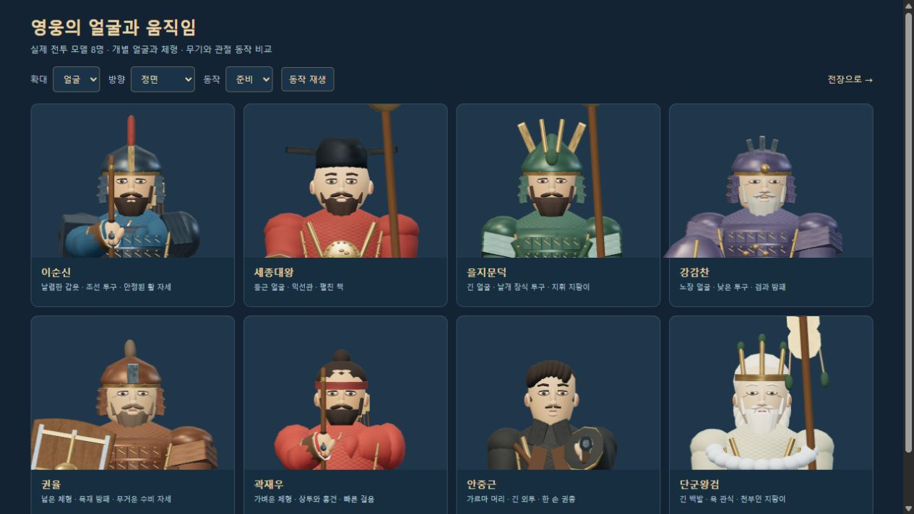
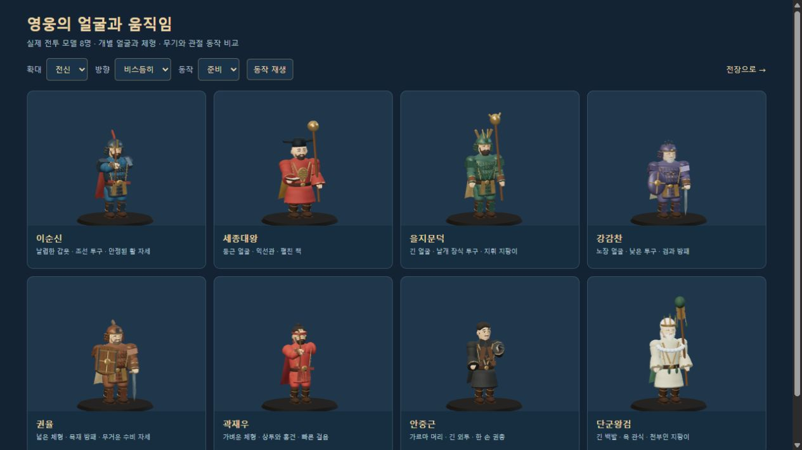
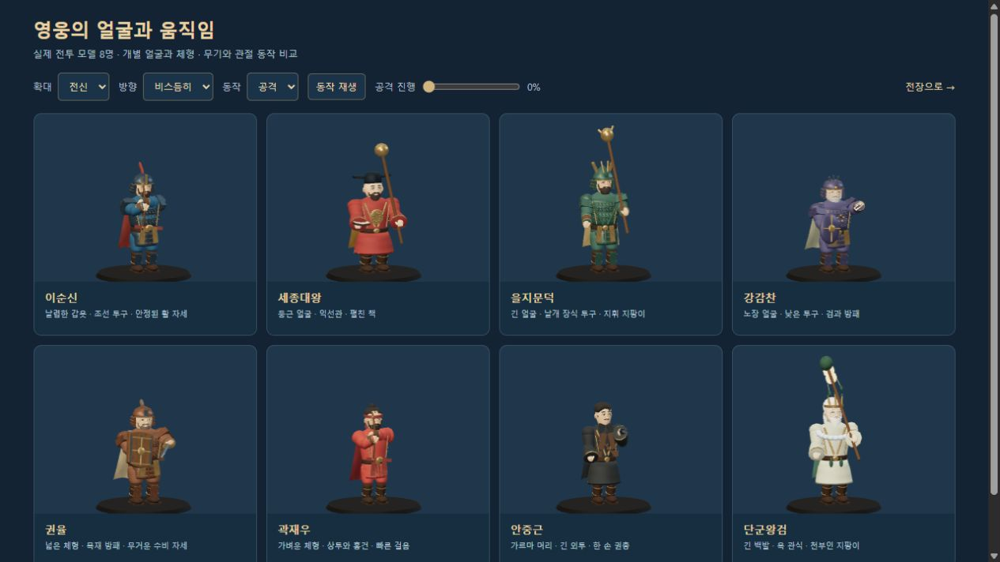
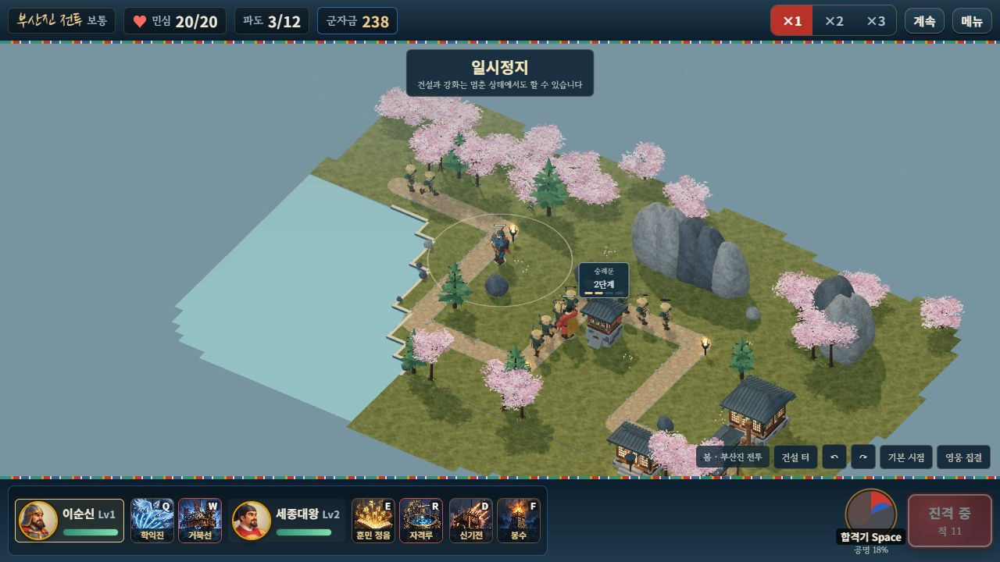
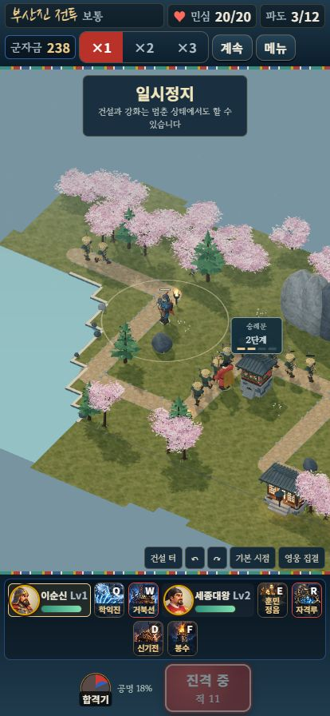

# 영웅별 조형과 무기 동작 · 2026-10-10

영웅 8명의 얼굴 윤곽·체형·머리와 장비를 나누고 실제 전투용 관절 동작을 개선했습니다. 정식 게임·단일 HTML·자유 전장·캐릭터 비교 화면에 같은 모델을 사용합니다. 음악·효과음은 모두 0으로 확인했습니다.

[영웅 확대·회전·동작 비교](http://127.0.0.1:8080/dev/3d-hero-review.html) · [단일 파일 게임](http://127.0.0.1:8080/dist/hoguk.html?mute=1) · [검증 데이터](HERO_MODEL_VALIDATION.json)

이 문서의 파일 해시·화면·성능은 영웅 개선 당시의 기록입니다. 이후 [적군 22종의 조형·동작](ENEMY_MODELS_AND_MOTION.md), 곡면 이목구비와 캐릭터 전용 재질을 추가했습니다. 현재 빌드와 자동 검사 **89개**의 결과는 [캐릭터 얼굴·재질 검증](CHARACTER_SURFACES.md)에 기록했으며, 기존 영웅 동작 검사 41개도 최종 수정 뒤 다시 통과했습니다.



## 인물 구분

| 영웅 | 이번 조형과 동작 |
|---|---|
| 이순신 | 좁은 볼·단단한 턱, 푸른 갑옷·붉은 장식 투구, 안정된 활 자세 |
| 세종대왕 | 둥근 얼굴·넓은 도포, 익선관·펼친 책, 절제된 지팡이 시전 |
| 을지문덕 | 긴 얼굴·키·가는 체형, 날개 장식 투구·지휘 지팡이 |
| 강감찬 | 노장의 눈가·넓은 턱, 낮은 투구·검과 방패, 큰 참격 |
| 권율 | 넓은 체형과 턱, 목재 방패·짧은 투구 장식, 방패를 앞세운 수비 |
| 곽재우 | 가벼운 체형, 상투·홍건, 빠른 보행과 활 동작 |
| 안중근 | 긴 얼굴·가르마 머리, 외투와 어두운 뒷자락, 회전 약실 권총·한 손 조준 |
| 단군왕검 | 긴 백발·노장 얼굴, 옥 관식·천부인 장식 지팡이, 큰 시전 동작 |

별도의 둥근 볼 덩어리를 제거해 연속된 얼굴 곡면을 드러냈습니다. 피부·눈·코·수염도 새 윤곽에 맞췄습니다. `src/3d/hero-design.js`의 비율은 미술 설정이며 공격력·속도·사거리·비용을 변경하지 않습니다.



## 무기와 관절

기존 활은 손과 활 중앙이 떨어지고 시위가 왼손에 고정된 직선이었습니다. GPT 아스트라 xhigh 검토에서 이 문제와 팔 도달 거리를 확인했습니다. 활 중앙을 왼손 소켓 원점에 맞추고, 실제 상박·전완 벡터를 사용하는 두 관절 IK로 양손을 배치했습니다. 오른손의 화살은 왼손 활 중앙을 향합니다.

시위 두 가닥은 고정된 원통 메시의 위치·회전·길이만 갱신합니다. 각 끝은 실제 활 끝과 오른손에 연결되며, 방출 때 당기는 손이 시위 평면을 넘어가지 않습니다. 장전 화살은 방출 순간 숨고 준비 자세로 복원됩니다. 숨긴 소켓의 행렬과 포구는 계속 갱신해 실제 투사체의 출발점을 유지합니다. 가림 실루엣도 같은 부모와 변환을 따릅니다.

영웅에게 발목 관절을 추가하고 다리 길이에 맞춘 보행과 발목 보정으로 발바닥을 수평으로 유지합니다. 준비·걷기·공격은 현재 시간과 상태로 결정하므로 이전 자세나 호출 횟수가 다음 자세에 남지 않습니다. 기존 망토 움직임·피격·사망·소유자 표시·의복 재질·병력 인스턴스 표시는 유지합니다.



## 검증

| 검사 | 결과 |
|---|---|
| 시뮬레이션 자체 점검 | 14개 통과 |
| 3D 모델·지형·표적·효과·자원 | 41개 통과 |
| 정식 세션·저장·협동·의복·실루엣 | 15개 통과 |
| 합계 | 70개 통과 |
| 영웅 구별 | 서로 다른 얼굴 곡면과 체형 8종, 조형 원본 불변 |
| 궁수 연결 | 2명 × 32가지 시간·회전·이동·공격에서 손·활·시위 끝 오차 1e-8 이내, 화살 방향 내적 > .9999 |
| 보행 | 8명 × 40프레임에서 발바닥 높이 0~.09, 디딘 발 < .006, 발목 수평·복제 참조 유지 |
| 숨긴 화살 | 실제 실루엣 부착 → 방출 → 숨긴 포구에서 투사체 생성 → 화살 복원까지 검사 |
| 자유 전장 실제 플레이 | 안중근·곽재우 이동·교대·일반 공격, 홍의 질풍·일곱 발의 총성 시전. 5/12파도, 성문 20/20에서 정지 |
| 정식 단일 파일 | 기존 이순신·세종 편성으로 이동·전투, 숭례문 건설·2단계 강화. 3/12파도, 민심 20/20에서 정지 |
| 모바일 표시 | 414×896, 문서 폭 414, 가로 넘침 0. 2단계 배지 x289.15625/y396.765625, 65×46로 화면 안 배치 |
| 소리·글꼴·오류 | 효과음 0·배경음 0, Black Han Sans 버튼 0, 최종 게임·영웅 비교·성능 화면 console error/warn 0 |
| 묶음 빌드 | 3D 번들과 14,548,814바이트 단일 HTML 생성 |

새로운 다섯 자동 검사는 얼굴·체형 구별, 궁수 연결과 복제, 발바닥 높이와 발목, 자세의 호출 순서 독립성, 숨긴 화살·실루엣·발사점을 확인합니다. 기존 캠페인 25곳의 시뮬레이션도 통과했습니다. 이전 재화 성장 138전투와 두 브라우저 온라인 플레이 전체를 이번에 다시 실행한 것은 아닙니다.

최종 아스트라 검토에서 현재 실행 경로의 추가 결함은 발견되지 않았습니다. 검토에서 제안한 숨긴 화살·실루엣·투사체 통합 검사도 추가해 통과했습니다.





## 성능과 재현

Windows Codex 브라우저, 1280×720, 가을 s12, 같은 기본 카메라, 영웅 2명·유산 없음, 아시가루·사무라이·철포병 128명을 묶어 표시했습니다. 다른 탭에는 일시정지한 검증 전투 2개와 정적인 비교 화면이 있었습니다.

| 병력 | 품질 | FPS | 프레임 간격 p95 | 그리기 호출 | 삼각형 약 | 병력 초기 동기화 |
|---:|---|---:|---:|---:|---:|---:|
| 128 | 높음 | 59 | 17ms | 636 | 771만 | 185ms |

짧은 PC 관측값이며 실제 휴대폰 성능을 나타내지 않습니다. 이전 64명 개별/묶음 비교와 128명 가벼운 품질 측정은 [재질 검증 기록](PAINTED_ENVIRONMENTS.md)에 보존했습니다.

```bash
node tools/selftest.mjs
node tools/test-3d.mjs
node tools/test-campaign.mjs
node tools/build-3d.mjs
node tools/build.mjs
node server/server.js
```

현재 모델은 코드로 조형한 메시와 관절을 사용합니다. 참고 이미지 수준의 전용 피부·머리 재질, 스킨 리깅과 제작 애니메이션은 추가 아트 제작 범위입니다. 실제 휴대폰의 장시간 발열·메모리, 외부 인터넷 두 기기의 장시간 협동, 사람 플레이와 어려움·지옥의 실제 재화 성장 검증도 남아 있습니다.
