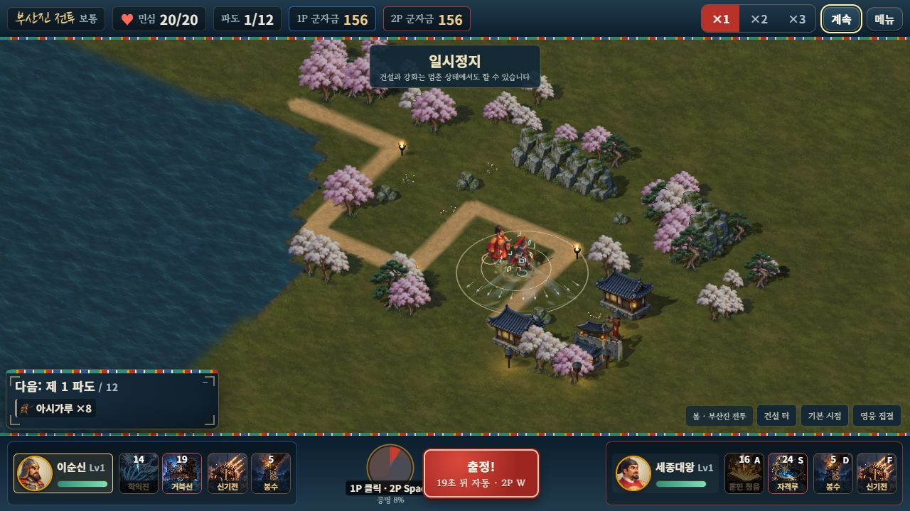
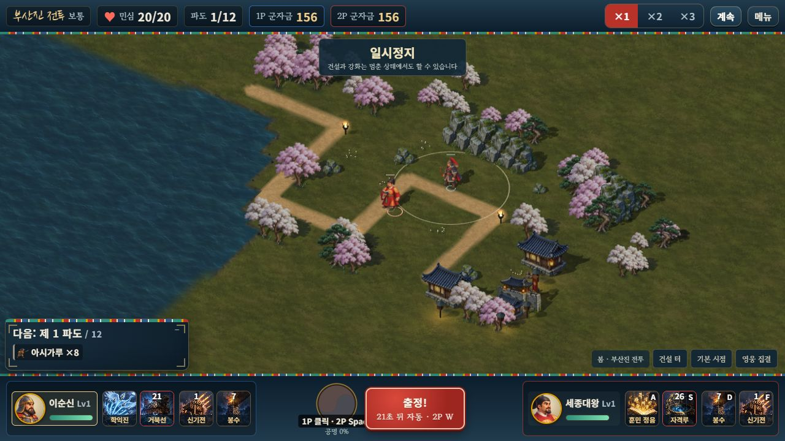
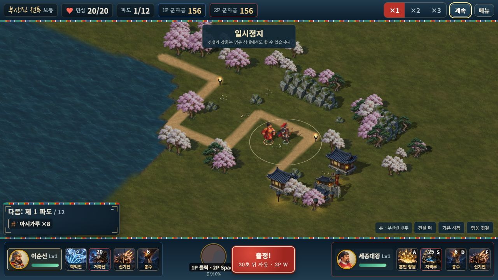
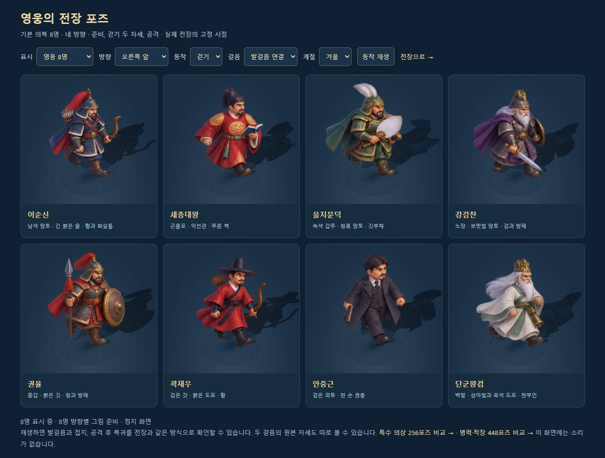

# 발걸음·공격 복귀와 로컬 협동 유지

2026-10-11. 승인된 캐릭터 그림 832개와 모든 단계 높이 1.2칸의 건물을 유지하면서, 고정 시점 전장의 움직임을 다듬었다. 로컬 1P 마우스·2P 방향키/ASDF/E 조작과 전투 계산은 유지한다.

## 변경 범위

- 영웅·특수 의상·왜군·적장·소환수·전령·거북선의 발걸음을 실제 이동 거리에 연결했다. 생성 좌표와 멈춰 있는 시간은 보행으로 세지 않는다. 같은 거리는 프레임률이나 이동 속도에 관계없이 같은 보행 위상이다.
- 기존 두 걸음 사이에 접지 자세를 사용하고, 출발·정지의 작은 몸 기울기와 공격 후 복귀를 연결한다. 그림을 늘이거나 공유 지오메트리를 변형하지 않는다. 거북선과 충차는 사람처럼 뛰거나 기울지 않는다.
- 실제 공격·기술·궁극기·성공한 치유에만 동작 번호, 시작 시각, 지속 시간을 기록한다. 피해와 투사체는 기존 순간에 발생하며 연출 때문에 지연하지 않는다.
- 스냅샷 뒤에 선택적인 동작 정보 세 필드를 추가했다. 이전 패킷도 읽는다. 게스트의 위치 보간 중에도 발걸음이 이어지고, 같은 공격 번호를 받은 것으로 동작을 다시 시작하지 않는다. 소환수도 위치를 보간한다.
- 큰 위치 보정과 영웅의 사망→재출전은 새 위치로 한 번에 적용한다. 정지·기절 중 위치 변화는 보행에 누적하지 않는다. 늦게 도착한 일시정지 패킷도 표시 동작 시계를 진행시키지 않는다.
- 체력 감소에 짧은 피격 반응을 연결하고, 사망은 그림을 발 기준으로 기울여 사라지게 한다. 시체를 계속 작게 줄이던 표현을 제거했다. 재출전하면 이미지·접지·투영 그림자·가림 표시를 복구한다.
- 투영 그림자가 최종 이미지의 위치·기울기·크기를 따르고 지면에 붙는다. 영웅의 건물 뒤 가림 표시도 같은 변환을 사용한다. 상태는 네트워크가 교체하는 개체 객체 대신 각 표시 루트에 저장한다.
- 영웅·병력·의상 비교 화면의 재생에도 전장과 같은 동작을 사용한다. 두 원본 걸음과 16포즈를 정지 상태로 검사하는 기능은 유지했다.

새 해부학적 중간 그림이나 긴 프레임 애니메이션을 추가한 작업은 아니다. 원본 준비·두 걸음·공격 그림의 연결과 변환을 개선했다. 더 긴 보행·무기별 준비/방출 프레임은 별도 자산 제작이 필요하다.

## 검증

동작 검사 15개와 기존 158개, 총 **173개**를 통과했다. 로컬 Session과 실제 GameUI의 2P 방향키·A 기술 경로, 양측 동작 상태 분리, 생성·정지·기절·피격·재출전·반복 공격·게스트 보간·구형 스냅샷·그림자·자원 보존을 포함한다.

변경 전 `2a4da15`에서 솔로 시드 42와 협동 시드 7의 완주 기록을 저장했다. 변경 후 두 전투의 모든 이벤트와 기존 스냅샷 필드, 완료 틱·민심·수입·통계·결과의 SHA-256이 동일하다. `node tools/check-motion-determinism.mjs`로 재현한다.

GPT Astra xhigh 검토에서 늦은 pause 패킷과 가까운 재출전 보간 문제를 발견해 수정하고 회귀 검사를 추가했다. 최종 재검토에서는 추가 필수 결함이 없었다.

브라우저에서는 별도 루프백 포트의 신규 검증 프로필로 실제 로컬 협동을 시작했다. 1P 우클릭 이동과 2P 방향키 이동, 2P A와 1P 학익진 버튼의 독립 시전, 일시정지 유지, 2P E 건설에서 1P 자금 156 유지·2P 자금 156→86을 확인했다. 기존 사용자 프로필이 있는 8080 주소의 저장·구매·승패 보상은 건드리지 않았다. 확인한 전투 탭의 경고·오류는 0이다.

서버 번들과 단일 HTML을 재생성했다. 단일 HTML **45,627,814바이트**, 방향 시트 52장·지형 3장·계절 수목 1장·수면 1장 각각 한 번 포함, 거부된 이전 자산 0이다. 실제 휴대폰이나 외부 네트워크의 두 기기 검증을 완료한 것은 아니다.

[검증 기록](MOTION_REFINEMENT_VALIDATION.json) · [영웅 비교](http://localhost:8080/dev/3d-hero-pose-review.html?mute=1) · [병력 비교](http://localhost:8080/dev/3d-combat-pose-review.html?mute=1) · [의상 비교](http://localhost:8080/dev/3d-skin-pose-review.html?mute=1)

