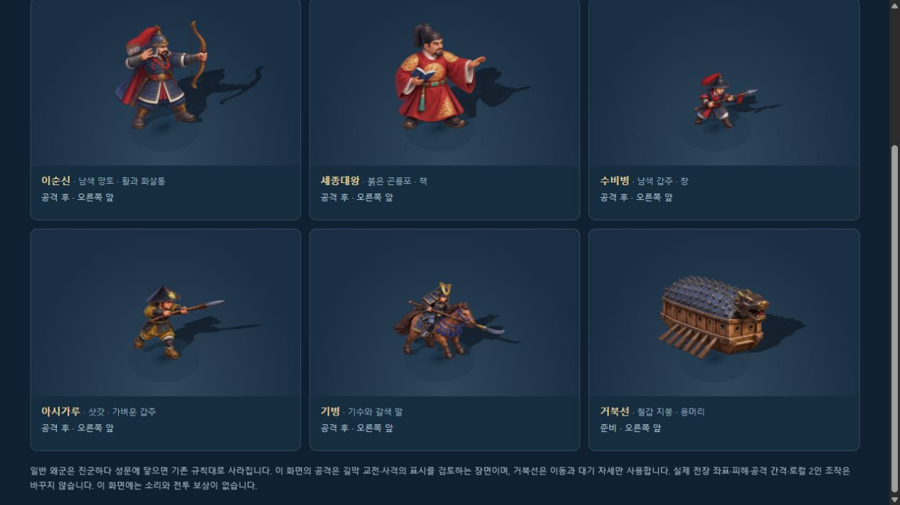
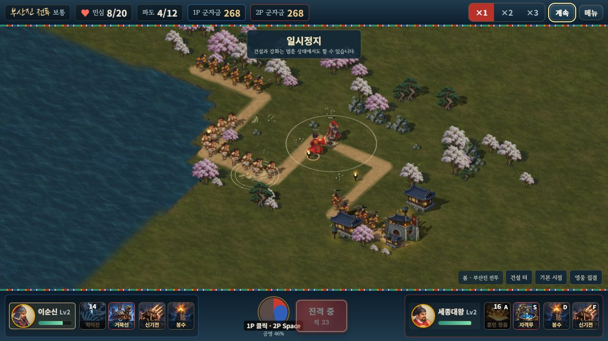
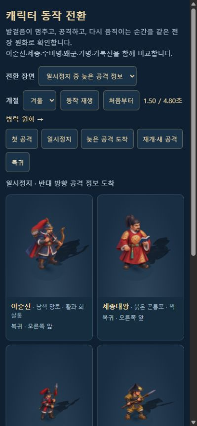

# 이동·정지·공격 전환과 조준

> 2026-10-11 · 승인된 1,664자세를 그대로 사용한 표시 동작 개선

이동 중 멈추면 들려 있던 발을 디딘 뒤 준비 자세로 돌아오도록 연결했다. 방향 경계에서 그림이 번갈아 뒤집히는 현상, 기술 첫 프레임의 잘못된 방향, 일시정지 중 늦게 도착한 조준 정보가 본체와 그림자를 바꾸는 문제도 수정했다. 고정 시점의 2.5D 전장·작은 유산·로컬 2인 조작과 전투 계산을 유지한다.

## 적용 범위

| 상황 | 현재 동작 |
|---|---|
| 이동 → 정지 | 중간 걸음에서 다음 디딤을 거쳐 120ms 뒤 준비 자세로 복귀한다. 실제 위치·이동 거리 위상은 바꾸지 않는다. |
| 정리 중 재이동·공격 | 즉시 새 이동·실제 타격 자세로 전환한다. 발 정리를 기다리며 명령을 늦추지 않는다. |
| 방향 경계 | 바닥 평면에서 8도 여유를 두어 작은 위치·방향 흔들림을 흡수한다. 실제 회전은 네 방향으로 전환한다. |
| 새로운 조준 | 새 공격 신호의 첫 프레임에는 정확한 방향을 즉시 사용한다. 같은 신호의 반복 수신은 경계를 계속 넘기지 않는다. |
| 일시정지 | 표시한 자세·방향·기울기·반동·접지/투영 그림자·발사 원점을 함께 고정한다. 늦은 정보는 재개 때 적용한다. |
| 게스트·높은 화면 주사율 | 정지 서버 시각에서도 양의 화면 시간으로 발 정리를 끝낸다. 60Hz 전투/120Hz 화면의 반복 위치에서 병력·거북선·충차가 준비 자세로 깜빡이지 않게 한다. |
| 거북선·충차 | 인간의 발 들림·기울기·발 정리를 적용하지 않는다. 거북선·전령에 새 공격 행동을 추가하지 않는다. |
| 원화 검사기 | 수동 방향을 선택하면 원화·기울기·반동·발사 원점의 좌우 부호도 함께 바뀐다. |

학익진·영웅 사격의 조준을 본체 배치 **전에** 수집한다. 학익진 효과를 그린 뒤 루트를 돌리던 처리를 없애 그림과 발사 원점이 같은 프레임의 방향을 사용한다. 학익진 `cone` 이벤트에는 선택적인 표시용 `caster` ID만 추가했다. 이전 패킷은 가까운 이순신 한 명을 명확하게 찾을 수 있을 때만 보완하며, 모호하면 다른 영웅을 임의로 돌리지 않는다.

기본 영웅 8명·의상 16종·병력/이동체 28종의 기존 원화·포즈 좌표는 변경하지 않았다. 중간 시트가 없는 대체 외형은 기존 네 행 동작을 유지한다. 일반 적의 진군은 공격을 만들지 않으며 성문 도착 시 즉시 누출·제거되는 규칙도 유지한다.

## 실제 동작 검수 화면

서버 실행 후 [이동·정지·공격 비교](http://localhost:8080/dev/3d-motion-review.html?mute=1)를 연다. 이순신·세종·수비병·아시가루·기병·거북선 여섯 대표가 실제 표시 컨트롤러와 같은 그림을 사용한다. 다섯 시퀀스의 23개 지점을 선택하고 재생/정지·사계절을 비교할 수 있다. 강제 원화 행 선택으로 동작을 흉내 내지 않으며 전투 세션·프로필·보상·음향을 만들지 않는다. 비교를 위해 본체는 중앙에 두고 실제 이동 거리 입력을 재생한다.

## 검증

새 기능 검사 **14개**, 기존 **248개**를 합한 **262개 / 19검사군**을 통과했다. [실행 결과](MOTION_TRANSITION_RUNTIME_VALIDATION.json) · [통합 릴리스 기록](MOTION_TRANSITION_RELEASE_VALIDATION.json).

- 네 박자 중간 자세에서 디딤·준비로 연결, 20/60/120fps의 정지 완료, 정리 중 명령 전환, 60Hz/120Hz 반복 위치, 기절·점프·되감기, 정지 중 늦은 패킷을 검사했다.
- 실제 월드에서 원화·기울기·반동·그림자·총구를 비교하고 세 카메라 높이의 방향 경계와 검사기 수동 방향을 확인했다.
- 실제 로컬 `Session` 양측 기술과 스냅샷의 시전자 분리, 이전 패킷의 모호성, 조준 수집→본체 배치→효과 순서를 검사했다. 같은 이순신 두 명의 겹침은 직접 구성한 세션의 방어 검사이며, 정식 출전 선택 UI가 같은 영웅 중복 선택을 허용한다는 뜻은 아니다.
- Astra xhigh가 확인한 거북선/충차의 반복 위치 깜빡임과 검사기 좌우 부호 불일치를 수정했다. 최종 구현과 새 14개 검사의 독립 재실행을 통과했다.

변경 전 완주 두 판의 **기존 이벤트 필드·기존 스냅샷 필드·피해·수입·승패**를 비교했다. 기준 fixture를 다시 기록하지 않았으며 솔로 시드 42의 SHA는 `197d7cc6c0ab46485874691b0e1a2bee5f4065896a017566c635ef7e25c15721`, 협동 시드 7은 `020eb8c69ee2a24ca286bb925abeace7019e78a27e43a7d8bd36f44a2e4c681b`로 일치한다. 비교에서는 기존 표시용 cue/확장 필드 외에 이번에 추가한 `cone.caster`만 제외한다. 새 ID를 포함한 원시 이벤트 바이트 전체가 이전과 같다고 주장하는 검사는 아니며, 시전자 ID 전달은 별도 실제 세션 검사로 확인한다.

브라우저에서는 **5시퀀스·23지점×6대표**, 사계절·재생/정지, **414×896** 표시를 확인했다. 이순신의 정지 전환은 중간→디딤→준비, 좌우 방향 경계를 오갈 때 그림이 반복해서 뒤집히지 않으며 정지 중 늦은 반대 방향 공격은 재개 전까지 화면을 바꾸지 않는다. 거북선에는 모든 지점에서 공격 자세가 나오지 않는다. 모바일 검수 화면의 가로 넘침은 없었고 기본 크기로 복원했다. [관측 데이터](MOTION_TRANSITION_BROWSER_VALIDATION.json).

최신 단일 HTML의 정상 출전 UI에서 **이순신/세종 로컬 2인**으로 1P 지점 지정 학익진·2P 실제 A키 기술·영웅 집결 이동을 실행하고 일시정지했다. 확인 화면은 4/12파도·민심 8/20·군자금 268/268이다. 이번 UI 검수의 이동 범위는 집결 명령이며 개별 방향키 이동은 자동 Session 검사의 범위다. 승패 화면·해금·구매·승리 보상을 발생시키지 않았다. 검수/정식 게임 두 탭의 콘솔 경고·오류는 0이다.

두 빌드와 단일 HTML 포함 검사를 통과했다. 배포 HTML은 **107,974,162바이트**, 방향/중간 시트 104장·메뉴 1장·지면 3장·수목 1장·물 1장·기술 4장을 각각 한 번 포함한다. 거부 버전과 보존용 중간 PNG 256장은 제외한다. 승인 그림과 기준 fixture는 Git 비교로 불변을 확인했다. `dist/`는 생성물로 Git에서 제외하며 재현 소스·서버 번들·검수 화면·기록을 커밋한다.

## 남은 범위

이번은 기존 원화 사이의 전환을 개선한 작업이다. 더 긴 연속 원화, 장비·옷자락의 프레임 간 미세한 일관성, 큰 초상화, 주변 울타리의 새 변형 원화는 후속 미술 범위다. 실제 기기의 메모리·발열·터치, 외부 네트워크 두 기기의 협동, 약 108MB 단일 파일 최적화도 별도 검증·개선이 필요하다. 브라우저 120Hz 관련 자동 검사는 입력 시간 모형의 회귀 검사이며 실제 120Hz 기기 측정을 대신하지 않는다.
