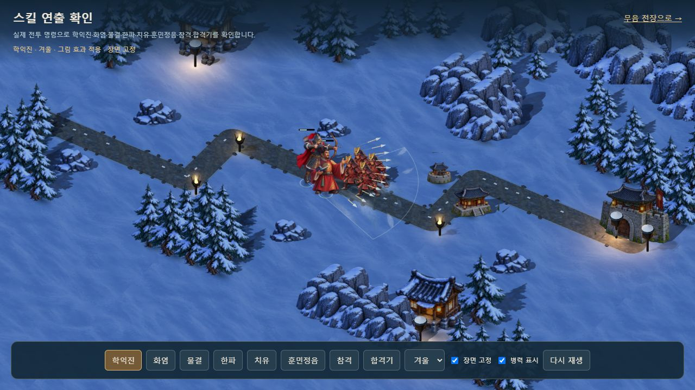
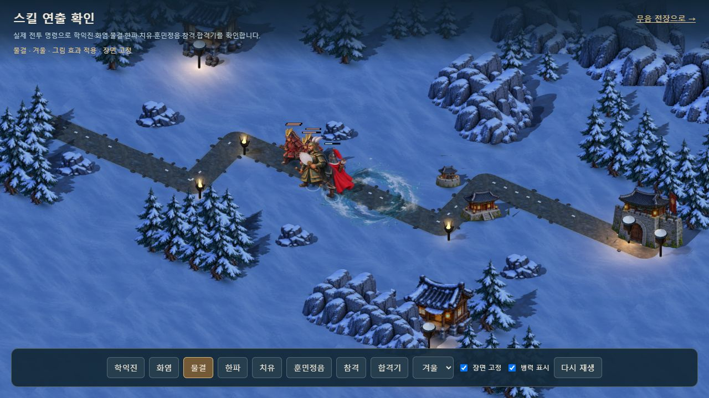
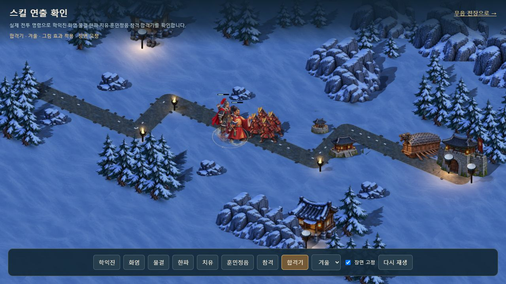
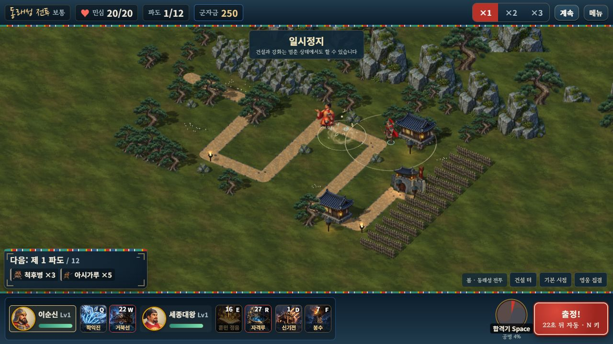

# 고정 시점 전장의 스킬 그림

2026-10-10. 승인된 캐릭터·건물의 색감과 작은 건물 크기를 유지하면서 전투 효과와 이동 병기의 화풍을 맞췄습니다.

## 제작과 파일

내장 `imagegen`으로 투명한 4×2 시트 한 장을 생성했습니다. 새 그림은 여덟 종류의 공용 효과이며, 영웅 기술 16개와 합격기 10종을 각각 별도로 그린 것은 아닙니다. 기존 기술 아이콘은 유지합니다.

- PNG 원본: [`assets/3d/fixed/source/battle-effects-v1.png`](../assets/3d/fixed/source/battle-effects-v1.png), 1774×887.
- 배포용 WebP: [`assets/3d/fixed/battle-effects-v1.webp`](../assets/3d/fixed/battle-effects-v1.webp), 1536×768, 알파 유지, 697,136바이트.
- 사용한 전체 프롬프트와 칸 순서: [`battle-effects-v1.prompt.json`](../assets/3d/fixed/battle-effects-v1.prompt.json).
- `tools/prepare-fixed-art.mjs`는 생성 원본 보존과 배포용 인코딩에만 사용합니다.

| 그림 | 적용 |
|---|---|
| 호박빛 화염 | 화염 착탄, 을지문덕 화공 장판 |
| 푸른 물결 | 살수, 을지문덕·강감찬 합격기 착탄 |
| 옅은 서리 | 한파 장판, 얼음·서리 착탄 |
| 잎 모양 치유 | 치유, 동의보감, 단군·세종 합격기 착탄 |
| 금빛 참격 | 근접 일반 공격의 짧은 접촉 궤적 |
| 부드러운 빛 | 훈민정음, 신성 효과, 번개 착탄, 건설·강화 |
| 은청색 깃결 | 학익진의 실제 부채꼴 안쪽 |
| 주홍·남색 태극 | 합격기 공명 |

그림은 과한 발광을 줄인 일반 알파 합성입니다. 학익진의 화살은 목재·옅은 강철 색으로 표시합니다. 근접 참격은 인물의 몸에 가려지지 않도록 표시 순서를 높이고 체력바보다 먼저 그립니다. 지면형 효과는 기존 깊이 검사를 유지합니다.

## 전투 연결과 정리

`src/3d/battle-events.js`가 정식 캠페인과 자유 전장의 효과 이벤트를 함께 처리합니다. 자유 전장에서 훈민정음·살수·치유 등이 같은 원형 착탄으로 표시되던 차이를 수정했습니다. 합격기는 한 번만 발생하고, 사격은 모델 동기화 후 실제 무기 위치에서 표시합니다. 학익진 방향은 실제 시전자에게 적용합니다.

`src/3d/effect-art.js`가 원본 이미지 로딩을 공유하고, 전장별 GPU 텍스처를 소유합니다. 개별 효과가 끝나도 다른 효과의 텍스처를 해제하지 않습니다. 순간 효과는 최대 64개이며, 지속 화염·한파 장판은 이 상한과 무관하게 시뮬레이션의 만료 시간까지 유지합니다. 그림이 늦게 도착하면 장판만 새 표현으로 교체하고 종료된 순간 효과를 재생하지 않습니다. 실패 시 기존 효과로 복구합니다.

출격 거북선·전령에도 기존 아군 일러스트를 연결했습니다. 경로 좌표·이동 속도·방향·피해·지급 재화는 원래 엔진이 결정합니다. 각 병기의 그림 재질과 접지 그림자는 만료 시 정리하고 공용 그림은 전장 종료까지 유지합니다. 그림이 없는 이동체는 기존 모델을 사용합니다.

## 화면 확인

서버를 실행하고 [스킬 비교 화면](http://localhost:8080/dev/3d-effect-review.html)을 여세요. 여덟 효과·사계절·장면 고정·병력 표시·다시 재생을 사용할 수 있습니다. 비교용 병력은 실제 엔진의 기술과 피해를 받지만, 효과를 비교하기 위해 체력과 기절 시간을 높였습니다. 저장 기록과 음악은 사용하지 않습니다.

배포용 `dist/hoguk.html?mute=1`에서도 동래성 출정 → 훈민정음 조준·시전 → 일시정지/계속을 실제 UI로 확인했습니다. 효과와 캐릭터 그림 모두 `ready`였고 콘솔 경고·오류는 없었습니다. 기존에 열려 있던 전투 탭은 보존했습니다.

비교 화면의 414×896 크기에서 아홉 조작 버튼이 모두 화면 안에 있으며 가로 넘침이 없었습니다. 봄 치유·여름 한파·가을 화염·겨울 효과를 확인했습니다. 이는 배치와 표시 검증이며 목표 기기에서의 프레임 성능 측정은 아닙니다.

## 자동 검증과 빌드

자동 검사 총 88개가 통과했습니다.

| 명령 | 통과 |
|---|---:|
| `node tools/test-effects.mjs` | 8 |
| `node tools/test-fixed-art.mjs` | 9 |
| `node tools/test-3d.mjs` | 41 |
| `node tools/test-campaign.mjs` | 16 |
| `node tools/selftest.mjs` | 14 |

비동기 로딩·종료 후 로딩 완료·그림 실패·UV 범위·공유 자원·효과 상한·일시정지·실제 장판 만료·시전자·사격 순서·합격기 중복·거북선과 전령의 이동/만료를 포함합니다. Astra xhigh 검토에서 확인한 번개·살수·치유 합격기의 착탄 종류 혼동도 수정하고 회귀 검사에 포함했습니다.

`node tools/build-3d.mjs`, `node tools/build.mjs` 모두 성공했습니다. 단일 파일은 새 효과 그림을 포함합니다. 상세 기록은 [`PAINTED_EFFECTS_VALIDATION.json`](PAINTED_EFFECTS_VALIDATION.json)에 있습니다.
