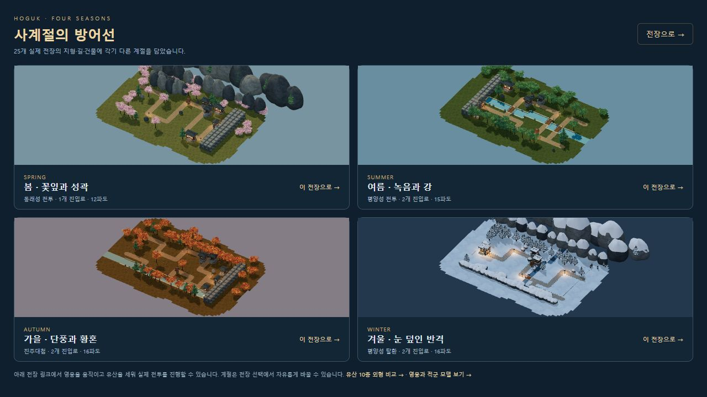
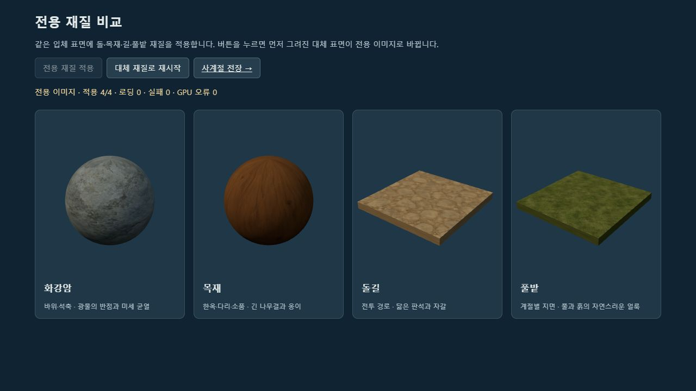
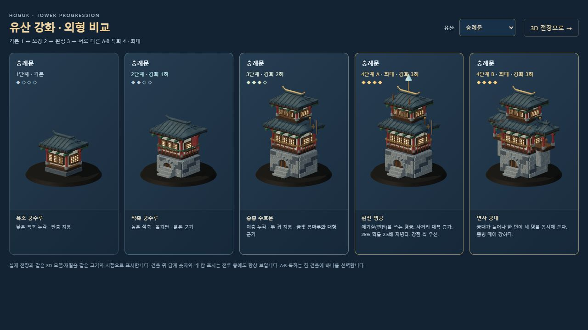
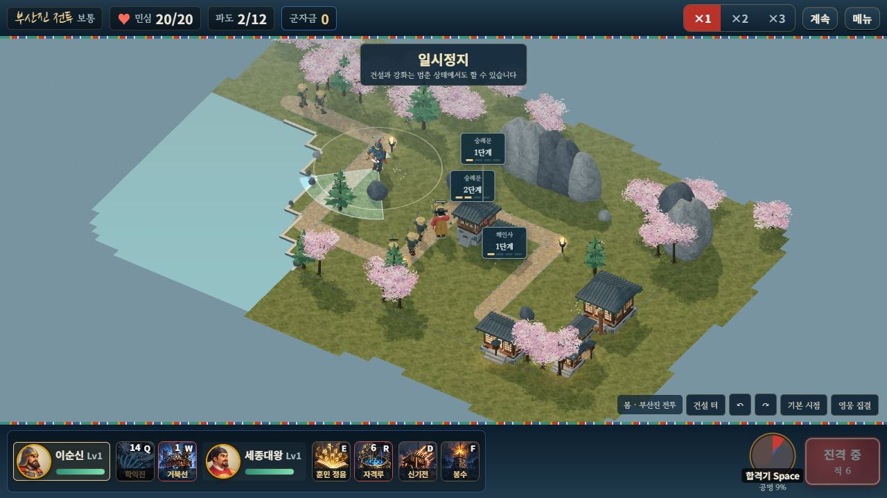
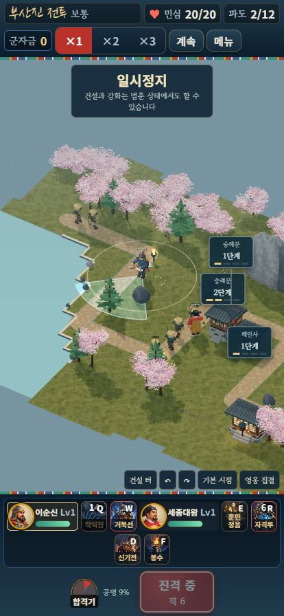
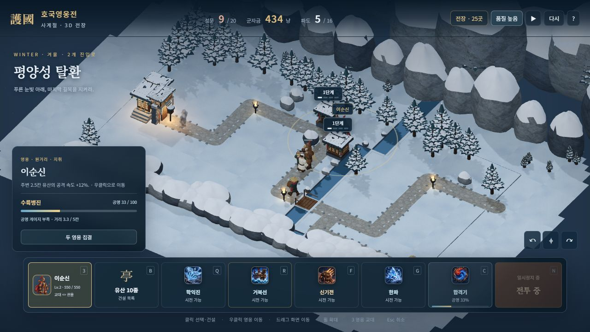
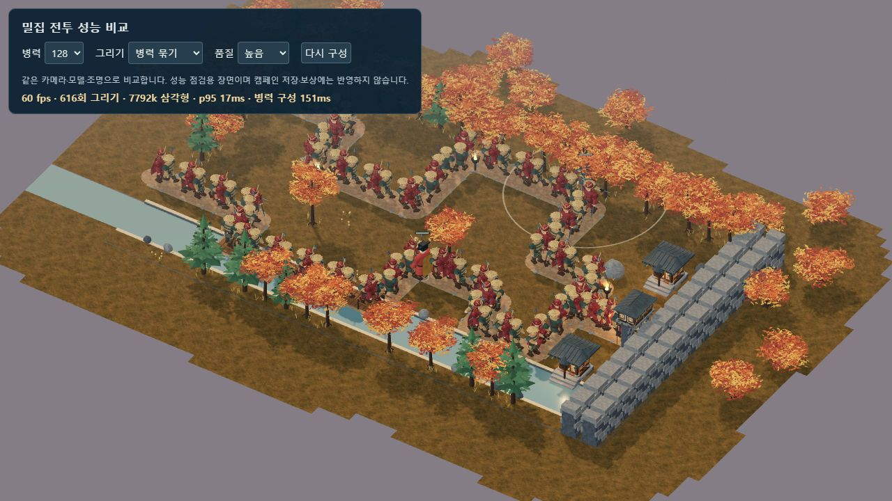

# 전용 재질·주변 지형 개선 · 2026-10-10

이후 영웅별 얼굴·체형·장비와 활·발목 동작을 개선했습니다. 가장 최근의 화면과 70개 자동 검사는 [영웅 조형·동작 검증](HERO_MODELS_AND_MOTION.md)에 기록했습니다.

실제 3D 전투의 돌·목재·길·풀밭에 전용 표면 이미지를 적용했습니다. 바위 조형과 눈의 조명, 길 모서리의 무늬 연결, 전장 밖의 땅·물·나무도 다듬었습니다. 정식 게임·단일 HTML·자유 전장·모델 비교 화면에서 같은 재질을 사용합니다. 현재 검증 프로필의 배경음·효과음은 모두 0입니다.

[정식 게임](http://127.0.0.1:8080/?mute=1) · [단일 HTML](http://127.0.0.1:8080/dist/hoguk.html?mute=1) · [전용 재질 비교](http://127.0.0.1:8080/dev/3d-material-review.html) · [사계절 비교](http://127.0.0.1:8080/dev/3d-season-review.html)

## 적용 범위

- 화강암은 광물의 반점·균열, 목재는 나무결·옹이, 돌길은 닳은 판석·자갈, 풀밭은 풀·흙의 얼룩을 담았습니다. albedo와 요철·거칠기 맵을 분리해 어두운 색을 깊은 홈으로 취급하지 않습니다.
- 바위는 24방향·10개 높이의 윤곽과 부드러운 법선을 사용합니다. 삼각형마다 달랐던 명암을 공유 정점 기준으로 이어 붙이고, 원통 UV로 측면의 무늬 늘어짐을 줄였습니다. 눈은 같은 바위의 위쪽 면을 따라갑니다.
- 길 조각과 둥근 모서리는 같은 월드 좌표의 UV를 사용합니다. 지면에는 넓고 완만한 색 변화를 더하고 반복 간격을 조정했습니다.
- 25개 지도의 경계 바깥에 낮은 지면·물과 작은 나무를 이어 붙였습니다. 바깥 지형은 전투면 아래·물 높이 위에 놓이고, 원래 길·물·건설 가능 셀은 그대로 사용합니다. 주변 나무는 최대 20개로 제한합니다.
- 겨울 햇빛·주변광·보조광·반사광·노출과 지면 색을 조정해 눈의 밝음을 줄였습니다. 봄·여름·가을의 주변광도 낮춰 표면의 입체감이 보이게 했습니다.



## 생성 원본과 실행 파일

이미지 4종은 **기본 내장 imagegen 도구**로 새로 생성했습니다. 입력 이미지 편집이나 외부 3D 생성 서비스는 사용하지 않았습니다. 요청한 분위기를 표면 재질의 방향으로 사용했으며, 참고 화면을 그대로 복사한 재질은 아닙니다.

[최종 프롬프트 4개와 제작 모드](../assets/3d/painted/prompts.json)를 보존했습니다. 생성된 PNG 원본은 프로젝트에 복사했고, 런타임에는 512×512 WebP(품질 88)를 사용합니다. 다음 경로는 이 문서 기준의 상대 경로입니다.

| 표면 | 생성 원본 | 게임 실행 파일 | 실행 파일 바이트 |
|---|---|---|---:|
| 화강암 | [granite-v1.png](../assets/3d/painted/source/granite-v1.png) | [granite-v1.webp](../assets/3d/painted/granite-v1.webp) | 98,548 |
| 목재 | [timber-v1.png](../assets/3d/painted/source/timber-v1.png) | [timber-v1.webp](../assets/3d/painted/timber-v1.webp) | 36,126 |
| 돌길 | [road-v1.png](../assets/3d/painted/source/road-v1.png) | [road-v1.webp](../assets/3d/painted/road-v1.webp) | 77,244 |
| 풀밭 | [ground-v1.png](../assets/3d/painted/source/ground-v1.png) | [ground-v1.webp](../assets/3d/painted/ground-v1.webp) | 105,812 |

실행 재질 합계는 317,730바이트입니다. 이미지는 한 번 디코딩해 공유하고, 계절별 지면 색은 선형 공간에서 곱한 뒤 sRGB로 저장합니다. 겨울 눈 지면은 기존 전용 대체 맵을 사용합니다. 이미지를 읽지 못하거나 DOM 없는 검사 환경이면 기존 절차적 표면을 유지합니다. 단일 HTML에는 네 WebP를 모두 data URI로 포함합니다.





## 발견한 결함과 수정

실제 겨울 화면에서 바위에 수평 줄무늬가 남아 GPT 아스트라 xhigh의 읽기 전용 검토를 받았습니다. 이미 GPU에 업로드된 128×128 DataTexture를 나중에 512×512로 바꾸면 저장 공간을 다시 할당하지 않는 문제가 확인됐습니다. albedo의 대체 맵을 처음부터 512×512로 만들고, 이미지 디코딩도 512로 고정했습니다. 요철·거칠기 맵은 기존의 작은 해상도를 유지합니다. 텍스처 객체를 보존하므로 먼저 복제된 의복과 캐시 모델에도 적용됩니다.

후속 검토에서 바위 꼭대기의 임의 U값이 원통 이음새 판정에 섞이는 문제도 확인했습니다. 꼭대기를 제외한 정점으로 이음새를 판정한 뒤 꼭대기 U를 이웃의 중간값으로 설정했습니다. 여러 seed의 삼각형 UV 범위와 정점 색 연속성을 자동 검사했습니다.

개발용 재질 비교 화면은 먼저 대체 재질을 GPU에 그린 다음, 사용자가 버튼을 눌러 새 이미지를 적용합니다. 돌·목재의 sRGB 유지와 길·풀밭의 Linear-sRGB→sRGB 전환을 포함한 늦은 로딩 검사를 실제 WebGL에서 수행했습니다. 네 종류 모두 적용 완료, 로딩·실패·GPU 오류·console 경고/오류 0을 확인했습니다.

## 검증 결과

| 검사 | 결과 |
|---|---|
| 시뮬레이션 자체 점검 | 14개 통과 |
| 3D 재질·지형·UV·전체 모델·관절·조준·효과·자원 | 36개 통과 |
| 정식 세션·저장·협동·스냅샷 | 15개 통과 |
| 25개 지도 외곽 | 원래 셀 침범 0, 경계의 땅/물 유형 연결, 외곽 높이·모든 정점 유효 |
| 단일 HTML의 부산진 전투 | 숭례문 건설·2단계 강화·해인사 건설·영웅 이동·학익진 시전·2파 진입, 민심 20/20 |
| 414×896 브라우저 화면 | 숭례문 추가 건설, 군자금 70→0, 문서 폭 414px, 가로 넘침 0, 세 단계 배지 비겹침 |
| 사계절 비교 | 재질 9개 적용, 실패·미완료 0, 네 계절의 실제 전장 렌더링 |
| 겨울 자유 전장 | 5/16파 진행 중 성문 9/20, 높음→가벼움→높음 전환, console 경고/오류 0; 완주 검증에 포함하지 않음 |
| 소리·글꼴 | 배경음 0·효과음 0 유지, 이전 Black Han Sans로 돌아가지 않음 |
| 묶음 빌드 | 최신 3D 번들과 14,538,347바이트 단일 HTML, 외부 painted WebP 경로 0 |

이번에 추가한 네 자동 검사는 초기 텍스처 치수·작은 요철 맵 보존, 선형 색상 곱·알파·원본 보존, 길 모서리 UV·25개 지도 외곽, 바위 원통 UV·꼭대기·정점 색의 연속성을 확인합니다. 이전 성장 검증 138전투 전체를 다시 실행한 결과로 간주하지 않습니다.







## 이번 버전 성능

Windows PC의 Codex 브라우저, 1280×720, 가을 s12 지도, 같은 카메라·영웅 2명·유산 없음, 아시가루·사무라이·철포병의 같은 비율로 측정했습니다. 다른 탭에는 일시정지된 검증 전투와 정적인 모델 비교 화면이 있었습니다. 아래 수치는 짧은 관측 구간의 결과이며 실제 휴대폰 성능을 나타내지 않습니다.

| 표시 | 병력 | 품질 | 그리기 호출 | 삼각형 약 | FPS | 프레임 간격 p95 | 병력 초기 동기화 |
|---|---:|---|---:|---:|---:|---:|---:|
| 개별 | 64 | 높음 | 5,248 | 486만 | 53 | 33ms | 1,427ms |
| 묶음 | 64 | 높음 | 572 | 486만 | 60 | 17ms | 134ms |
| 묶음 | 128 | 높음 | 616 | 779만 | 60 | 17ms | 151ms |
| 묶음 | 128 | 가벼움 | 319 | 390만 | 60 | 17ms | 147ms |

64명에서 그리기 호출은 약 89.1% 감소했습니다. 주변 나무와 바위 디테일 때문에 삼각형 수는 직전 조형 버전보다 늘었고, 정적 주변 오브젝트를 재질별로 합쳐 그리기 호출 증가를 제한했습니다. FPS는 60 제한과 캐시·관측 순서의 영향을 받으므로 세부 수치 차이를 기기 전반의 성능 향상으로 해석하지 않습니다. [이번 검증 데이터](PAINTED_ENVIRONMENT_VALIDATION.json)와 [직전 모델 데이터](SCULPTED_MODEL_VALIDATION.json)를 따로 보존했습니다.



## 재현과 남은 제작

```bash
node tools/selftest.mjs
node tools/test-3d.mjs
node tools/test-campaign.mjs
node tools/build-3d.mjs
node tools/build.mjs
node server/server.js
```

현재 캐릭터와 건물은 코드로 만든 3D 메시입니다. 캐릭터별 고유 스컬프·피부/머리카락 전용 재질·스킨 리깅·제작된 걷기/공격 애니메이션, 더 자연스러운 지형 경계와 절벽 조합은 추가 아트 제작 범위입니다. 실제 휴대폰의 장시간 발열·메모리, 외부 인터넷 두 기기의 장시간 협동, 사람 플레이 및 어려움·지옥의 실제 재화 성장은 별도 검증이 남아 있습니다. 이번 변경으로 게임 전체가 참고 이미지 품질에 도달했다고 판단하지 않습니다.
