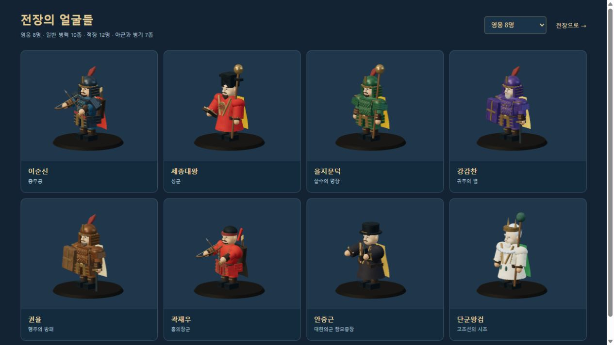
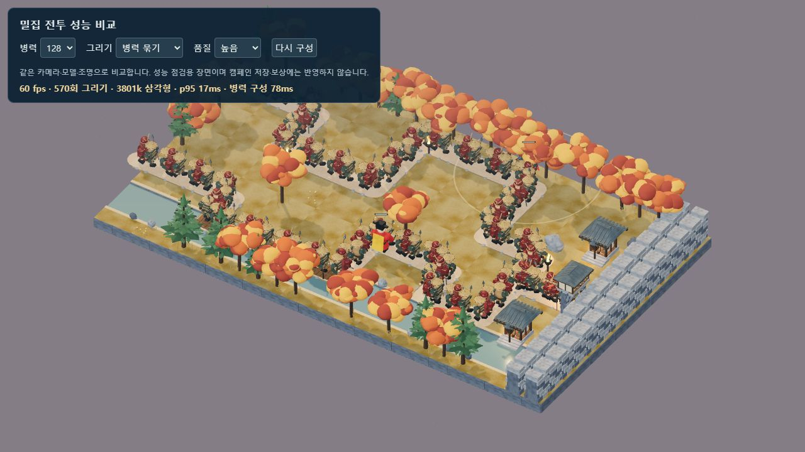
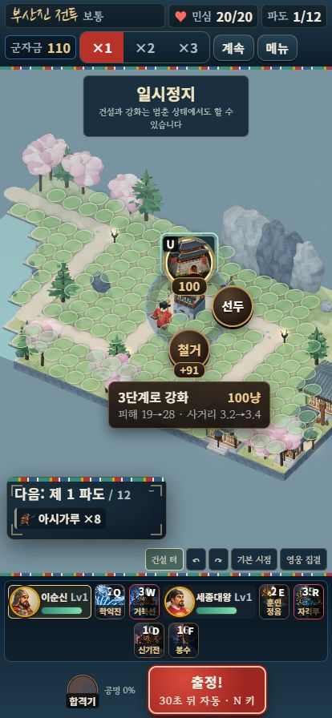

# 호국영웅전 전체 개선 기록 · 2026-10-10

정식 3D 게임의 캐릭터·배경·전투 표시·성장 수급·밀집 전투 성능을 함께 개선했습니다. 실제 게임은 [서버 기본 주소](http://localhost:8080/?mute=1), 혼자/로컬용 단일 파일은 [묶음 빌드](http://localhost:8080/dist/hoguk.html?mute=1)에서 실행합니다. 현재 검증 설정은 음악·효과음 모두 0입니다.

이후 얼굴·옷·관절과 건물 구조를 다시 조형한 최신 모델을 적용했습니다. [최신 모델 화면과 검증](SCULPTED_MODELS.md)에 61개 자동 점검, 모바일 건설과 새 성능 측정을 기록했습니다. 아래 밀집 전투 수치는 이전 모델의 기록입니다.

그다음 돌·목재·길·풀밭 전용 재질, 둥근 바위와 주변 지형을 적용했습니다. 현재의 [전용 재질·배경 검증](PAINTED_ENVIRONMENTS.md)에는 65개 자동 검사와 새로운 성능 측정을 기록했습니다.

그다음 영웅별 얼굴·체형·장비, 실제 손과 연결된 활·시위·화살과 발목 보정 보행을 적용했습니다. [영웅 조형·동작 기록](HERO_MODELS_AND_MOTION.md)에는 당시 70개 자동 검사와 실제 전투·모바일·128명 성능 측정이 있습니다.

이후 [적군 조형·동작 검증](ENEMY_MODELS_AND_MOTION.md)에는 병력 10종·적장 12명의 개별 조형, 말·충차·양손 무기, 실제 사격·타격·치유와 게스트 동작, 당시 자동 검사 82개와 단일 HTML·모바일·128명 측정을 기록했습니다.

현재 [캐릭터 얼굴·재질 검증](CHARACTER_SURFACES.md)에는 인간형 33종의 곡면 이목구비, 다섯 재질, 머리·수염과 의복 16종, 자동 검사 **89개**와 최종 단일 HTML·모바일·128명 측정이 있습니다. 아래 항목의 수치·화면은 각 작업 당시의 기록입니다.

## 캐릭터와 전장

- 영웅 8명의 피부·눈·눈썹·코·귀·수염을 다듬고 개별 색과 특징을 적용했습니다. 세종의 용 문양·도포, 단군의 털 장식·옥, 안중근의 옷깃·주머니, 장수의 갑옷 이음새·리벳·팔 보호구를 추가했습니다.
- 활 당기기, 총 반동, 지팡이 시전, 근접 휘두르기와 몸통 회전을 공격에 연결했습니다. 정식 일시정지 중에는 관절·기술 효과도 멈춥니다.
- 기와·회벽·돌·흙길·자갈길의 색과 거칠기·요철을 나눠 적용했습니다. 계절별 나뭇잎과 가지, 먼 배경의 바위·수목, 등불의 지면 빛 번짐을 보완했습니다. 기존 길과 건설 터를 보존합니다.
- 건물의 1/2/3/4단계·A/B 특화 외형과 단계 배지는 유지하며, 영웅 발밑 고리와 체력막대는 소유자 색으로 구분합니다.



## 전투 표시

한글 자모 낙하·회복 십자·물결·참격 호·신성 기둥을 실제 전투 이벤트에 연결했습니다. 기절·보호막·화상·둔화 표시는 실제 남은 시간을 따르며, 죽은 유닛과 발각되지 않은 은신 적을 노출하지 않습니다. 동시 상태 표시는 24개, 기술 효과는 64개로 제한합니다. 큰 피해와 아군 피해도 구분합니다.

## 성장 수급과 마지막 전투

이전 전투 완주 검사는 전장별 예상 영구 강화 수치를 가정했습니다. 새 검사는 같은 날 새 기록에서 시작해 전투·임무·품계·한 번의 출석으로 얻은 재화만 사용합니다. 모든 영구 강화는 실제 구입 함수로 비용을 차감하고, 결과 저장·불러오기 일치도 검사합니다. 보급품 구입·옥 환전·무료 레벨·미해금 유산은 사용하지 않습니다.

장별 보통 첫 승리 포상을 300/600/900/1,200/1,500냥으로 지급해 25전장 합계 22,500냥을 추가했습니다. 난이도 보상 배율을 적용하며 전장·난이도별 첫 승리 때 한 번만 지급합니다. 기존 별 기록은 지급 일지를 저장해 한 번만 소급하며 성장·별·음소거 설정을 보존합니다. 결과·출전 화면에서 포상을 확인할 수 있습니다.

| 실제 성장 검증 | 완주 | 전투 수 | 재도전 | 모의 플레이 시간 |
|---|---:|---:|---:|---:|
| 혼자 · 시드 1 | 25/25 | 34 | 9 | 322분 |
| 혼자 · 시드 2 | 25/25 | 32 | 7 | 289분 |
| 로컬 · 시드 1 | 25/25 | 39 | 14 | 348분 |
| 로컬 · 시드 2 | 25/25 | 33 | 8 | 278분 |

[138개 전투·구입 내역](PROGRESSION_VALIDATION.json)을 보존했습니다. 봇은 실제 유효 피해 비중과 성장률로 구입 우선순위를 정하고, 제한된 횟수 안에서 배치·특화·시드를 바꿔 재도전합니다. 지원 비기의 가치는 고정 추정치를 사용하므로 최적 전략이나 사람의 체감 난이도를 증명하지 않습니다.

마지막 전장에서는 남한산성 저지와 탐지를 유지하고, 최종 파도에 기여가 적은 유산을 철거해 석굴암 **대광명(A)**에 재투자하는 전략을 확인했습니다. 실제 성장 기록 하나를 고정한 18개 비교에서, 같은 시드·영구 강화·아이템 없이 재투자 전략은 민심 4로 승리했고 재투자를 뺀 대조군은 패배했습니다. [고정 기록 전략 비교](PAID_FINAL_STRATEGY_VALIDATION.json)에 실패 사례도 포함했습니다. GPT 아스트라 xhigh 검토를 거쳐 전장 설명과 초반·최종 파도 안내에 반영했으며 적의 전투 수치는 낮추지 않았습니다.

## 밀집 전투 성능

같은 종류의 병력은 관절별 인스턴스 메시로 함께 그립니다. 원래 관절과 숨김 메시를 선택·가림 판정에 유지하고, 움직이는 망토·은신 유닛·영웅·병기는 별도로 처리합니다. 용량 확장 시 기존 변환을 복사하며 재시작·종료의 GPU 자원 소유를 분리했습니다. 공유 재질의 환경맵과 망토 양면 설정이 다른 모델을 바꾸는 문제도 수정했습니다.

Windows의 Codex 브라우저, 1280×720, 높음 품질, 같은 가을 지도와 카메라, 영웅 2명·유산 없음에서 비교했습니다. 64명은 아시가루·사무라이·철포병의 동일한 조합입니다. 초기 동기화는 모델 준비 시간을 포함하며 지속 프레임 속도와 다릅니다.

| 표시 방식 | 병력 | 그리기 호출 | 삼각형 | FPS | 프레임 간격 p95 | 병력 초기 동기화 |
|---|---:|---:|---:|---:|---:|---:|
| 개별 메시 | 64 | 4,716 | 약 222만 | 60 | 17ms | 884ms |
| 인스턴스 | 64 | 526 | 약 222만 | 60 | 17ms | 110ms |
| 인스턴스 | 128 | 570 | 약 380만 | 60 | 17ms | 78ms |

64명에서 그리기 호출은 **88.8% 감소**했습니다. 둘 다 60fps 제한에 도달했으므로 FPS 상승률을 주장하지 않습니다. 한 PC에서의 관측이며 기기별 성능 보장은 아닙니다. [측정 값](PERFORMANCE_VALIDATION.json) · [비교 화면](http://localhost:8080/dev/3d-performance-review.html)



## 회귀 검증

| 검사 | 결과 |
|---|---|
| 시뮬레이션 자체 점검 | 14개 통과 |
| 3D 모델·지도·표적·효과·자원 정리 | 영웅 조형·동작·전용 재질·지형·UV 검사 포함 현재 41개 통과 |
| 정식 세션·저장·협동·상태·소급 포상 | 15개 통과 |
| 25전장 × 3난이도 × 혼자/로컬, 예상 강화 | 150개 모두 종료; 보통 49/50, 어려움 15/50, 지옥 3/50 승리 |
| 실제 재화 성장, 보통 | 새 기록 4개 모두 25전장 완주 |
| 같은 실제 성장 기록의 최종 전투 | 전략 18개 비교, 정상 명령으로 적장 격퇴·승리 |
| 브라우저 온라인 협동 | 방 생성·참가·영웅 중복 차단·준비·양쪽 3D 진입·건설·강화·군자금 일치·게스트 기술·이탈 인계 확인 |
| 브라우저 단일 파일·모바일 | 414×896 건설·강화 성공, 문서 폭 414px, 가로 넘침 0, 2단계 배지 화면 안 배치 |
| 가벼운 품질·평면 대체 | 두 설정에서 정식 부산진 전투 진입·표시 확인, 검사 후 입체 3D·높음 품질·음소거 복원 |
| 브라우저 오류·글꼴 | 최종 협동·모바일 화면 console error/warn 0, Black Han Sans 사용 버튼 0 |



## 재현

```bash
node tools/selftest.mjs
node tools/test-3d.mjs
node tools/test-campaign.mjs
node tools/verify-release.mjs
node tools/verify-progression.mjs --seeds=2 --attempts=12
node tools/verify-paid-final.mjs
node tools/build-3d.mjs
node tools/build.mjs
node server/server.js
```

온라인 검사는 같은 PC의 두 브라우저 탭에서 수행했습니다. 외부 인터넷의 두 기기·지연·장시간 재접속, 실제 휴대폰의 발열·메모리, 어려움·지옥의 실제 재화 성장과 사람 플레이 밸런스 검증은 남아 있습니다. 캐릭터는 코드로 만든 관절 모델이므로 참고 이미지 수준의 전용 고해상도 모델·스킨 리깅·전문 애니메이션 제작은 별도 작업입니다. 현재 구현과 관측 결과를 그 범위까지 완료된 것으로 간주하지 않습니다.
