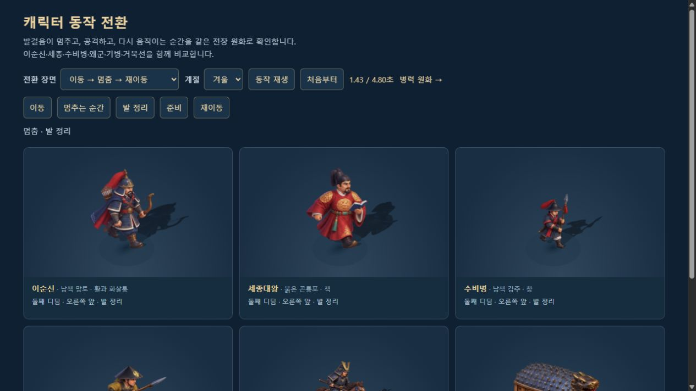
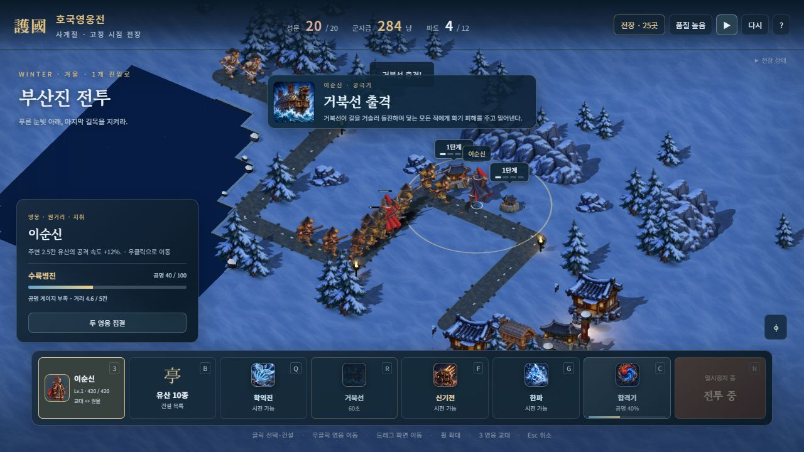
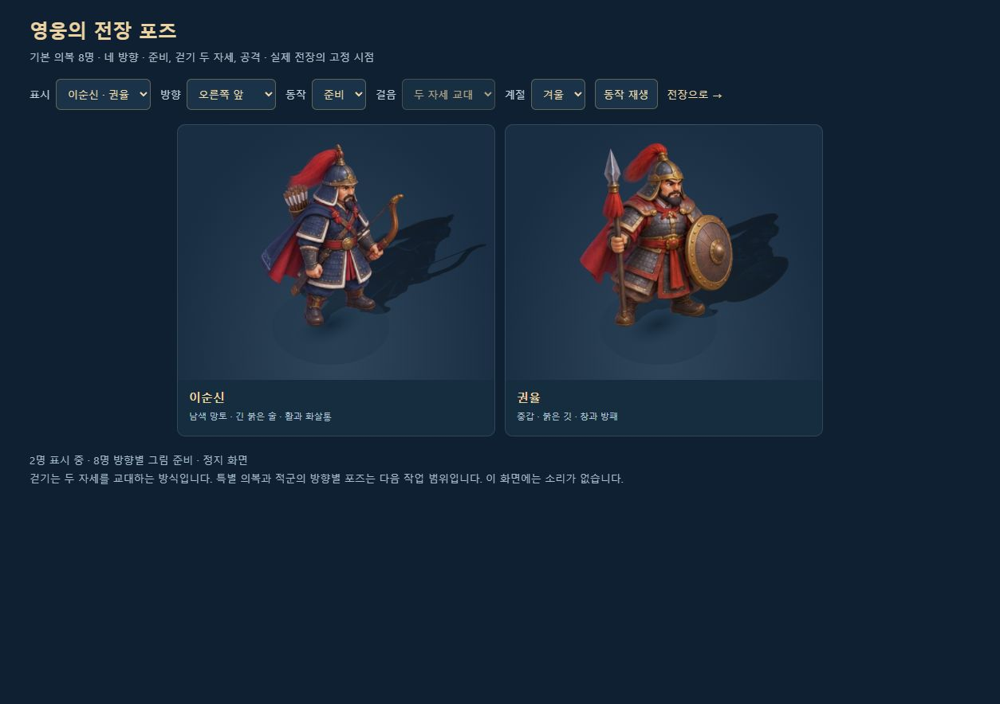

# 호국영웅전 프로젝트 리뷰

> 갱신: 2026-10-11 · 현재 구현과 남은 작업을 기록하는 기준 문서
> 저장소: [evilmuff0805-create/Td](https://github.com/evilmuff0805-create/Td) · 작업 브랜치: [`claude/korean-hero-tower-defense-i8ard8`](https://github.com/evilmuff0805-create/Td/tree/claude/korean-hero-tower-defense-i8ard8)

## 현재 상태

기본 전장은 **고정된 높은 시점의 2.5D 일러스트**다. 실제 3D 지면 위에 투명 캐릭터·건물 그림을 배치하고, 기존 시뮬레이션의 이동·건설·사거리·피해·협동 명령에 연결했다. 전장 25곳, 영웅 8명, 유산 10종, 왜군 22종을 같은 표현으로 사용한다.

가장 최근에는 **이동→디딤→정지와 방향·조준 전환을 다듬었다**. 승인된 1,664자세를 유지하며 일시정지 중 늦은 조준이 원화·기울기·반동·그림자·발사 원점을 바꾸던 문제를 수정했다. 60Hz 전투/120Hz 화면의 반복 위치 깜빡임과 검사기 방향도 보완했다. 로컬 2인·기존 전투 계산과 성문 즉시 누출 규칙을 유지하며 전체 262개 / 19검사군·Astra xhigh 재검토를 통과했다. [최신 범위·실제 검수·검증](MOTION_TRANSITIONS.md).

앞선 작업에서는 **적군·적장·아군과 이동체 28종의 중간 동작 원화 448장을 추가했다**. 네 방향의 중간 걸음 A·B와 공격 후·복귀를 연결해 병력은 기존 448장과 새 448장, 총 **896자세**다. 영웅 24외형의 768자세를 합한 전체 준비 그림은 **1,664장**이다. 앞선 1,216장의 픽셀·좌표와 로컬 2인 조작·소유·군자금·실제 전투 계산을 유지한다. 전령·거북선은 네 박자 이동만 실제로 사용하며 추가 공격/복귀 그림은 검토용 예비 자세다. [원화·정확한 범위·검증](COMBAT_INBETWEENS.md).

앞선 작업에서는 특수 의상 16종의 중간 동작 원화 256장을 추가해 기본 영웅과 의상의 모든 외형을 네 박자 보행·공격 복귀에 연결했다. [의상 작업 당시 기록](SKIN_INBETWEENS.md).

앞선 작업에서는 기본 영웅 8명의 중간 원화 128장을 추가해 기본 영웅 총 256자세와 네 박자 보행·공격 복귀를 연결했다. [기본 영웅 작업 당시 기록](HERO_INBETWEENS.md).

앞선 작업에서는 **타이틀·도감·의상실·출전 선택·전투 HUD·평면 모드의 기본 영웅 8명과 의상 16종을 확정된 전장 그림에 연결했다**. 승인된 준비 포즈를 색상·투명도 변경 없이 메뉴용 한 시트로 묶고 얼굴 영역을 따로 맞췄다. 로컬 2인 조작·소유·재화는 유지한다. [범위와 검증](HERO_MENU_ART.md).

앞선 작업에서는 **비기 8개·전용/일반 합격기 11개·참격에 전용 그림 20개를 추가했다**. 비기의 해결 좌표와 실제 폭탄·대포탄·한파를 따르고, 합격기는 조합별 중앙 문양을 사용한다. 실제 피해·시간·양측 입력·각자 군자금은 유지한다. [정확한 범위와 검증](TACTIC_ART.md).

앞선 작업에서는 **숲의 높낮이·절벽·한옥 주변 짐·등불 배치를 다듬었다**. 26지도×사계절에서 원래 경로·건설 자리·물·다리를 보존한다. 성문 등불은 진입로 옆의 안전한 자리에만 놓고 유산 높이 1.2칸과 로컬 2인 규칙은 유지한다. [배치 범위와 검증](SCENERY_LAYOUT.md).

앞선 작업에서는 **영웅 기술·궁극기 16개에 각각 다른 그림 모티프를 연결했다**. 학익진 전체 그림·거북선 항적·자격루·낙성우·총구·마늘·번개 등은 실제 명령의 좌표와 시점을 따른다. 기존 아이콘 디자인은 유지하면서 두 시트를 WebP로 압축했다. 로컬 2인과 기존 전투 수치는 유지한다. [기술 연출 범위와 검증](SKILL_SIGNATURES.md).

앞선 동작 작업에서는 **캐릭터의 발걸음을 실제 이동 거리에 연결하고 공격 복귀·피격·사망을 다듬었다**. 로컬 1P 마우스·2P 방향키/ASDF/E를 유지하며 게스트 보간·반복 공격·일시정지·재출전도 보완했다. 승인된 832포즈는 변경하지 않았다. [동작 범위와 검증](MOTION_REFINEMENT.md).

앞선 작업에서는 **낮은 연속 물가와 차분한 그림 수면을 실제 강·바다에 연결**하고 외곽 수면의 계단형 종료를 고쳤다. 원래 물·다리·건설 판정은 유지하며 먼 수면만 보간을 보존해 최적화했다. [최신 물가 범위와 검증](WATER_REFINEMENT.md).

앞선 작업에서는 **봄 꽃나무·여름 활엽수·가을 단풍 총 6개를 제작해 실제 전장에 연결**하고 모바일 영웅 이름표의 화면 넘침을 수정했다. 기존 설송과 상록수 군락도 유지한다. [계절 수목 범위와 검증](SEASONAL_SCENERY.md).

앞선 지형 작업에서는 **길을 하나의 연속 메시로 바꾸고 풀·흙·눈·다져진 길 재질의 반복을 줄였다**. 25전장과 별도 겨울 전장에서 실제 경로·건설 자리·물·다리는 유지한다. 사계절 비교도 실제 그림 영웅·작은 유산·소품을 표시한다. [지형 범위와 검증](TERRAIN_REFINEMENT.md).

앞선 작업에서는 사용자 확정 **이순신 v2와 기본 영웅의 톤을 특수 의상 16종까지 확장**했다. 의상별 16포즈, 총 **256포즈**를 추가해 전장용 준비 그림은 **832개**다. 앞선 병력 확장에서는 새로 **28종 × 16 = 448포즈**를 실제 전투에 연결했고, 기존 영웅 **8명 × 16 = 128포즈**와 합하면 준비된 기본 전장 포즈는 **576개**다. 네 방향의 준비·이동 두 자세·공격을 사용하며 전령·거북선의 마지막 네 자세는 예비 전투 준비 그림이다. 승인된 영웅 그림은 유지했다. 이순신의 남색 망토·활·화살통과 권율의 붉은 망토·창·방패 구분도 그대로다.

유산은 **10종 × 기본·2단계·3단계·최종 A·B = 50개 전용 외형**을 사용하고, 표시 높이는 모든 단계에서 **1.2칸으로 일정**하다. 스킬 공용 그림 8종·영웅 전용 16모티프·비기/합격기/참격 20모티프도 연결돼 있다. 전장에 필요한 병종·현재 장착한 의상·선택한 영웅 외형의 중간 시트만 준비하고, 전장 변경 때 빠진 전용 그림 자원을 해제한다.

최초의 순수 Canvas 2D 구현 이후 실제 3D 전투, 관절 모델, 전용 재질을 거쳐 현재의 그림 전장으로 바뀌었다. [2026-10-09 리뷰](PROJECT_REVIEW_2026-10-09.md)는 당시 기록으로 보존한다. 이전 모델 문서와 스크린샷의 '현재'·검사 수·성능 수치는 각 작업 시점의 기록이며, 최신 범위는 이 문서와 아래의 그림 전장 문서를 기준으로 한다.






## 합의한 미술 방향

- 참고 이미지의 입체 애니메이션풍 색감과 미감을 기준으로 한다. 남색·주홍·오래된 금속색, 차가운 환경광과 따뜻한 등불을 함께 사용한다.
- 전투는 고정된 높은 시점으로 진행한다. 기본 그림 모드의 카메라 회전은 막고 이동·확대·축소를 사용한다.
- 건물은 작게 유지한다. 기본·강화·최종 특화의 크기를 키우지 않고 기와·장식·등불·깃발·핵심 장비와 단계 표식으로 상태를 구분한다.
- 봄·여름·가을·겨울을 전장별로 배치한다. 모든 전장을 겨울이나 강설로 통일하지 않는다.
- 메뉴·일시정지 등 조작 글자는 가독성 있는 굵은 고딕 계열을 사용한다. 작업 중 게임은 `?mute=1`로 열어 음악·효과음을 끈다.

## 구현된 게임 범위

| 구분 | 현재 구현 |
|---|---|
| 전투 모드 | 혼자 영웅 2명 지휘 · 한 화면 로컬 2인 · 방 코드 온라인 2인 |
| 전장 | 5장 25전장 · 보통/어려움/지옥 · 다중 경로·해전·최종 적장 |
| 영웅 | 이순신·세종대왕·을지문덕·강감찬·권율·곽재우·안중근·단군왕검 8명, 기술·궁극기 16개 |
| 유산 | 숭례문·수원화성·보신각·첨성대·해인사·석굴암·경복궁·남한산성·석빙고·불국사 10종, 단계·특화 외형 50개 |
| 적군 | 일반 병력 10종 · 적장 12명, 최종 도요토미 히데요시 포함 |
| 전투 시스템 | 비기 8종 · 보급품 4종 · 전용 합격기 10종과 기본 합격기 · 전술 예고·파훼 · 전령 이벤트 |
| 성장 | 품계 18단계 · 엽전/옥 · 영웅/비기 영구 강화 · 유산 복원 30단계 · 장별 첫 승리 포상 |
| 진영 | 저장·불러오기 · 영웅/유산 해금 · 상점 · 의복 16종 · 일일/주간 임무 · 7일 출석 |
| 표시·설정 | 체력·상태·은신/탐지 · 선택·사거리·착탄 예고 · 강화 단계 배지 · 가벼운 품질 · 평면 모드 대체 · 음량·화면 흔들림 설정 |

온라인은 호스트가 시뮬레이션을 실행하고 게스트가 명령을 보내는 방식이다. 상대 영웅 이동과 상대 유산 철거를 검증하며, 동료 이탈 시 호스트가 인계받는다. 메뉴와 성장·보상은 실제 전투 세션에 연결돼 있다.

## 최신 미술 적용 범위

| 대상 | 적용과 정확한 범위 |
|---|---|
| 캐릭터·적군·소품 | 투명 그림 시트와 접지 그림자를 사용한다. 그림 로딩 실패 시 기존 표현으로 대체한다. |
| 기본 영웅 8명 | 기존 128장과 새 중간 128장, 총 256포즈. 각각 네 방향의 준비·네 보행·발사/타격·타격 후·복귀 32포즈를 사용한다. 원래 배율·발 기준점·그림자·가림 실루엣을 함께 전환하고 실제 이동 거리와 공격 시각을 따른다. 피격·사망·일시정지·재출전도 유지한다. |
| 이순신 톤 수정 | 부드러운 비율·넓은 남색 면·절제한 금속 명암의 v2를 사용한다. 활·화살통·남색 망토로 권율과 구분한다. 메뉴 초상화·평면 모드도 승인된 같은 준비 포즈를 사용한다. 특수 의상도 같은 톤의 전용 32포즈를 사용한다. |
| 병력·적장·아군 | 일반 왜군 10종·적장 12명·아군과 이동체 6종의 기존 448장과 새 중간 448장, 총 896포즈. 네 박자 이동과 타격·공격 후·복귀, 실제 뒷모습·발 기준점·접지 그림자를 전환한다. |
| 특별 의복 16종 | 기존 256장과 새 중간 256장, 총 512포즈. 각각 네 방향의 준비·네 보행·발사/타격·타격 후·복귀 32포즈를 사용한다. 장착한 의상과 그 의상의 중간 시트만 준비한다. 중간 시트 실패는 기존 의상 동작, 원래 의상 실패는 승인된 기본 영웅으로 대체하며 다른 옷의 중간 그림이 섞이지 않는다. 정상 소유·구매·장착·능력치 규칙을 유지한다. |
| 유산 강화 | 전용 그림 50개와 기본→보강→완성→최종 A/B 단계 표시. 모든 단계 높이 1.2칸. 실제 비용·공격·해금은 기존 엔진이 결정한다. |
| 스킬 효과 | 공용 그림 8종에 영웅 16기술의 개별 모티프를 추가했다. 실제 투사체·장판·이동체·생성 위치를 사용한다. 비기 8개와 합격기 11개·참격의 개별 그림도 추가했다. 합격기는 중앙 문양이며 실제 전체 피해 장면을 새로 제작한 범위와 구분한다. 아이콘 25칸은 기존 디자인·해상도·알파를 유지하며 WebP로 압축했다. |
| 이동 병기 | 출격 거북선·전령의 방향별 준비·네 박자 이동, 각각 20자세를 실제 경로·피해·보상 이벤트에 연결했다. 기존/추가 공격·복귀 그림 12자세는 검토용 예비 자세이며 새 공격 행동을 추가한 범위가 아니다. |
| 지형·주변 환경 | 계절별 지면·길·물·박석, 나무·한옥·바위·등불·소품을 실제 지도 좌표에 조립한다. 직각 중심 경로를 유지한 연속 메시·불규칙한 가장자리·새 풀/흙/눈/길 재질을 사용한다. 물·다리·건설 중심을 침범하지 않는다. 자유 곡선 지도는 남은 범위다. |
| 강·바다·물가 | 낮은 .125칸 연속 물가와 .25칸 그림 수면. 외곽 물은 풍경 끝까지 연장하고 먼 상수 영역·페이드 스트립만 보간을 보존해 병합한다. 실제 물·다리·경로·건설 판정은 유지한다. |
| 계절 수목 | 봄 벚꽃·여름 활엽수·가을 단풍 각각 두 변형, 총 6개를 실제 지도와 주변 숲에 혼합한다. 겨울 설송·먼 숲은 기존 그림이며 시트 실패 시 기존 소품으로 대체한다. |
| 기존 3D 모델 | 관절·얼굴·복식·무기·유산 모델은 대체 표현과 비교 도구에 보존한다. 기본 전장의 캐릭터 표현은 그림이다. |

새 유산·영웅·병력 포즈는 실제 투명 경계를 따라 개별 텍스처로 분리하고 사방에 12픽셀 여백을 둬 축소 시 이웃 그림이 섞이지 않게 했다. 영웅 128포즈·병력 448포즈·특수 의상 256포즈의 이웃 혼입·누락·중복 픽셀은 모두 0이며 원본과 WebP의 알파도 일치한다. 병력과 의상은 시트 외곽 접촉도 0이다. 원본 PNG·배포 WebP·최종 생성 프롬프트와 자산 검사 결과를 저장소에 함께 보존한다.

추가 중간 원화는 기본 영웅 128장·특수 의상 256장·병력 448장, 총 **832장**이다. 정확한 자르기·균일 리사이즈·포장 뒤 무손실 WebP **52장(48,364,004바이트)**으로 배포한다. 이번 병력 28장 합계는 **25,817,292바이트**다. 포장 여백은 24px이며 원래 외형의 기준 높이를 유지한다. 선택 원본 97개 시트와 새 448칸의 혼입·누락·중복·외곽·알파·보이는 RGB 차이는 0이다. [최신 병력 중간 원화](COMBAT_INBETWEENS.md) · [앞선 의상](SKIN_INBETWEENS.md) · [앞선 기본 영웅](HERO_INBETWEENS.md).




## 실행과 빌드

포함된 번들로 플레이할 때는 **Node.js 18 이상**에서 저장소 폴더를 열고 서버를 실행한다.

```bash
node server/server.js
```

게임: [http://localhost:8080/?mute=1](http://localhost:8080/?mute=1). 작업 중에는 음소거 주소를 사용한다. 같은 네트워크의 다른 기기와 협동하려면 PowerShell에서 `$env:HOST = "0.0.0.0"`을 설정한 뒤 서버를 실행하고 터미널의 네트워크 주소를 사용한다.

소스를 수정하거나 단일 HTML을 다시 만들 때는 개발 패키지를 설치한다.

```bash
npm install
npm run build:3d
npm run build
```

`three@0.186.1`, `esbuild@0.24.0`를 사용한다. `npm run build:3d`는 서버용 번들을 갱신하고, `npm run build`는 엔진과 그림을 포함한 `dist/hoguk.html`을 만든다. 현재 검증한 단일 HTML은 **107,974,162바이트**이며 영웅 8장·병력 28장·의상 16장·중간 원화 52장, 총 **104방향/중간 시트**와 메뉴용 1장, 지면 3장·수목 1장·물 1장·기술 시트 4장을 각각 한 번 포함한다. 거부된 이전 버전·보존용 아이콘 PNG·중간 원화 원본/참조/포장 PNG 256장은 포함하지 않는다. 선택 외형만 디코딩해도 단일 HTML에는 전체 배포 그림이 포함되므로 파일 크기는 커진다. `node_modules/`와 `dist/`는 Git 제외 생성물이며 재현 소스·원본·배포 그림·도구·서버용 번들은 저장소에 포함한다.

단일 파일은 혼자/로컬 협동용이며 온라인 협동은 서버 기본 게임 주소에서 실행한다. 브라우저 검증은 `/dist/hoguk.html?mute=1`에서 수행했다. 브라우저 보안 정책 때문에 `file://` 직접 실행 검증은 하지 못했다. 선택 웹 글꼴을 받지 못하면 시스템 글꼴을 사용한다.

주요 비교 도구: [이동·정지·공격 전환](http://localhost:8080/dev/3d-motion-review.html?mute=1) · [사계절 풍경](http://localhost:8080/dev/3d-season-review.html?mute=1) · [전체 영웅 외형 768자세](http://localhost:8080/dev/3d-skin-pose-review.html?mute=1) · [기본 영웅 256포즈](http://localhost:8080/dev/3d-hero-pose-review.html?mute=1) · [병력 896자세](http://localhost:8080/dev/3d-combat-pose-review.html?mute=1) · [강화 외형 50개](http://localhost:8080/dev/3d-tower-review.html?mute=1) · [사계절 스킬 효과](http://localhost:8080/dev/3d-effect-review.html?mute=1) · [밀집 병력 28종](http://localhost:8080/dev/3d-performance-review.html?mute=1) · [자유 전장](http://localhost:8080/3d.html?mute=1). 자유 전장은 미술·전투 비교용 지원 설정을 제공하며 정식 캠페인 보상과 구분한다.

## 현재 버전 검증

이번 동작 전환·조준·일시정지와 기존 미술·전투 통합에 아래 열아홉 검사군을 실행했다.

| 명령 | 통과 수 |
|---|---:|
| `node tools/selftest.mjs` | 14 |
| `node tools/test-3d.mjs` | 41 |
| `node tools/test-fixed-art.mjs` | 15 |
| `node tools/test-campaign.mjs` | 16 |
| `node tools/test-effects.mjs` | 8 |
| `node tools/test-enemies.mjs` | 12 |
| `node tools/test-combat-art.mjs` | 13 |
| `node tools/test-skin-art.mjs` | 14 |
| `node tools/test-terrain.mjs` | 8 |
| `node tools/test-seasonal-props.mjs` | 6 |
| `node tools/test-water.mjs` | 11 |
| `node tools/test-sprite-motion.mjs` | 15 |
| `node tools/test-signatures.mjs` | 12 |
| `node tools/test-scenery.mjs` | 8 |
| `node tools/test-tactics.mjs` | 8 |
| `node tools/test-menu-art.mjs` | 8 |
| `node tools/test-inbetweens.mjs` | 19 |
| `node tools/test-combat-inbetweens.mjs` | 20 |
| `node tools/test-motion-transitions.mjs` | 14 |
| 합계 | **262** |

새 동작 전환 검사 **14개**는 20/60/120fps의 발 정리, 공격/재이동 즉시 전환, 60Hz/120Hz 반복 위치, 기절·점프·되감기, 8도 경계와 새 조준, 실제 월드의 pause 중 원화/기울기/반동/그림자/총구 고정, 검사기 방향, 실제 로컬 Session 양측 기술·스냅샷·시전자 분리를 확인했다. 같은 이순신 두 명은 직접 구성한 방어 검사이며 정식 UI의 중복 선택을 뜻하지 않는다. 기존 248개를 합한 **262개 / 19검사군**, 승인 그림·기준 fixture 불변과 두 빌드를 확인했다. 변경 전 완주 두 판의 기존 이벤트/스냅샷 SHA는 같으며 비교에서는 기존 표시 전용 필드 외에 새 선택적 `cone.caster` ID만 제외한다. Astra xhigh가 찾은 반복 위치 깜빡임·검사기 좌우 부호를 수정한 뒤 최종 검토와 독립 14개 재실행을 통과했다. 브라우저 5시퀀스·23지점×6대표·사계절·재생/정지·414×896 가로 넘침 없음, 최신 단일 HTML 이순신/세종 로컬 2인의 1P 지정 학익진·2P 실제 A키 기술·집결 이동·정지를 확인했다. 화면은 4/12파도·민심 8/20·군자금 268/268이며 승패·해금·구매·승리 보상은 발생시키지 않았다. 이번 UI 이동은 집결이며 개별 방향키는 자동 Session 검사 범위다. 두 탭 콘솔 경고/오류는 0이다. [최신 범위](MOTION_TRANSITIONS.md) · [실행 검사](MOTION_TRANSITION_RUNTIME_VALIDATION.json) · [브라우저](MOTION_TRANSITION_BROWSER_VALIDATION.json) · [릴리스](MOTION_TRANSITION_RELEASE_VALIDATION.json).

앞선 병력 작업 당시 검사 **20개**는 실제 896자세·거리 기반 네 박자·공격 후/복귀·은신/정지/기절/사망·총구, 실제 로컬 Session 양측 입력·두 병영 비용·병사 소유와 스냅샷, 선택 로딩·부분 실패·오래된 요청 폐기·전장별 자원 정리를 확인했다. 진군 중에는 새 공격을 만들지 않고 성문 도착 시 바로 누출되며 기존 길막 교전에서만 공격한다는 검사도 통과했다. 기존 228개를 합한 **248개 / 18검사군**, 기존 1,216장 픽셀·파일 불변, 변경 전 완주 두 판 SHA, 두 빌드·104시트 단일 포함을 확인했다. Astra xhigh 최종 미술·런타임 검토를 통과했다. 브라우저 896자세·사계절·재생/정지·414×896 가로 넘침 없음, 최신 단일 HTML 기본 이순신/세종 로컬 2인 이동·기술과 첫 적 진군을 확인한 뒤 20/20·군자금 156/156·첫 파도에서 일시정지했다. 정상 해금·구매·승패 보상은 발생시키지 않았고 두 탭 콘솔 경고/오류는 0이다. 두 병영의 비용·소유 검증은 실제 Session 자동 검사 범위이며 이번 브라우저에서 병영을 건설한 것은 아니다. 단일 HTML은 DOM 전송 크기 한도 때문에 실제 화면·마우스·키보드로 검수했다. [최신 원화·범위](COMBAT_INBETWEENS.md) · [브라우저 기록](COMBAT_INBETWEEN_BROWSER_VALIDATION.json).

앞선 영웅 검사 19개는 24외형/768자세·거리 기반 네 박자·세 공격 자세·서로 다른 의상의 실제 로컬 Session 양측 입력/스냅샷 독립·정지·누락 조합·선택 로딩·첫 틱·게스트·자원 정리를 확인했다. 의상 검사에서는 코어/병력/원래 의상/중간 그림의 완료 순서 24가지도 통과했다. 추가 384장 픽셀 검사와 변경 전 전투 두 판 SHA 동일성, 두 빌드·76시트 단일 포함을 확인했다. Astra xhigh 최종 검토에서 추가 필수 런타임 결함은 없었다. 브라우저 768자세 전환, 백의종군/행주 산성의 선택 로딩·실제 이동/발사 후/정지, 최신 단일 HTML 기본 이순신/세종 로컬 2인 양측 이동·기술·2P 숭례문 건설과 군자금 156/86을 확인했다. 의상 검수 화면은 414×896 가로 넘침 0이며 기본 크기로 복원했다. 세 탭 콘솔 경고/오류는 0이다. 단일 HTML의 DOM 전송은 도구 크기 한도를 넘어 실제 스크린샷·마우스·키보드로 검수했다. [최신 원화와 검증](SKIN_INBETWEENS.md) · [브라우저 기록](SKIN_INBETWEEN_BROWSER_VALIDATION.json).

새 메뉴 그림 검사 8개는 24포즈의 정체성·로딩 대기·정확한 얼굴/전신 영역·평면 실제 그리기·장착 CSS·누락/크기 오류 대체·프로필 불변을 확인했다. 픽셀의 보이는 색상·알파 차이는 0이고 기존 전투 두 판 SHA도 같다. 브라우저 타이틀 8명·도감 8명·의상 24표시·단일 HTML 로컬 2인 이동/기술/건설·평면 협동·자유 전장 의상 교대를 확인했다. Astra xhigh가 찾은 자유 전장 얼굴의 세로 늘어남을 정사각 요소로 수정했고 데스크톱 HUD 40×40을 확인했다. 세 탭의 경고/오류와 1280px 넘침은 0이며 이번 모바일 검증은 별도 수행하지 않았다. [최신 메뉴 검증](HERO_MENU_ART.md).

새 비기·합격기 검사 8개는 20모티프·실제 36명령·2P 해결 좌표/소유/JSON·합격기 양측 입력·투사체·한파 교체/수명·64효과 상한·자원 정리를 확인했다. Astra xhigh가 찾은 비교 화면 시트 대기를 수정했고 전투 SHA도 같다. 브라우저 36장면·사계절·단일 HTML 로컬 2인·반복 자원 수 일치와 두 탭 경고/오류 0을 확인했다. 이번 414px 설정은 반영되지 않아 모바일 검증으로 기록하지 않는다. [최신 비기·합격기 검증](TACTIC_ART.md).

새 소품 검사 8개는 26지도×사계절 배치 불변·길/건설/물/다리 발 범위·고리형 한옥·문 옆 짐·안전한 등불·실제 조립/해제·2P 건설 비용을 확인했다. Astra xhigh가 지적한 성문 등불의 길 중심 배치를 수정한 뒤 재검토를 통과했다. 사계절·414×896·정식 로컬 2인과 28종 밀집 표시 128→64명도 확인했다. 자동 거리는 선언된 소품 발 범위에 대한 검사이며 전체 수관의 가림을 보증하지 않는다. [배치 검사](SCENERY_PLAN_VALIDATION.json) · [브라우저 기록](SCENERY_BROWSER_VALIDATION.json).

영웅 전용 기술 16개는 실제 명령·투사체·장판·이동체와 연결되며, 새 검사 12개에서 실제 생성 좌표·양측 소유권·JSON 전달·학익진 범위·12회 번개·늦은 준비·실패·일시정지·자원 정리를 확인했다. 기존 25칸 아이콘은 디자인을 유지하면서 배포를 압축했다. 원래 솔로/협동 완주 두 판의 전투 이벤트·스냅샷·수입·승패 SHA도 같다. 비교에서는 이번에 추가한 표시 전용 `abilityCue` 이벤트만 제외한다. 브라우저 실제 명령 26개·사계절·414×896·최신 정식 로컬 2인·단일 HTML과 반복 자원 수 일치를 확인했고 세 탭의 경고·오류는 0이다. Astra xhigh의 학 그림 잘림 지적을 수정했고 번개 대기 구체·예고 병합까지 최종 검토했다. [최신 기술 검증](SKILL_SIGNATURES_VALIDATION.json) · [브라우저 기록](SKILL_SIGNATURE_BROWSER_VALIDATION.json).

검사에는 실제 영웅 루트의 128포즈, 포즈 공통 배율·발 기준점·그림자·가림 그림 동기화, 영웅 시트 일부 누락과 공유 자원 정리를 포함한다. 실제 엔진의 건설·강화·A/B 선택 50조합, 동일한 작은 건물 크기, 선택·발사 원점, 비동기 그림 로딩·실패·종료, 스킬 이벤트·장판 만료, 세션·저장·협동·첫 승리 포상 검사도 통과했다.

후속 이순신 v2 교체 후에는 **고정 그림 검사 15개**와 **8시트·128포즈 픽셀 검사**를 다시 실행했다. 이웃 혼입·누락·중복과 알파 변경은 모두 0이다. 다른 일곱 영웅의 원본·WebP·프롬프트·포즈 데이터가 이전 커밋과 같은지 확인했다. 두 빌드와 단일 HTML의 8시트 단일 포함 검사도 통과했다. 요청한 **GPT Astra xhigh**의 미술 비교에서도 톤 일치와 권율 구분에 필수 수정이 없다는 판정을 받았다. [이순신 최신 검증](YI_TONE_REFINEMENT_VALIDATION.json).

새 검사 13개는 실제 병력 루트 28종의 448포즈·발 기준점·그림자·UV, 25전장 파도·전술·분열·적장 증원 준비, 은신·기절·사격 예고·사망, 실제 거북선·전령 이벤트와 개인/공용 자원 정리, 일부 시트 실패 대체와 비동기 로딩 순서를 포함한다. Astra 검토로 늦은 이전 전장의 완료가 새 카메라·로딩 표시를 바꾸는 결함과 로딩 중 키보드 궁극기 소모를 수정했다. 구루시마·시마즈의 첫 시트에 있던 이웃 픽셀 9개·69개는 전체 인물 간격을 넓힌 v2로 해결했으며 최종 미술·픽셀 검토도 통과했다.

이번 브라우저 확인은 병력 448개 포즈의 개별 전환, 사계절·단독 표시·재생/정지, 자유 전장 4파도 진입과 실제 거북선 출격, 부산진→나고야성→부산진 병종 준비 12→21→12종, 정식 단일 HTML 동래성의 영웅·13병종 로딩과 첫 파도 전 일시정지, 비교·정식 화면의 414×896 표시를 포함한다. 네 검사 탭의 콘솔 경고·오류와 확인한 모바일 가로 넘침은 없었다. 정식 검증에서 승패 보상을 발생시키지 않았다. PC 혼합 렌더링 부하 장면은 64·128·64명에 6종 아군·이동체를 더해 28종을 표시했고 관측값은 60fps·p95 17ms였다. 이는 이동을 지정한 표시 부하 장면의 측정이며 실제 휴대폰이나 전체 게임의 성능 보증은 아니다. [최신 병력 검증](COMBAT_DIRECTIONAL_ART_VALIDATION.json) · [브라우저 기록](COMBAT_DIRECTIONAL_ART_BROWSER_VALIDATION.json).

특수 의상 후속 작업에서는 256포즈·같은 영웅을 고른 두 소유자의 서로 다른 의상·정상 프로필과 세션 전달·장착값 중복 제거·코어/병력/의상 로딩 순서·첫 틱 보류·게스트 수신 유지·실패 대체·이전 요청 무효화·살아 있는 영웅과 사망 잔상의 자원 정리 검사 14개를 추가했다. Astra xhigh의 구현 재검토도 통과했다. 브라우저에서 256포즈·사계절·재생/정지·실제 의상 전투·재시작 유지·의상 2→1종 전환·414×896 표시와 단일 HTML 제목 기동을 확인했다. 콘솔 경고·오류와 확인한 모바일 가로 넘침은 없었다. [특수 의상 검증](SKIN_DIRECTIONAL_ART_VALIDATION.json) · [브라우저 기록](SKIN_DIRECTIONAL_ART_BROWSER_VALIDATION.json).

새 지형 검사 8개는 26지도 경로·지도 불변, 합류·모서리·맵 밖 진입의 실제 보간 알파, 물·다리·건설 중심 제외, 지면 연속성, 실제 사계절 풍경 병합·자원 해제를 확인한다. 새 지면 3장도 단일 HTML에 각각 한 번 포함한다. Astra xhigh 설계·구현 검토와 실제 사계절 전장·겨울 2파도·강/다리·재시작·414×896 표시를 통과했다. 브라우저 경고·오류와 확인한 모바일 가로 넘침은 없었다. [지형 검증](TERRAIN_REFINEMENT_VALIDATION.json) · [브라우저 기록](TERRAIN_BROWSER_VALIDATION.json).

새 수목 검사 6개는 계절 선택·겨울 그림 보존, 실제 나무 메시의 높이·줄기 기준점·UV·그림자, 사계절 지도 불변, 계절 소유자별 색·자원 정리, 누락 대체·종료 후 늦은 완료를 확인한다. 새 시트 6개의 이웃 혼입·누락·중복·외곽 접촉·알파 변경은 모두 0이며 기존 832포즈의 픽셀·좌표 검사도 다시 통과했다. 봄 실제 3파도·사계절 전장·414×896 표시를 확인했고, 발견한 모바일 이름표 넘침과 화면 밖 이름표를 수정 후 카메라 이동·선택창·Astra xhigh 재검토로 확인했다. 수정 후 확인한 가로 넘침과 콘솔 경고·오류는 없었다. [계절 수목 검증](SEASONAL_SCENERY_VALIDATION.json) · [브라우저 수정 전후](SEASON_TREE_BROWSER_VALIDATION.json).

새 물가 검사 11개는 26지도 불변·물 coverage·보드 밖 외곽 면적·보간 알파·건설 중심 여백·높이·UV·RGBA·사계절 정렬·자원 해제·그림 실패 대체를 확인한다. 먼 큰 면과 페이드 스트립의 기존 정점·변 중간점 보간도 원래 세밀한 면과 일치한다. Astra xhigh가 지적한 도로 덮임과 수면 교차를 수정했고, 외곽 종료·최적화까지 최종 재검토에서 추가 필수 결함이 없었다. 사계절 다섯 전장·실제 여름 첫 파도/정지·414×896 표시·단일 HTML 제목을 확인했으며 해당 탭의 콘솔 경고·오류와 가로 넘침은 없었다. [물가 최신 검증](WATER_REFINEMENT_VALIDATION.json) · [브라우저 기록](WATER_BROWSER_VALIDATION.json).

앞선 이순신·권율 톤 비교, 영웅 128포즈, 유산 50외형·강화·스킬 검증은 각각의 상세 보고서에 보존한다.

전체 성장 검증은 앞선 [실제 수입 성장 보고서](PROGRESSION_VALIDATION.json)에 있다. 새 기록 4개(혼자/로컬 × 시드 2개)가 실제 획득 재화와 정상 구입만 사용해 보통 25전장을 모두 완주했다. 총 138전투·38회 재도전이다. 이 결과는 특정 봇 전략의 관측이며 사람의 체감 난이도나 어려움·지옥의 실제 수입 완주를 보증하지 않는다.

기존 150전투 회귀와 최종 전장 전략 비교, 모델별 성능 수치는 각 보고서에 보존한다. 최신 그림 전장의 모든 기기 성능을 이전 모델 측정으로 대체하지 않는다.

## 문서와 파일 위치

| 목적 | 위치 |
|---|---|
| 현재 프로젝트 현황 | 이 문서 `docs/PROJECT_REVIEW.md` |
| 최신 그림 구조·제작·범위 | [ART.md](ART.md) |
| 이동·정지·조준·pause 전환 | [MOTION_TRANSITIONS.md](MOTION_TRANSITIONS.md) · [실행 검사](MOTION_TRANSITION_RUNTIME_VALIDATION.json) · [브라우저](MOTION_TRANSITION_BROWSER_VALIDATION.json) · [릴리스](MOTION_TRANSITION_RELEASE_VALIDATION.json) |
| 병력 중간 원화 448장·총 896자세·협동 | [COMBAT_INBETWEENS.md](COMBAT_INBETWEENS.md) · [통합 검사](COMBAT_INBETWEEN_RELEASE_VALIDATION.json) · [브라우저](COMBAT_INBETWEEN_BROWSER_VALIDATION.json) |
| 특수 의상 중간 원화 256장·전체 외형 768자세 | [SKIN_INBETWEENS.md](SKIN_INBETWEENS.md) · [통합 검사](SKIN_INBETWEEN_RELEASE_VALIDATION.json) · [브라우저](SKIN_INBETWEEN_BROWSER_VALIDATION.json) |
| 기본 영웅 중간 원화 128장·256자세·협동 | [HERO_INBETWEENS.md](HERO_INBETWEENS.md) · [자산 검사](INBETWEEN_ASSET_VALIDATION.json) · [동작 검사](INBETWEEN_RUNTIME_VALIDATION.json) · [브라우저](INBETWEEN_BROWSER_VALIDATION.json) |
| 메뉴·의상·HUD·평면 영웅 톤 | [HERO_MENU_ART.md](HERO_MENU_ART.md) · [검사](HERO_MENU_VALIDATION.json) · [브라우저](HERO_MENU_BROWSER_VALIDATION.json) |
| 비기·합격기·참격 20그림·협동 | [TACTIC_ART.md](TACTIC_ART.md) · [검사](TACTIC_VALIDATION.json) · [브라우저](TACTIC_BROWSER_VALIDATION.json) |
| 주변 소품 배치·집/짐/등불·협동 | [SCENERY_LAYOUT.md](SCENERY_LAYOUT.md) · [검사](SCENERY_PLAN_VALIDATION.json) · [브라우저](SCENERY_BROWSER_VALIDATION.json) |
| 영웅 16기술·아이콘 압축·최신 검증 | [SKILL_SIGNATURES.md](SKILL_SIGNATURES.md) · [결과 JSON](SKILL_SIGNATURES_VALIDATION.json) · [자산 검사](SKILL_SIGNATURE_ASSET_VALIDATION.json) |
| 연속 물가·그림 수면·최신 검증 | [WATER_REFINEMENT.md](WATER_REFINEMENT.md) · [결과 JSON](WATER_REFINEMENT_VALIDATION.json) |
| 계절 수목 6개·모바일 이름표·검증 | [SEASONAL_SCENERY.md](SEASONAL_SCENERY.md) · [결과 JSON](SEASONAL_SCENERY_VALIDATION.json) |
| 연속 도로·지면 재질·사계절 비교 | [TERRAIN_REFINEMENT.md](TERRAIN_REFINEMENT.md) · [결과 JSON](TERRAIN_REFINEMENT_VALIDATION.json) |
| 특수 의상 256포즈·장착 로딩·검증 | [SKIN_DIRECTIONAL_ART.md](SKIN_DIRECTIONAL_ART.md) · [결과 JSON](SKIN_DIRECTIONAL_ART_VALIDATION.json) · [자산 검사](SKIN_POSE_ASSET_VALIDATION.json) |
| 병력·적장·이동체 448포즈·로딩·검증 | [COMBAT_DIRECTIONAL_ART.md](COMBAT_DIRECTIONAL_ART.md) · [결과 JSON](COMBAT_DIRECTIONAL_ART_VALIDATION.json) · [자산 검사](COMBAT_POSE_ASSET_VALIDATION.json) |
| 이순신 v2 톤·권율 구분·최신 검증 | [YI_TONE_REFINEMENT.md](YI_TONE_REFINEMENT.md) · [결과 JSON](YI_TONE_REFINEMENT_VALIDATION.json) |
| 기본 영웅 128포즈·경계·동작·검증 | [HERO_DIRECTIONAL_ART.md](HERO_DIRECTIONAL_ART.md) · [결과 JSON](HERO_DIRECTIONAL_ART_VALIDATION.json) · [자산 검사](HERO_POSE_ASSET_VALIDATION.json) |
| 유산 50외형·경계·크기·검증 | [TOWER_STAGE_ART.md](TOWER_STAGE_ART.md) · [결과 JSON](TOWER_STAGE_ART_VALIDATION.json) · [자산 검사](TOWER_STAGE_ASSET_VALIDATION.json) |
| 캐릭터 동작·로컬 협동 | [MOTION_REFINEMENT.md](MOTION_REFINEMENT.md) · [검증](MOTION_REFINEMENT_VALIDATION.json) |
| 스킬 그림·이동 병기 | [PAINTED_EFFECTS.md](PAINTED_EFFECTS.md) · [결과 JSON](PAINTED_EFFECTS_VALIDATION.json) |
| 고정 시점 전장·포즈·표시 검증 | [FIXED_BATTLE_ART_VALIDATION.json](FIXED_BATTLE_ART_VALIDATION.json) |
| 정식 전투·협동·성장 통합 이력 | [3D_FULL_GAME.md](3D_FULL_GAME.md) · [POLISH_RELEASE.md](POLISH_RELEASE.md) |
| 설계·수치 | [GAME_DESIGN.md](GAME_DESIGN.md) · [BALANCE.md](BALANCE.md) · `src/data/` |
| 주요 구현 | `src/sim/`, `src/game/`, `src/meta/`, `src/ui/`, `src/3d/` |
| 생성 원본·배포 자산·프롬프트 | `assets/illustrated/`, `assets/3d/fixed/`, `assets/3d/painted/`, `assets/3d/art/` |
| 빌드·검사·검증 재현 | `tools/` · 화면 기록은 `docs/screenshots/` |

## 남은 작업

1. 연속 도로·지면·계절 수목·물가와 주변 소품 배치는 개선했다. 기존 울타리 반복의 새 원화와 자유 곡선 지도는 별도 미술·경로 범위다.
2. 밀집 병력 28종의 128→64명 표시를 확인했고 비기·합격기의 개별 그림을 추가했다. 합격기의 전체 착탄 장면·군락 울타리 반복 등 추가 원화는 후속 미술 범위다.
3. 메뉴·평면 톤 연결, 영웅 중간 384장과 병력 중간 448장·전체 캐릭터의 네 박자 이동/공격 복귀와 정지·방향·조준·pause 전환을 연결했다. 더 긴 주기와 큰 흉상, 프레임 사이 장비·옷자락의 미세한 일관성은 후속 자산 범위다. 단일 HTML 용량과 실제 기기의 메모리도 후속 최적화 대상으로 확인한다.
4. 실제 휴대폰과 더 다양한 PC에서 메모리·발열·프레임·터치 조작을 확인한다. 온라인은 외부 네트워크의 두 기기·지연·재접속 검증을 확장한다.
5. 사람 플레이와 어려움·지옥의 실제 재화 성장으로 후반 밸런스를 추가 검증한다.

전투와 성장 시스템이 연결돼 있다는 것과 모든 미술·기기·밸런스 검증이 끝났다는 것은 별개의 상태다. 후자의 남은 범위를 완료로 표시하지 않는다.

동작 개선은 새 검사 15개와 변경 전 솔로·협동 완주 2판의 전투 이벤트·기존 스냅샷 SHA 동일성, 실제 로컬 2인 UI의 양측 이동·기술·2P 건설을 확인했다. Astra xhigh의 pause/재출전 지적을 수정하고 최종 검토를 통과했다. 당시 단일 HTML은 45,627,814바이트였고, 이후 아이콘 압축과 전용 기술 적용 버전은 위의 최신 빌드 수치를 따른다. [동작 검증](MOTION_REFINEMENT.md).

## GitHub와 프로젝트 기록 유지

2026-10-10 확인 시, 기존 GitHub 최신 커밋은 `9ddbf3a`였고 그 이후 미술·전투 작업은 로컬에만 쌓여 있었다. 누락된 코드·원본·배포 그림·검증 도구·문서를 `e693ce2`, 기본 영웅 128포즈 확장을 `fabe4d6`, 이순신 톤 수정을 `0cb2bc2`로 커밋·푸시하고 각각 원격 일치를 확인했다. 병력 448포즈와 로딩 수정은 `3714d26`으로 푸시하고 원격 일치를 확인했다. 특수 의상 256포즈와 장착 로딩 통합은 `d9c30cb`로 푸시하고 원격 일치를 확인했다. 연속 도로·지면 다듬기는 `9eabc20`으로 푸시하고 원격 일치를 확인했다. 계절 수목 6개와 모바일 이름표 수정은 `aed17c0`으로 푸시하고 원격 일치를 확인했다. 연속 물가·그림 수면과 외곽 최적화는 `7bf511b`로 푸시하고 원격 일치를 확인했다.

발걸음·공격 복귀와 협동 동작 개선은 `2b2ccfd`로 푸시하고 원격 일치를 확인했다. 영웅 전용 기술 연출은 `8e14d0d`로 푸시하고 원격 일치를 확인했다. 주변 배치 개선은 `d4b41a3`으로 푸시하고 원격 일치를 확인했다. 비기·합격기 그림은 `8d04906`으로 푸시하고 원격 일치를 확인했다. 메뉴·HUD·평면 영웅 톤 연결은 `b2e8a7d`로 푸시하고 원격 일치를 확인했다.

기본 영웅 중간 원화 128장·네 박자 보행·공격 복귀·정지/로딩 보완과 검증 기록은 `71500dd`로 푸시했다. `git ls-remote`로 원격 브랜치와 로컬 구현 커밋 `71500dd613a7b5a3c104db0c664c33e5fedb2847`의 일치를 확인했다. 정확한 범위와 남은 원화 작업은 [중간 동작 기록](HERO_INBETWEENS.md)에 보존한다.

특수 의상 중간 원화 256장·전체 영웅 외형 768자세와 228개 검사는 `e6f72db`로 커밋·푸시했다. `git ls-remote`로 실제 원격 브랜치와 구현 커밋 `e6f72dba28d04ace759676b98c84c881234eb49b`의 일치를 확인했다. [상세 기록](SKIN_INBETWEENS.md) · [릴리스 JSON](SKIN_INBETWEEN_RELEASE_VALIDATION.json).

적군·아군 병력 중간 원화 448장·총 896자세·전체 준비 그림 1,664장과 248개 검사·로컬 2인 유지 기록은 [`1e83d12`](https://github.com/evilmuff0805-create/Td/commit/1e83d120c99ef0e7327dd68ce284ed3c8b33a59c)로 커밋·푸시했다. `git ls-remote`로 원격 브랜치와 구현 커밋 `1e83d120c99ef0e7327dd68ce284ed3c8b33a59c`의 일치를 확인했다. 일반 진군·성문 즉시 누출 규칙은 유지하고 공격 자세는 기존 길막 교전·사격·지원 신호에서만 표시한다. 내장 imagegen 원본·프롬프트·검증·서버 번들을 포함하고 상위 프로젝트 기록도 갱신했다. [병력 작업 기록](COMBAT_INBETWEENS.md) · [릴리스 JSON](COMBAT_INBETWEEN_RELEASE_VALIDATION.json).

이후 완료한 작업 단위마다 다음을 함께 수행한다.

1. 구현 범위·합의한 방향·검증 결과·남은 작업을 이 문서와 해당 상세 문서에 갱신한다.
2. 상위 작업 폴더의 `호국영웅전_PROJECT_REVIEW.md`도 이 기준 문서와 같은 내용으로 갱신한다. 저장소 안의 이 파일이 GitHub 기준본이다.
3. 변경 내용을 확인하고 같은 브랜치에 커밋·푸시한다. 원격을 강제로 덮어쓰지 않는다.
4. 로컬 커밋과 원격 브랜치의 SHA가 같은지 확인한 뒤 GitHub 반영 완료를 알린다. 실패하면 로컬 완료와 원격 미반영 상태를 구분해 알린다.

원격 반영 여부는 브랜치의 실제 커밋으로 확인한다. 문서에 진행했다고 적는 것만으로 업로드가 완료된 것으로 간주하지 않는다.
