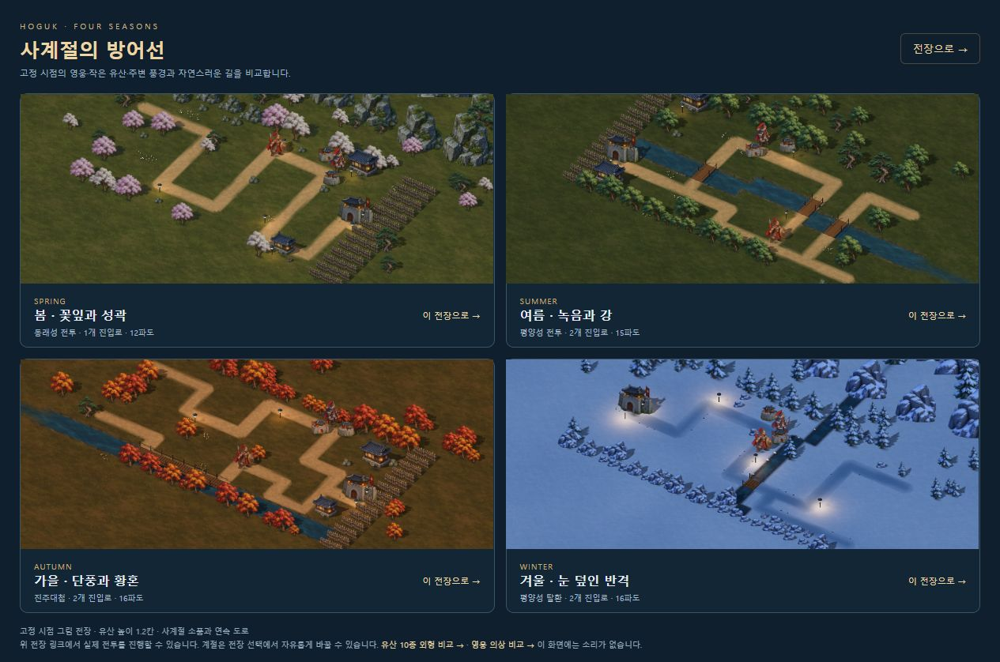
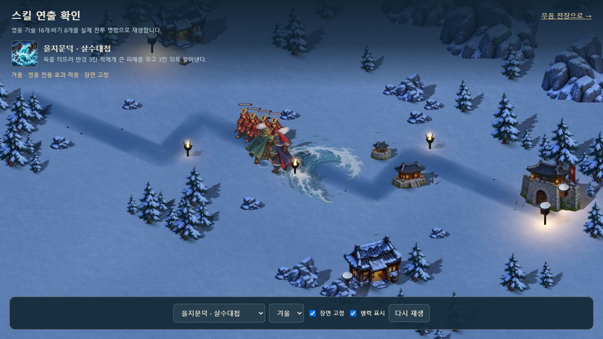
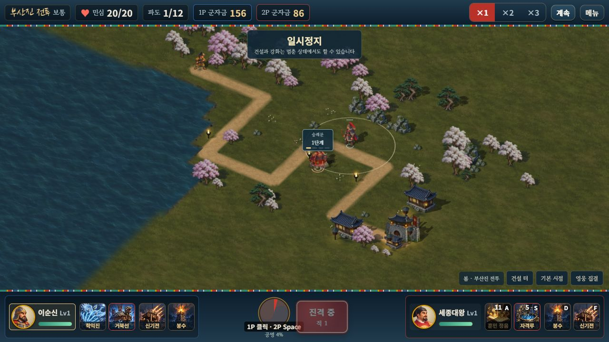

# 주변 소품 배치 개선

2026-10-11. 확정한 캐릭터·계절 수목·한옥·바위 그림을 재배치했다. 새 그림 제작이나 지도·전투 규칙 변경은 이번 범위가 아니다.

## 적용

- 높은 나무와 낮은 군락을 섞고 길·성문 근처 수목을 낮췄다. 높은 수관은 간격을 두고 배치한다.
- 절벽 덩어리에 큰 바위와 낮은 돌을 섞어 동일 높이의 반복을 줄였다.
- 붙어 있는 한옥 칸은 한 건물로 묶고, 여유가 있으면 문 옆 짐과 등불을 배치한다. 중앙이 건설 터인 고리형 구역도 안전한 지점을 고른다.
- 성문 등불은 실제 진입로 옆에 배치한다. 길·물·다리·소품과 겹치는 후보는 버리고 안전한 자리가 없으면 생략한다.
- 유산 50외형의 높이 **1.2칸**, 로컬 2인 소유권·각자 군자금·조작은 유지한다.

좌표 해시를 사용하므로 같은 지도의 배치는 계절을 바꿔도 같다. 시뮬레이션 난수는 사용하지 않는다. 그림 로딩 실패 시 기존 풍경을 사용한다.

## 검증

새 검사 **8개**와 기존 **185개**, 총 **193개·14군**이 통과했다. 26지도 × 사계절 104조합에서 지도·경로 불변, 소품 발 범위와 건설 중심·실제 길·물·다리의 여백, 집·짐 배치, 실제 조립·전용 자원 해제와 협동 건설비를 검사했다. 변경 전 솔로·협동 완주 두 판의 기존 이벤트·스냅샷·수입·승패 SHA도 같다.

Astra xhigh가 지적한 성문 등불의 길 중심 배치를 수정했다. 수정 후 26지도 검사와 재검토에서 추가 필수 결함은 없었다. 자동 거리는 **선언된 발 범위**에 대한 검사이며 수관 전체의 화면상 가림을 보증하지 않는다. 사계절 실제 화면과 겨울 기술 장면에서 가림을 별도로 확인했다.

브라우저에서는 사계절·414×896·정식 로컬 2인 이동/기술/건설/정지를 확인했다. 2P 숭례문 건설 후 군자금은 156→86, 1P는 156으로 같았다. 28종 밀집 표시 장면의 128→64명 전환도 확인했다. 관측값 60fps·p95 17ms는 이 PC의 **이동을 지정한 표시 부하 장면**이며 전체 전투·실제 휴대폰 측정과 구분한다. 네 탭의 콘솔 경고·오류는 0이다. 공식 8080 프로필 대신 QA 주소 8092를 사용했다.

두 빌드와 포함 자산 중복 검사를 통과했다. 단일 HTML은 **40,033,755바이트**, 이번에는 제목 기동까지 확인했다. 직전 기술 작업의 단일 HTML 로컬 2인 전투 기록도 보존한다.

[좌표·조립 검사](SCENERY_PLAN_VALIDATION.json) · [브라우저 기록](SCENERY_BROWSER_VALIDATION.json)

## 남은 범위

기존 울타리 그림의 반복, 새 소품 원화·자유 곡선 지도는 별도 작업이다. 메뉴 초상화·평면 모드 톤, 비기·합격기 전용 그림, 추가 중간 포즈와 실제 기기·외부망 검증도 남아 있다.
