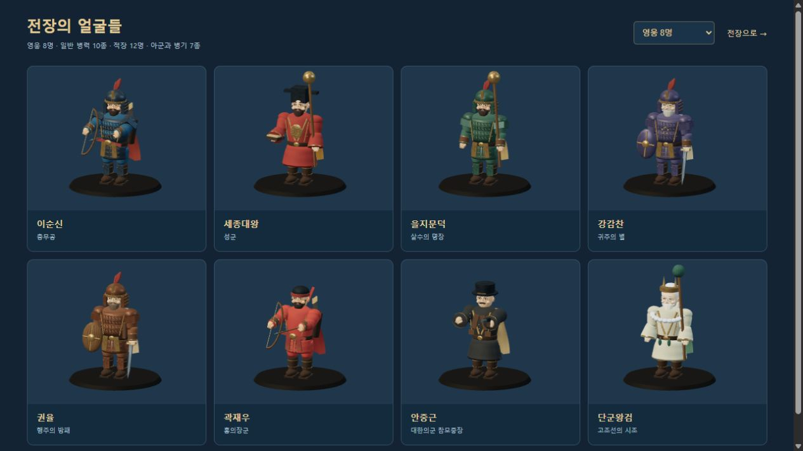
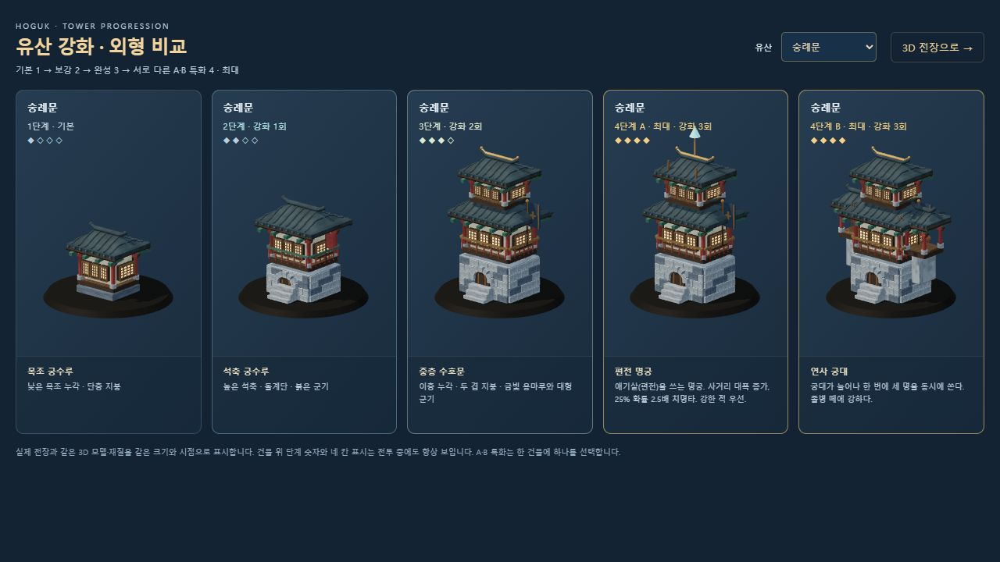
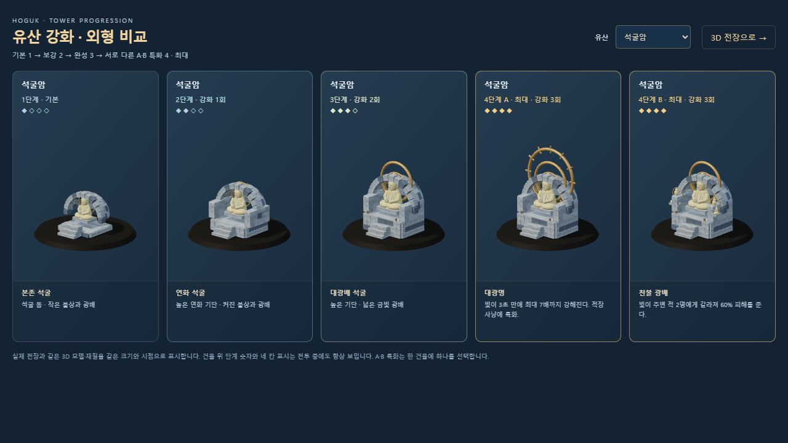
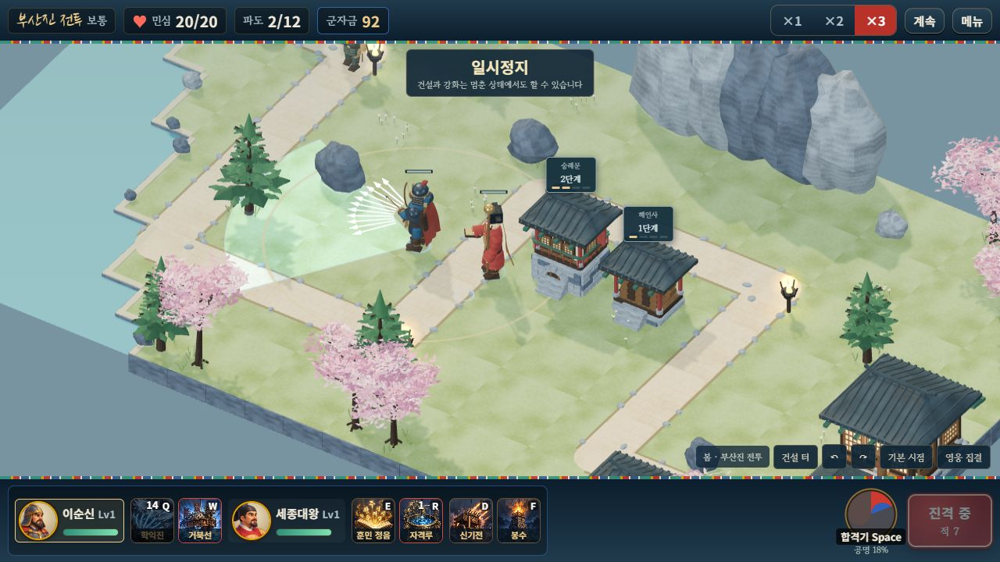
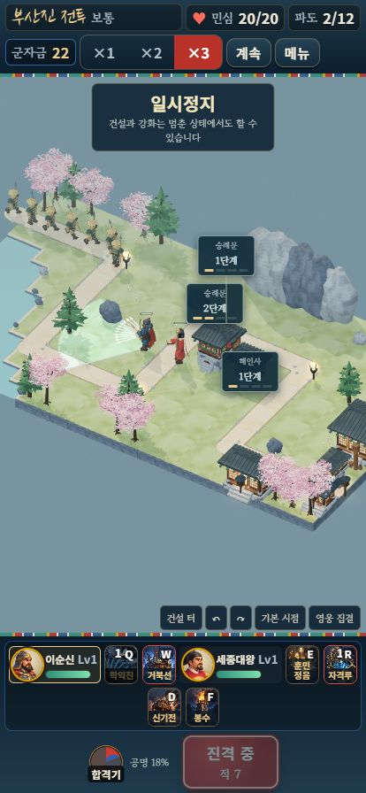
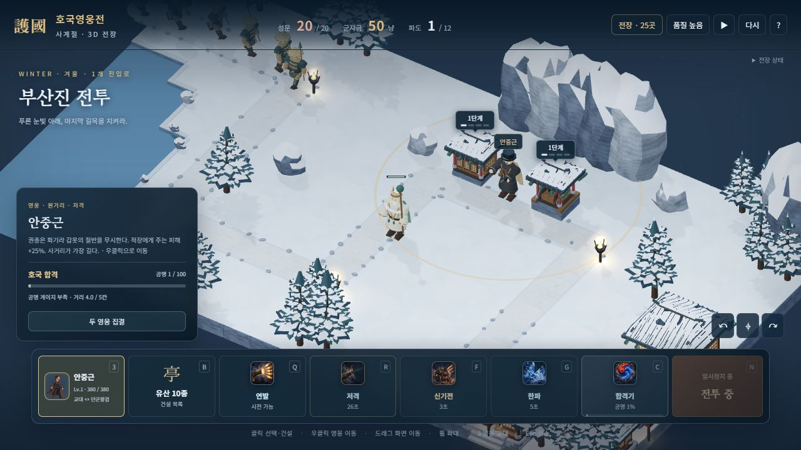
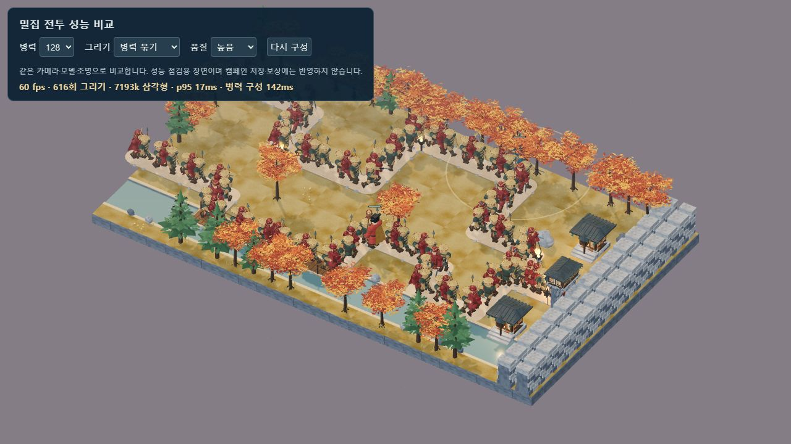

# 캐릭터·건물 조형 개선 · 2026-10-10

이후 영웅별 얼굴·체형·장비와 활·발목 동작을 개선했습니다. 가장 최근의 화면과 70개 자동 검사는 [영웅 조형·동작 검증](HERO_MODELS_AND_MOTION.md)에 기록했습니다.

이 문서는 조형 변경 당시의 검증 기록입니다. 이후 적용한 전용 돌·목재·길·풀밭 재질과 주변 지형의 최신 화면·성능은 [전용 재질·배경 검증](PAINTED_ENVIRONMENTS.md)에 기록했습니다.

참고 이미지의 애니메이션풍 입체 표현에 가까워지도록 실제 전투용 메시와 관절을 수정했습니다. 정식 게임과 단일 HTML, 사계절 전장 미리보기, 캐릭터·유산 비교 화면에 같은 모델을 적용했습니다. 현재 검증 프로필의 음악·효과음은 모두 0입니다.

[정식 게임](http://127.0.0.1:8080/?mute=1) · [단일 HTML](http://127.0.0.1:8080/dist/hoguk.html?mute=1) · [캐릭터 비교](http://127.0.0.1:8080/dev/3d-roster-review.html) · [유산 단계 비교](http://127.0.0.1:8080/dev/3d-tower-review.html)

## 적용한 모델

- 얼굴은 턱·볼·이마가 이어지는 곡면으로 만들고, 코·귀·눈꺼풀·눈동자·눈빛·입술·머리카락·수염을 조형했습니다. 영웅별 피부와 머리색을 나누고 의복·망토 색을 차분하게 조정했습니다.
- 몸통·소매·허벅지·장화와 갑옷을 연속 곡면으로 바꾸고, 옷 주름·갑옷 겹침·허리띠·옷자락을 더했습니다. 팔꿈치·손목·무릎을 움직이며 무기는 손목 아래의 소켓을 따라갑니다. 병력 복제와 밀집 인스턴스 표시에서도 새 관절을 보존합니다.
- 한옥·누각·성문의 처마는 상면·하면·단면을 가진 곡선 지붕입니다. 기와 줄·기와 끝·목재 테두리·공포·창살·기둥 받침·마루·석축 줄눈·계단을 추가했습니다. 작은 건물의 지붕 높이도 비례에 맞게 낮췄습니다.
- 숭례문 최대 A의 상부 장식을 지붕에 붙이고 최대 B의 곁채에 받침을 추가했습니다. 보신각 종의 곡면·안쪽·띠, 석탑의 처마·모서리, 석굴암 불상·연화대·광배와 곡면 석축을 다듬었습니다. 석굴암·석빙고 돔은 틈이 보이는 개별 곡면 돌로 조립합니다.
- 봄·여름·가을의 활엽수는 큰 덩어리 대신 작은 입체 나뭇잎 묶음과 가지로 구성합니다. 사계절의 기존 길·건설 터·계절 색과 겨울의 눈 표현을 유지합니다.

영웅 8명과 일반 병력·적장·아군의 공용 인체 모델에 적용됩니다. 병기의 바퀴·선체·충차 구조는 기존 전용 모델을 사용합니다. 유산 10종의 기본·보강·완성·A/B 최대 특화 50개 외형과 단계 배지를 보존합니다.







## 전투 연결과 수정

활·지팡이 투사체는 손에 붙은 실제 무기 위치에서 시작해 원래 표적에 도달합니다. 안중근의 기본 사격·일곱 발·저격과 단군의 첫 번개는 실제 포구·지팡이 끝을 사용합니다. 피해·사거리·명중 시점은 기존 시뮬레이션을 따릅니다.

GPT 아스트라 xhigh의 읽기 전용 검토에서 곽재우의 연쇄 화살이 원래 영웅으로 되돌아가 보일 수 있는 문제, 게스트 상태에서 영웅 발사자 정보가 빠지는 문제, 안중근 사격이 투사체 대신 즉시 명중 이벤트를 쓰는 점을 확인했습니다. 연쇄 표시를 별도로 전달하고, 압축 상태 뒤에 영웅 ID·연쇄 여부를 추가하며, 실제 사격 이벤트에 발사자를 연결해 수정했습니다. 연쇄 화살·번개는 맞은 적에서 이어집니다. 이전 15필드 압축 투사체도 읽을 수 있습니다. 후속 검토에서 새 결함은 발견되지 않았습니다.

## 이번 검증

| 검사 | 결과 |
|---|---|
| 시뮬레이션 자체 점검 | 14개 통과 |
| 3D 지도·전체 모델·관절·조준·효과·자원 정리 | 32개 통과 |
| 정식 세션·저장·협동·스냅샷 호환 | 15개 통과 |
| 단일 HTML의 실제 부산진 전투 | 건설·2단계 강화·영웅 이동·학익진 시전·2파 진입, 민심 20/20 확인 |
| 414×896 브라우저 화면 | 추가 숭례문 건설 성공, 군자금 92→22, 문서 폭 414px, 가로 넘침 0, 두 숭례문의 단계 배지 비겹침 |
| 겨울 전장 미리보기 | 안중근·단군 편성, 새 모델로 파도 진행, 높음/낮음 품질 전환 성공 |
| 브라우저 오류 | 최신 단일 파일·겨울 미리보기의 console error/warn 0 |
| 글꼴·설정 | 전투 버튼의 이전 Black Han Sans 사용 0, 음악·효과음 0, 검사 후 기본 화면 크기·높음 품질·1배속 복원 |
| 빌드 | 외부 CDN 없는 3D 번들과 13,757KB 단일 HTML 갱신 |

새 자동 검사에는 전체 인체 모델의 관절 계층·복제 후 동작, 지붕의 상면·하면·단면 방향, 실제 곽재우 공격에서 생긴 연쇄 화살, 안중근의 실제 기본·기술·궁극기 이벤트와 단군 연쇄 번개가 포함됩니다. 스냅샷 검사에서 새 영웅 발사자·연쇄 정보와 이전 형식의 호환을 확인했습니다.







## 새 모델 성능

같은 Windows PC의 Codex 브라우저, 1280×720, 높음 품질, 가을 s12 지도와 같은 카메라, 영웅 2명·유산 없음에서 측정했습니다. 아시가루·사무라이·철포병을 같은 비율로 표시했습니다. 이전 모델의 [성능 기록](PERFORMANCE_VALIDATION.json)과 구분한 [이번 측정](SCULPTED_MODEL_VALIDATION.json)입니다.

| 표시 | 병력 | 그리기 호출 | 삼각형 약 | FPS | 프레임 간격 p95 | 병력 초기 동기화 |
|---|---:|---:|---:|---:|---:|---:|
| 개별 메시 | 64 | 5,248 | 426만 | 48 | 33ms | 1,397ms |
| 인스턴스 | 64 | 572 | 426만 | 60 | 17ms | 127ms |
| 인스턴스 | 128 | 616 | 719만 | 60 | 17ms | 142ms |

64명에서 그리기 호출은 약 89.1% 감소했습니다. 첫 64명 인스턴스 구성은 116ms, 반복 구성은 127ms였습니다. 초기 동기화는 모델 준비 시간을 포함하고 캐시·순서에 영향을 받습니다. FPS는 60 제한이 있는 짧은 관측 구간이며 다른 PC나 실제 휴대폰의 성능을 보장하지 않습니다.



## 재현과 남은 제작 범위

```bash
node tools/selftest.mjs
node tools/test-3d.mjs
node tools/test-campaign.mjs
node tools/build-3d.mjs
node tools/build.mjs
node server/server.js
```

현재 모델은 코드로 만든 곡면과 관절 메시입니다. 참고 이미지 수준의 고유 조형·손으로 그린 재질·머리카락·피부 스킨 리깅·전용 걷기/공격 애니메이션은 별도 아트 제작이 남아 있습니다. 실제 휴대폰의 발열·메모리, 외부 인터넷 두 기기의 지연·장시간 재접속, 사람 플레이와 어려움·지옥의 실제 재화 성장 검증도 남아 있습니다. 이번 변경은 시각 모델과 발사 표시를 개선했으며 이전 성장 검증 전체를 새로 실행한 결과로 간주하지 않습니다.
