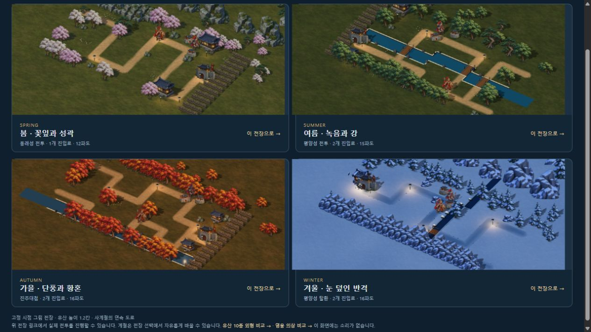

# 계절 수목과 풍경 다듬기

2026-10-11. 승인된 그림 전장에 봄 꽃나무·여름 활엽수·가을 단풍을 추가했다. 이순신 v2와 기본 영웅·작은 유산의 확정 톤을 유지하며 주변 풍경의 계절 차이를 키웠다.

## 적용

- 내장 imagegen으로 기존 겨울 소품을 참고해 투명 수목 6개를 제작했다. 봄은 분홍·흰 벚꽃, 여름은 차가운 녹색·회녹색 활엽수, 가을은 황동빛·붉은 단풍의 두 변형이다.
- 실제 지도의 나무와 주변 숲에 계절 수목을 섞고 소나무 군락도 유지한다. 겨울에는 기존 설송·눈 소품을 사용한다. 먼 배경 숲은 기존 표현이다.
- 각 나무는 실제 투명 경계로 분리하고 사방 12픽셀 여백을 둔다. 줄기 아래를 배치 기준으로 삼고 요청된 월드 높이에 맞춘다. 접지 그림자와 기울어진 투영 그림자를 함께 사용한다.
- 계절 소품 준비는 전장의 코어 로딩에 포함한다. 새 시트가 실패하면 기존 계절 소품으로 대체하며 영웅·유산·병력 준비는 계속한다. 종료 후 늦은 완료가 전장이나 GPU 자원을 되살리지 않는다.
- 원본 캔버스는 공유하고 계절별 색·텍스처·재질·지오메트리는 각 그림 소유자가 관리한다. 사계절 비교 화면도 실제 전장과 같은 그림을 사용한다.
- 모바일 비교 중 발견한 영웅 이름표 넘침을 수정했다. 화면 안의 이름은 8픽셀 여백을 두고 배치하며 화면 밖 영웅의 이름표는 숨긴다. 전장 컨테이너도 넘침을 잘라낸다.

원본은 `assets/3d/fixed/source/season-trees-v1.png`, 배포본은 `assets/3d/fixed/season-trees-v1.webp`, 전체 생성 지시와 참고 경로는 인접한 `.prompt.json`에 보존했다. 1536×1024 WebP 한 장은 **575,836바이트**다. 후처리는 압축·경계 분석만 수행했으며 알파는 원본과 같다.

## 확인

새 수목 6개의 이웃 혼입·누락·중복·외곽 접촉·알파 변경은 모두 0이다. 검사 도구를 3×2 소품 시트에도 사용할 수 있게 확장한 뒤 기존 영웅·병력·의상 **832포즈**의 경계와 알파 검사를 모두 다시 통과했고 저장된 포즈 좌표도 일치했다. [수목 자산 검사](SEASON_TREE_ASSET_VALIDATION.json).

`node tools/test-seasonal-props.mjs`의 6개 검사는 계절 선택·겨울 보존, 실제 메시의 높이·줄기 기준점·UV·그림자, 실제 사계절 풍경과 지도 불변, 소유자별 색·자원 정리, 시트 실패 대체, 종료 후 늦은 완료를 확인한다. 기존 141개와 합해 자동 검사 **147개**를 통과했다. 모바일 이름표 후속 수정 뒤 전투 미술 검사 13개도 다시 통과했다.

서버 번들과 단일 HTML 빌드, 방향 시트 52장·새 지면 3장·수목 시트 1장 각각의 단일 포함 검사를 통과했다. 이 작업의 단일 HTML은 **45,592,947바이트**다. 거부된 이전 그림 여섯 장은 포함하지 않는다. GPT Astra xhigh의 수목 구현 검토를 통과했고, 이름표 검토에서 지적된 화면 밖 이름표 조건도 수정 후 재검토를 통과했다. [통합 결과](SEASONAL_SCENERY_VALIDATION.json).

브라우저에서 실제 봄 전투 3파도·일시정지, 여름 평양성·가을 진주·겨울 평양성 탈환과 사계절 비교, 414×896 전장·계절 비교·카메라 이동·전장 선택창을 확인했다. 수정 후 가로 넘침과 확인한 콘솔 경고·오류는 없었다. 재빌드한 단일 HTML은 제목 화면 기동까지 확인했다. 정식 프로필·구매·승패 보상은 변경하지 않았다. [브라우저 기록과 수정 전후](SEASON_TREE_BROWSER_VALIDATION.json).

## 정확한 범위

이번 추가는 고정 시점 2.5D 전장의 수목 그림이다. 시뮬레이션의 지도·경로·건설 위치·경제·피해 계산과 모든 유산의 높이 1.2칸은 유지한다. 평면 대체 모드·먼 숲·주변 건물 전체를 새로 제작한 것은 아니다. 강 경계와 개별 기술 연출, 긴 보행 연결은 추가 범위이며 실제 휴대폰 성능·외부 네트워크 협동·사람의 후반 밸런스 검증도 남아 있다.
