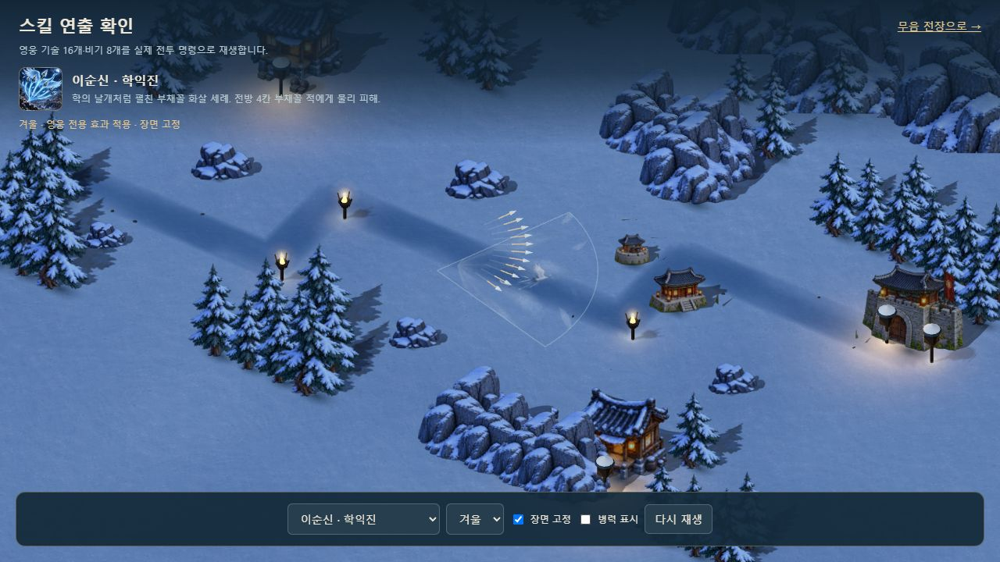
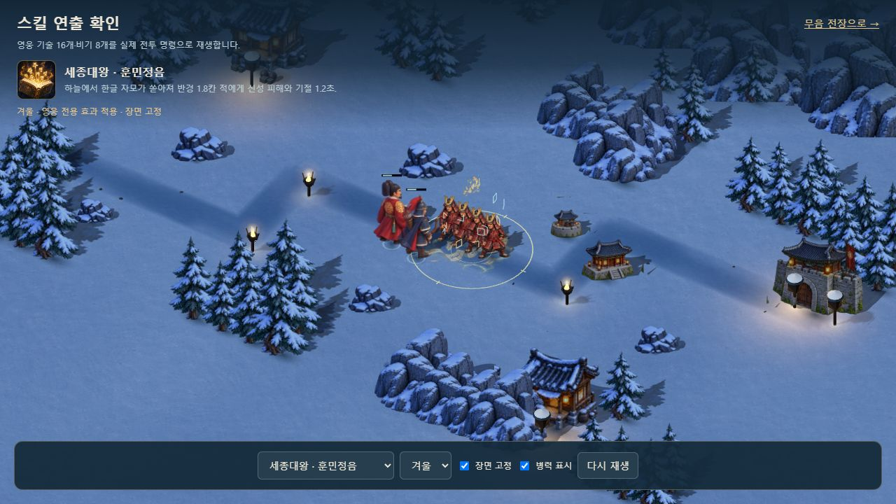
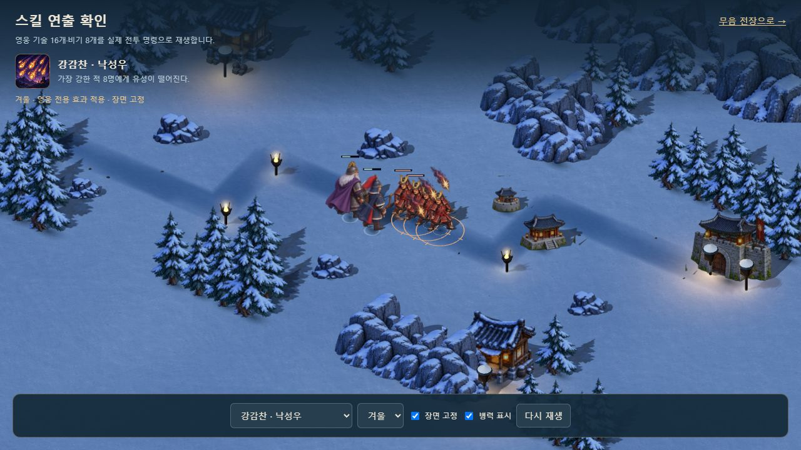

# 영웅 전용 기술 그림과 연출

2026-10-11. 캐릭터의 발걸음·공격 복귀 개선에 이어 **영웅 기술 16개에 각각 다른 그림 모티프**를 연결했다. 기존 전투 명령·투사체·장판·이동체의 실제 위치와 시점을 사용한다. 로컬 1P 마우스·2P 방향키/ASDF/E와 온라인 이벤트 전달은 유지한다.

## 그림과 실제 연결

| 영웅 | 기술 | 궁극기 |
|---|---|---|
| 이순신 | 실제 학익진 부채꼴 안의 온전한 학·깃털, 기존 화살 | 실제 출격 거북선 아래 남색 항적 |
| 세종대왕 | 종이·붓글씨 낙하와 실제 한글 착탄 | 시전자 발밑의 놋쇠 자격루 눈금 |
| 을지문덕 | 실제 청야 장판의 절제된 불 리본 | 실제 살수 착탄의 푸른 물결 |
| 강감찬 | 실제 돌격 구간의 오래된 금빛 초승달 | 실제 낙하 투사체의 금빛 별·자주색 꼬리 |
| 권율 | 실제 투석 착탄의 바위·먼지 | 실제 목책 좌표의 나무·놋쇠 방패 |
| 곽재우 | 실제 의병 세 명의 생성 위치에 붉은 깃발·옥빛 연무 | 시전자 발밑의 붉은 비단·화살 나선 |
| 안중근 | 실제 총구의 따뜻한 섬광과 기존 일곱 사격선 | 실제 표적의 놋쇠 조준선·실제 총구 섬광 |
| 단군왕검 | 실제 마늘 투사체의 상아색 마늘·옥빛 잎 | 실제 번개 착탄의 진주색 번개·남색 구름 |

공용 그림 8종도 유지한다. 비기 8종과 전용 합격기 10종에 모두 새 개별 모티프를 제작한 범위는 아니다. 원래 25칸 기술·비기·합격기 아이콘 디자인과 이순신 학익진 별도 아이콘은 유지하며, 두 기존 PNG 시트를 WebP로 바꿨다. 원본 6,130,644바이트에서 배포 1,068,016바이트로 줄였고 해상도·알파는 같다. 전투 효과가 영웅과 적을 가리지 않도록 대부분 작은 지면 그림과 짧은 퇴장을 사용한다.







## 원본과 구현

- 생성: 내장 imagegen. [원본 PNG](../assets/3d/fixed/source/hero-signatures-v1.png)와 [최종 전체 프롬프트](../assets/3d/fixed/source/hero-signatures-v1.prompt.txt)를 보존했다.
- 배포: `assets/3d/fixed/hero-signatures-v1.webp`, 1254×1254, **858,154바이트**.
- `tools/signature-assets.mjs`는 실제 알파 성분의 경계를 구한다. nominal 4×4 경계를 넘은 깃털·깃발·번개도 전체를 보존하고 각 그림에 12px 투명 여백을 더한다. 재도색 없이 압축·경계 분석만 수행했다.
- `signature-art.js`는 디코딩 이미지를 공유하고 실제 사용한 모티프만 전장별 GPU 텍스처로 준비한다. 효과 만료는 개별 메시만 해제하고 공유 그림은 전장 종료 때 한 번 해제한다. 동시 일반 효과는 기존 64개 상한을 유지하며 실제 지속 장판은 별도 수명을 따른다.
- 기존에 위치 신호가 없던 자격루·행주산성·의병 매복·홍의 질풍에는 표시 전용 `abilityCue` 이벤트를 추가했다. 실제 생성 좌표와 소유자를 전달하며 피해·난수·재사용 시간·군자금을 바꾸지 않는다.
- 그림 실패·늦은 준비는 기존 공용 효과로 대체하며 전투를 멈추지 않는다. 학익진의 실제 사거리 4.2와 반각 .72는 그대로다.

## 고친 문제

Astra xhigh 검토에서 규칙적인 칸 경계가 학의 부리를 자르는 문제와 부채꼴 UV가 날개 약 34.82%를 자르는 문제를 확인했다. 실제 알파 경계와 별도 직사각형 그림으로 해결했고, 학 그림 모든 꼭짓점이 실제 부채꼴 안에 놓이는지 검사한다. 비교 화면 하위 경로에서 아이콘을 잘못 요청하던 URL도 수정했다.

브라우저에서는 대기 중인 천부인 번개가 검은 구체로 표시되고 같은 표적의 예고가 겹쳤다. 번개 대기 구체를 생략하고 같은 표적·반경의 예고만 합쳤다. 실제 12개 투사체·12회 착탄과 피해는 보존한다. 훈민정음 낙하도 작은 종이 그림으로 연결했다. 최종 Astra 재검토의 추가 필수 수정은 0개다.

## 검증

새 효과 검사 **12개**, 기존 회귀 **173개**, 총 **185개**를 통과했다. 실제 16기술·8비기·참격·합격기 명령, 양측 소유권, JSON 전달, 학익진 범위, 12회 번개, 늦은 로딩·실패·일시정지·만료·재시작·종료를 검사한다. 변경 전 솔로/협동 완주 두 판과 원래 전투 이벤트·기존 스냅샷·수입·승패 SHA가 같다. 이 비교에서 이번에 새로 추가한 표시 전용 `abilityCue`만 제외하며 기존 이벤트를 제외하지 않는다.

실제 브라우저 UI로 26개 선택 항목과 사계절을 재생했다. 16모티프 준비 후 같은 학익진 장면에서 다시 16기술을 순회해도 geometry **148→148**, texture **130→130**으로 같았다. 장면 고정 시간도 .27초로 유지됐다. 414×896에서 가로 넘침이 없고 세 검사 탭의 콘솔 경고·오류는 0이다. 실제 휴대폰 측정은 아니다.

격리된 8092 주소에서 최신 정식 로컬 2인, 2P 700ms 이동·A 기술과 1P 마우스 학익진·일시정지를 확인했다. 양측 군자금은 각각 156으로 유지됐고 원래 8080 주소의 프로필·보상은 건드리지 않았다. 단일 HTML에서도 2인 전장과 내장 효과 준비를 확인했다.

두 빌드를 완료했다. `dist/hoguk.html`은 **40,027,971바이트**로, 방향 시트 52장·지면 3장·수목 1장·물 1장·이번 기술 시트 3장이 각각 한 번 들어간다. 원본 아이콘 PNG와 거부된 이전 시트는 들어가지 않는다. 실제 기기·외부 네트워크·file 프로토콜 검증은 남아 있다.

[통합 결과](SKILL_SIGNATURES_VALIDATION.json) · [그림 경계 검사](SKILL_SIGNATURE_ASSET_VALIDATION.json) · [아이콘 압축 검사](SKILL_ICON_ASSET_VALIDATION.json) · [브라우저 기록](SKILL_SIGNATURE_BROWSER_VALIDATION.json)

```bash
node tools/test-signatures.mjs
node tools/signature-assets.mjs
node tools/skill-icon-assets.mjs
node tools/check-motion-determinism.mjs
node tools/build-3d.mjs
node tools/build.mjs
node tools/verify-embedded-art.mjs
```

다음 순서는 전장 소품 배치, 밀집 전투의 크기·색 대비, 메뉴·초상화 톤 연결이다. 새 중간 그림을 더한 긴 애니메이션과 비기·전용 합격기 전체의 개별 그림은 별도 자산 범위로 남아 있다.
