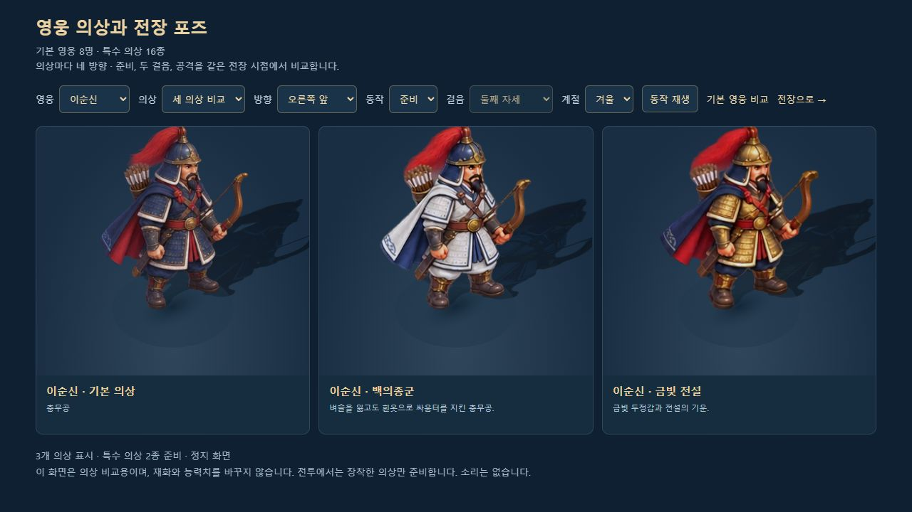
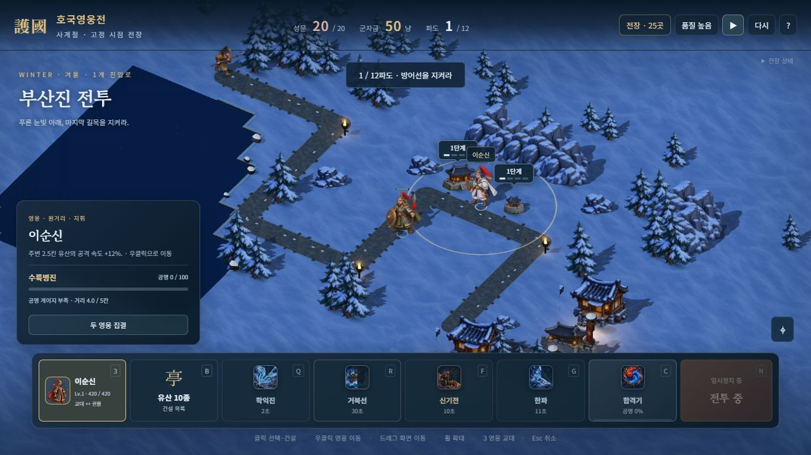

# 특수 의상 256포즈

> 2026-10-11 · 승인된 이순신 v2와 기본 영웅의 화풍 유지

기존 특수 의상 16종에 각각 네 방향의 준비·걷기 두 자세·공격 그림을 연결했다. 새 그림 256개와 기존 기본 영웅·병력 576개를 합하면 준비된 전장 포즈는 832개다. 이순신은 남색 망토·활·화살통, 권율은 붉은 망토·창·방패라는 구분을 유지한다. 유산의 모든 단계 높이는 1.2칸이다.

## 원본과 생성

내장 imagegen으로 승인된 영웅 시트를 참고해 의상별 완성 시트를 생성했다. PNG 원본·알파·최종 생성 프롬프트를 보존하고, Sharp는 WebP 압축과 픽셀 검사에만 사용했다. 최종 배포 그림 16장 합계는 5,677,748바이트다. 아래 프롬프트에는 최종 참고 파일과 반환된 생성 파일 경로가 있다.

| 영웅 · 의상 | 최종 파일 |
|---|---|
| 이순신 · 백의종군 | [WebP](../assets/3d/fixed/skins/yi_white-directions-v2.webp) · [PNG](../assets/3d/fixed/skins/source/yi_white-directions-v2.png) · [최종 프롬프트](../assets/3d/fixed/skins/yi_white-directions-v2.prompt.json) |
| 이순신 · 금빛 전설 | [WebP](../assets/3d/fixed/skins/yi_gold-directions-v2.webp) · [PNG](../assets/3d/fixed/skins/source/yi_gold-directions-v2.png) · [최종 프롬프트](../assets/3d/fixed/skins/yi_gold-directions-v2.prompt.json) |
| 세종대왕 · 청룡포 | [WebP](../assets/3d/fixed/skins/sejong_blue-directions-v2.webp) · [PNG](../assets/3d/fixed/skins/source/sejong_blue-directions-v2.png) · [최종 프롬프트](../assets/3d/fixed/skins/sejong_blue-directions-v2.prompt.json) |
| 세종대왕 · 금빛 전설 | [WebP](../assets/3d/fixed/skins/sejong_gold-directions-v2.webp) · [PNG](../assets/3d/fixed/skins/source/sejong_gold-directions-v2.png) · [최종 프롬프트](../assets/3d/fixed/skins/sejong_gold-directions-v2.prompt.json) |
| 을지문덕 · 고구려 철기 | [WebP](../assets/3d/fixed/skins/eulji_iron-directions-v1.webp) · [PNG](../assets/3d/fixed/skins/source/eulji_iron-directions-v1.png) · [최종 프롬프트](../assets/3d/fixed/skins/eulji_iron-directions-v1.prompt.json) |
| 을지문덕 · 금빛 전설 | [WebP](../assets/3d/fixed/skins/eulji_gold-directions-v1.webp) · [PNG](../assets/3d/fixed/skins/source/eulji_gold-directions-v1.png) · [최종 프롬프트](../assets/3d/fixed/skins/eulji_gold-directions-v1.prompt.json) |
| 강감찬 · 귀주의 붉은 별 | [WebP](../assets/3d/fixed/skins/gang_crimson-directions-v1.webp) · [PNG](../assets/3d/fixed/skins/source/gang_crimson-directions-v1.png) · [최종 프롬프트](../assets/3d/fixed/skins/gang_crimson-directions-v1.prompt.json) |
| 강감찬 · 금빛 전설 | [WebP](../assets/3d/fixed/skins/gang_gold-directions-v1.webp) · [PNG](../assets/3d/fixed/skins/source/gang_gold-directions-v1.png) · [최종 프롬프트](../assets/3d/fixed/skins/gang_gold-directions-v1.prompt.json) |
| 권율 · 행주 산성 | [WebP](../assets/3d/fixed/skins/gwon_hill-directions-v1.webp) · [PNG](../assets/3d/fixed/skins/source/gwon_hill-directions-v1.png) · [최종 프롬프트](../assets/3d/fixed/skins/gwon_hill-directions-v1.prompt.json) |
| 권율 · 금빛 전설 | [WebP](../assets/3d/fixed/skins/gwon_gold-directions-v1.webp) · [PNG](../assets/3d/fixed/skins/source/gwon_gold-directions-v1.png) · [최종 프롬프트](../assets/3d/fixed/skins/gwon_gold-directions-v1.prompt.json) |
| 곽재우 · 흑의 의병 | [WebP](../assets/3d/fixed/skins/gwak_black-directions-v1.webp) · [PNG](../assets/3d/fixed/skins/source/gwak_black-directions-v1.png) · [최종 프롬프트](../assets/3d/fixed/skins/gwak_black-directions-v1.prompt.json) |
| 곽재우 · 금빛 전설 | [WebP](../assets/3d/fixed/skins/gwak_gold-directions-v1.webp) · [PNG](../assets/3d/fixed/skins/source/gwak_gold-directions-v1.png) · [최종 프롬프트](../assets/3d/fixed/skins/gwak_gold-directions-v1.prompt.json) |
| 안중근 · 대한의군 군복 | [WebP](../assets/3d/fixed/skins/ahn_militia-directions-v1.webp) · [PNG](../assets/3d/fixed/skins/source/ahn_militia-directions-v1.png) · [최종 프롬프트](../assets/3d/fixed/skins/ahn_militia-directions-v1.prompt.json) |
| 안중근 · 금빛 전설 | [WebP](../assets/3d/fixed/skins/ahn_gold-directions-v1.webp) · [PNG](../assets/3d/fixed/skins/source/ahn_gold-directions-v1.png) · [최종 프롬프트](../assets/3d/fixed/skins/ahn_gold-directions-v1.prompt.json) |
| 단군왕검 · 천제의 푸른 옷 | [WebP](../assets/3d/fixed/skins/dangun_sky-directions-v1.webp) · [PNG](../assets/3d/fixed/skins/source/dangun_sky-directions-v1.png) · [최종 프롬프트](../assets/3d/fixed/skins/dangun_sky-directions-v1.prompt.json) |
| 단군왕검 · 금빛 전설 | [WebP](../assets/3d/fixed/skins/dangun_gold-directions-v1.webp) · [PNG](../assets/3d/fixed/skins/source/dangun_gold-directions-v1.png) · [최종 프롬프트](../assets/3d/fixed/skins/dangun_gold-directions-v1.prompt.json) |

첫 이순신 백의 시트는 인물 두 개가 연결돼 15개 성분으로 검출됐고, 금빛 이순신·청룡포 세종·금빛 세종 v1에는 이웃 픽셀 2·57·37개가 있었다. 네 시트를 충분한 간격의 v2로 다시 생성했다. 거부된 v1도 추적용으로 보존하며 빌드에는 넣지 않는다.

## 실제 전투 연결

skin-pose-data.js의 검증된 경계와 발 기준점을 사용한다. 기본 영웅과 같은 표시 배율로 본체·접지 그림자·가림 실루엣의 자세를 함께 전환한다. 코어 그림과 전장 병종, 현재 장착한 의상이 모두 준비될 때까지 솔로·로컬·호스트의 첫 전투 틱을 보류한다. 게스트는 이 동안에도 호스트 스냅샷을 받고 보간한다.

전체 의상 16장을 전투마다 해독하지 않는다. 검증된 영웅·의상 쌍을 정렬·중복 제거한 값으로 요청을 구분하고, 장착값이 같으면 기존 Promise를 유지한다. 장면 전환 때는 살아 있는 영웅과 사망 잔상의 개인 자원을 먼저 해제하고 빠진 의상 시트·GPU 자원을 정리한다. 늦은 이전 요청은 새 전장에 반영되지 않는다. 의상 그림 하나가 실패하면 그 영웅의 승인된 기본 16포즈로 대체한다.

[자유 전장](http://localhost:8080/3d.html?mute=1)의 첫째·둘째 영웅에 의상 선택을 추가했다. 미술 비교용이므로 정식 프로필의 의상 소유·재화·능력치·보상을 바꾸지 않는다. 정식 캠페인은 기존 정상 구매·장착 상태를 그대로 사용한다.

## 검증

새 의상 검사 14개와 기존 검사 119개, 총 133개를 통과했다. 포즈 256개의 이웃 혼입·누락·중복·외곽 접촉과 PNG/WebP 알파 변경은 모두 0이다. Astra xhigh 검토에서 첫 틱·비동기 요청·게스트 수신·자원 해제 순서를 확인했고 필수 추가 수정은 없었다.

브라우저에서 16종 × 네 방향 × 네 자세의 실제 루트 표시를 모두 확인했다. 사계절·재생/정지, 이순신 백의+권율 행주 의상의 실제 파도 진입과 일시정지, 재시작 유지, 나고야성 세종 청룡포 단독 출정으로 의상 준비 2→1종 전환, 414×896 비교·전투 표시를 확인했다. 콘솔 경고·오류와 모바일 가로 넘침은 없었다. 정식 프로필에서 승패 보상이나 의상 구매를 발생시키지 않았다.

두 빌드를 통과했고 단일 HTML은 44,700,527바이트다. 방향 시트 52장(기본 영웅 8·병력 28·의상 16)을 각각 한 번만 포함하며 거부된 여섯 시트는 제외한다. 단일 HTML은 제목 화면 기동을 확인했다. 의상 실전 로딩은 별도 자유 전투와 실제 Session/GameUI 자동 검사로 검증했다.

- [전체 검증](SKIN_DIRECTIONAL_ART_VALIDATION.json)
- [픽셀·자산 검사](SKIN_POSE_ASSET_VALIDATION.json)
- [브라우저 기록](SKIN_DIRECTIONAL_ART_BROWSER_VALIDATION.json)
- [의상 비교 화면](http://localhost:8080/dev/3d-skin-pose-review.html?mute=1)

걷기는 두 자세 교대 방식이다. 긴 보행·공격 연결은 남아 있다. 메뉴 초상화와 평면 대체 모드는 기존 의상 시트를 유지한다. 이번 PC의 반응형 표시는 실제 휴대폰의 메모리·발열·터치 검증과 구분한다.
