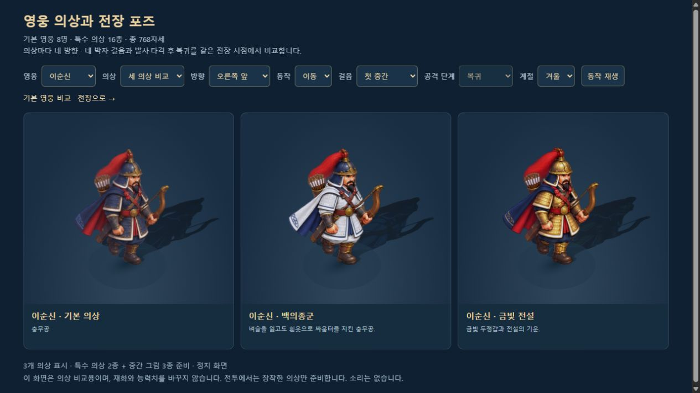
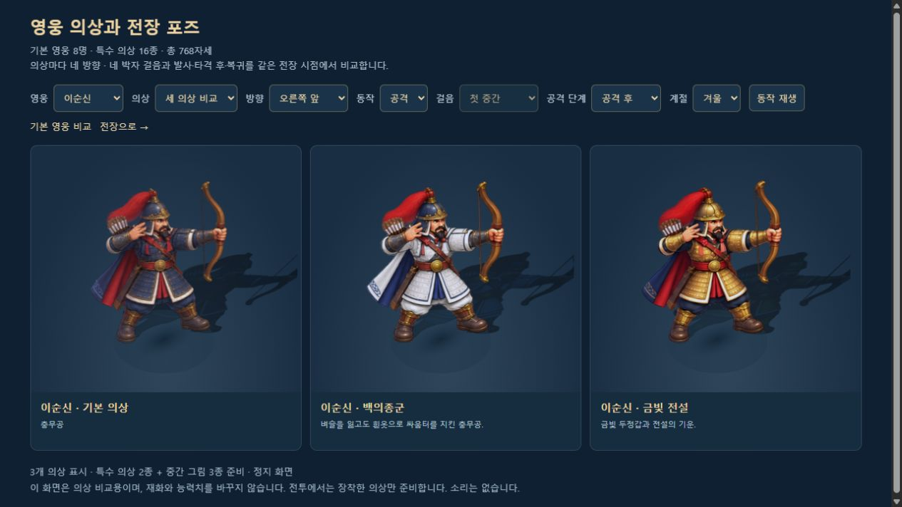
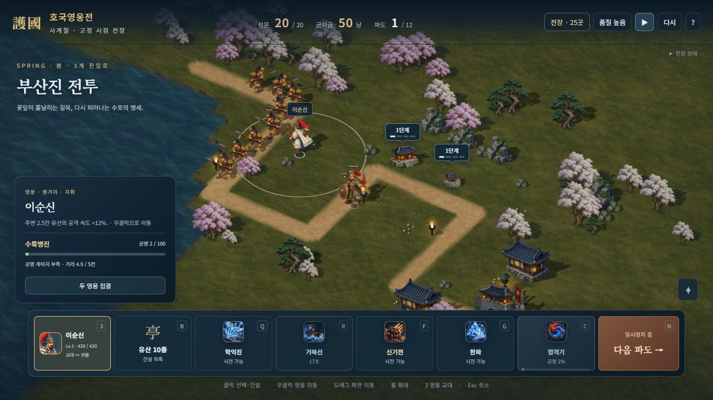
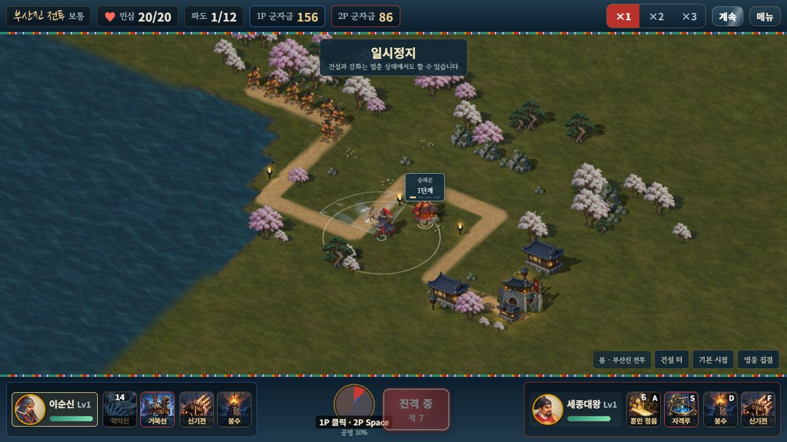

# 특수 의상 중간 동작 원화

2026-10-11. 특수 의상 16종에 네 방향의 중간 걸음 A·B, 발사·타격 후, 복귀 **256장**을 추가했다. 앞선 기본 영웅 중간 원화 128장과 합한 추가 원화는 **384장**이다. 기본 8종·특수 의상 16종의 24가지 영웅 외형은 각각 32자세, 총 **768자세**를 사용한다. 병력 448장을 합한 전장용 준비 그림은 **1,216장**이다.

승인된 기존 832장과 앞선 기본 중간 128장의 픽셀·배율·좌표는 그대로 유지했다. 이순신의 활·화살통·망토와 권율의 창·방패 구분, 유산의 전 단계 높이 1.2칸, 로컬 2인 조작·소유·군자금·전투 계산을 유지한다.



## 적용 범위

| 영웅 | 추가한 특수 의상 |
|---|---|
| 이순신 | 백의종군 `yi_white` · 금빛 전설 `yi_gold` |
| 세종대왕 | 청룡포 `sejong_blue` · 금빛 전설 `sejong_gold` |
| 을지문덕 | 고구려 철기 `eulji_iron` · 금빛 전설 `eulji_gold` |
| 강감찬 | 귀주의 붉은 별 `gang_crimson` · 금빛 전설 `gang_gold` |
| 권율 | 행주 산성 `gwon_hill` · 금빛 전설 `gwon_gold` |
| 곽재우 | 흑의 의병 `gwak_black` · 금빛 전설 `gwak_gold` |
| 안중근 | 대한의군 군복 `ahn_militia` · 금빛 전설 `ahn_gold` |
| 단군왕검 | 천제의 푸른 옷 `dangun_sky` · 금빛 전설 `dangun_gold` |

각 의상의 원래 색·장비와 승인된 부드러운 입체 일러스트 톤을 참고해 새 원화를 제작했다. 기존 두 펼침 걸음 사이에 새 두 중간 걸음을 넣어 **네 박자 보행**을 사용한다. 실제 발사·피해 시각에 기존 공격 자세를 시작하고 타격 후·복귀 자세를 연결한다. 새 원화 때문에 공격 판정이나 투사체를 늦추지 않는다.

병력 28종은 기존 준비·두 이동·공격 그림 448장과 거리 기반 접지를 유지한다. 이번 작업은 영웅 의상의 확장이며 병력의 긴 동작 주기나 메뉴의 새 고해상도 흉상 제작은 후속 범위다.

## 원화와 재현

내장 imagegen으로 각 의상의 원래 16포즈와 해당 기본 영웅의 승인된 중간 16포즈를 함께 참고해 투명 원화 16장을 제작했다. 네 행은 중간 A·중간 B·타격 후·복귀, 네 열은 앞오른쪽·뒤오른쪽·뒤왼쪽·앞왼쪽이다. 활시위의 발사 후 상태, 두 손과 무기 개수, 책·방패·천부인의 연결을 확인했다.

- 생성 원본과 최종 프롬프트: `assets/3d/fixed/inbetweens/source/skins/{skinId}-inbetweens-v1.png`와 `.prompt.txt`.
- 기계적 포장 PNG: `assets/3d/fixed/inbetweens/source/{skinId}-inbetweens-packed-v1.png`.
- 배포: `assets/3d/fixed/inbetweens/{skinId}-inbetweens-v1.webp`, 새 16장 합계 **14,735,932바이트**, 전체 중간 시트 24장 합계 **22,546,712바이트**.
- 선택 칸·동일 비율 배율·몸 기준점: `tools/inbetween-specs.json`. 의상마다 원래 준비 자세의 `referenceHeight`를 유지한다. 크기 맞춤은 균일 리사이즈이며 일부 강감찬 원화는 약 1.05–1.07배 확대한다.
- 런타임 좌표: `src/3d/inbetween-data.js`. 원래 행 0–3은 유지하고 새 행 4–7만 추가한다.

코드는 정확한 자르기·균일 크기 변경·24px 투명 여백·포장만 수행한다. 색 변경, 손·무기 그리기, 알파 마스크 수정으로 원화 결함을 숨기지 않는다. 무손실 WebP의 알파와 보이는 RGB는 포장 PNG와 동일하다. 완전 투명한 픽셀의 숨은 RGB는 비교에서 제외한다.

[자산 검사](INBETWEEN_ASSET_VALIDATION.json)는 전체 추가 384장의 이웃 혼입·누락·중복·시트 외곽 접촉·알파·보이는 색 차이 **0**을 기록한다. 의상마다 네 방향의 걷기·공격 접촉 비교 PNG도 `screenshots/inbetweens/`에 보존한다.

## 전투 연결과 누락 대체

기존 동작·로딩 구현에 의상별 메타데이터를 연결했다. 선택한 외형의 중간 시트만 준비하며 같은 소유자·스냅샷을 반복 받아도 재요청하지 않는다. 코어·병력·원래 의상·중간 그림의 준비가 끝날 때 첫 전투 틱을 재개한다. 게스트는 기다리는 동안에도 후속 스냅샷을 받는다.

중간 시트만 실패하면 해당 의상의 기존 두 걸음으로 대체한다. 원래 의상 시트가 실패해 기본 영웅으로 대체된 경우에는 성공한 의상 중간 그림을 섞지 않는다. 살아 있는 영웅과 사망 잔상을 제거한 뒤 빠진 자원을 해제하며 이전 세대·종료 후 늦은 완료를 버린다. 같은 영웅을 다른 의상으로 사용하는 두 플레이어의 상태·개인 재질·그림 자원을 독립적으로 유지한다.

검수 화면에도 중간 A·B와 발사·타격 후·복귀 선택을 추가했다. 긴 활·창의 끝이 카드에 잘리지 않도록 검수 카메라 여백을 늘렸다. 게임의 캐릭터 높이는 유지한다.



## 검증

[전체 릴리스 기록](SKIN_INBETWEEN_RELEASE_VALIDATION.json), [브라우저 기록](SKIN_INBETWEEN_BROWSER_VALIDATION.json), [동작 검사](INBETWEEN_RUNTIME_VALIDATION.json)에 실제 범위를 구분해 기록한다.

- **17개 검사군 228개** 통과. 중간 동작 19개에는 768자세의 실제 지오메트리·그림자·가림 전환, 서로 다른 의상의 실제 로컬 Session 양측 입력·스냅샷·상태 독립, 누락 조합·선택 로딩·정지·자원 정리가 포함된다. 의상 검사에서는 코어·병력·원래 의상·중간 그림의 **24가지 완료 순서**도 확인했다.
- 변경 전 고정 시드 솔로·협동 완주 두 판과 기존 피해·수입·이벤트·결과·스냅샷 SHA가 같다. 시뮬레이션과 조작 코드는 변경하지 않았다.
- Astra xhigh가 로딩·의상 실패 조합·양측 독립·이전 세대·두 월드 자원 소유와 대표 접촉 비교를 검토했다. 최종 런타임에 추가 필수 결함이 없었다.
- 브라우저에서 **32가지 선택 × 24외형 = 768자세**의 인덱스·방향·외형·추가 시트 준비를 확인했다. 검수 화면 414×896에서 가로 넘침 0·모든 선택 요소 표시, 기본 1280×720 복원도 확인했다.
- 자유 전장에서 백의종군 이순신·행주 산성 권율의 **두 의상과 두 중간 시트만 로딩**, 실제 이동 중 `pass-a`, 실제 발사 후 `follow-through`, 일시정지 중 자세·11.3초 시간 고정을 확인했다.
- 최신 단일 HTML에서 **로컬 2인 기본 이순신·세종**의 마우스·방향키 이동, 학익진·훈민정음, 2P E 숭례문 건설, 군자금 **156/86**을 확인했다. 첫 파도 적 7명이 보이는 상태에서 정지해 승패 보상 전 멈췄다. 의상별 2인 상태 독립은 별도의 실제 Session 자동 검사 범위다.
- 세 검수 탭의 콘솔 경고·오류는 0. 검수는 음소거된 8092 주소에서 수행했으며 사용자 8080 프로필은 유지했다. 실제 휴대폰·외부 네트워크 검증은 별도다.





## 빌드와 용량

두 빌드와 내장 검사를 통과했다. 단일 HTML은 **73,505,915바이트**, 방향/중간 시트 **76장**, 메뉴 1장·지면 3장·수목 1장·물 1장·기술 시트 4장을 각각 한 번 포함한다. 원본·참조·포장 PNG **70장**은 포함하지 않는다. 실제 전장에서는 선택한 외형의 중간 시트만 디코딩하지만 단일 HTML 파일에는 전체 배포 그림이 들어가 파일 자체는 커진다. `dist/`는 Git 제외 생성물이므로 저장소에서 다시 빌드한다.

이 파일 크기가 브라우저 검수 도구의 전체 문서 전송 한도를 넘겨 단일 HTML의 DOM 조회는 실패했다. 게임은 정상 표시됐고, 해당 검수는 스크린샷에 근거한 실제 마우스·키보드 입력으로 완료했다. 리뷰 화면의 768자세 DOM 검사는 정상 수행했다.

```bash
node tools/inbetween-assets.mjs
node tools/test-inbetweens.mjs
node tools/test-skin-art.mjs
node tools/check-motion-determinism.mjs
node tools/build-3d.mjs
node tools/build.mjs
node tools/verify-embedded-art.mjs
```

서버 실행 후 [전체 영웅 외형 768자세 비교](http://localhost:8080/dev/3d-skin-pose-review.html?mute=1)에서 영웅·의상·방향·보행·공격 단계를 선택할 수 있다. 다음 원화 범위는 병력 중간 동작이며, 실제 기기 메모리와 배포 용량 최적화도 별도 확인이 필요하다.
