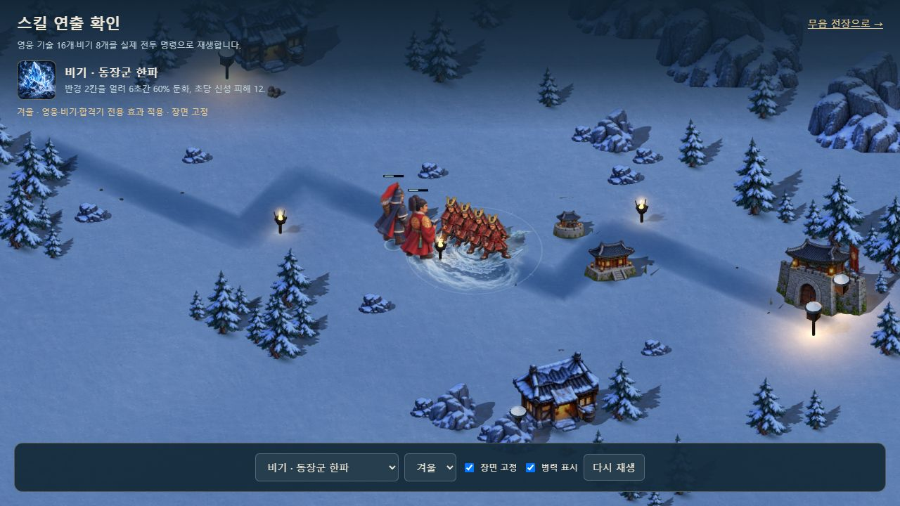
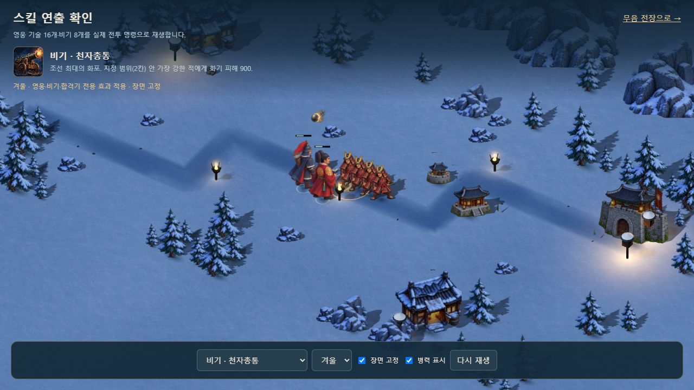
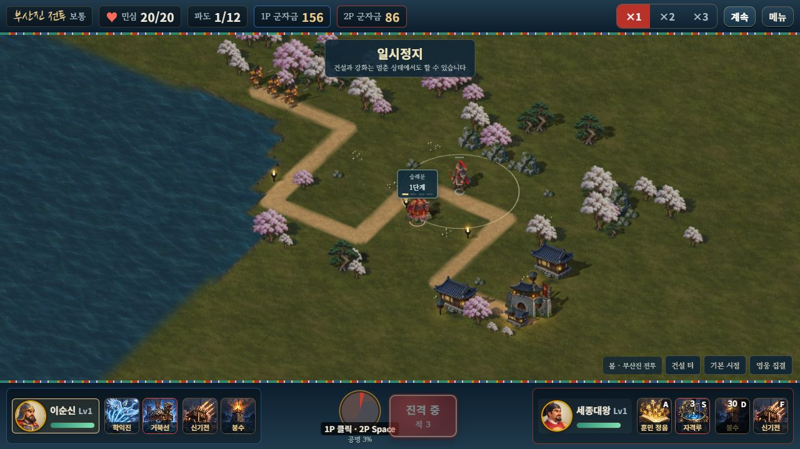

# 비기·합격기 전용 그림

2026-10-11. 기존 영웅 16모티프에 **비기 8개·전용 합격기 10개·일반 합격기·참격, 총 20개**를 추가했다. 내장 imagegen으로 생성하고 원본 PNG·전체 프롬프트·배포 WebP를 함께 보존한다.

[원본](../assets/3d/fixed/source/tactic-signatures-v1.png) · [전체 프롬프트](../assets/3d/fixed/source/tactic-signatures-v1.prompt.txt) · [배포 그림](../assets/3d/fixed/tactic-signatures-v1.webp)

## 정확한 적용 범위

비기는 해결된 시전 위치의 짧은 표식을 사용한다. 의병은 실제 생성 위치, 동의보감은 실제 회복 영웅, 봉수·군량은 시전자 진영의 살아 있는 영웅, 천자총통은 실제 선택한 포탄 표적을 따른다. 폭탄·대포탄은 실제 투사체의 id와 궤적을 따라 그림으로 이동하고 한파는 실제 반경 2칸·6초 수명의 장판 그림을 사용한다. 신기전의 실제 12발과 피해 계산은 유지한다.

합격기 11개는 기존 `combo` 이벤트의 조합 id에 따라 중앙 문양이 달라진다. 실제 거북선·유성·병력·착탄·지원 효과는 원래 시뮬레이션과 기존 표시를 따른다. 모든 합격기의 피해 장면 전체를 새 애니메이션으로 제작한 범위는 아니다. 아이콘 디자인 25칸도 유지한다.

비기의 새 `abilityCue`는 표시 전용이다. 난수·피해·재사용 시간·군량 분배·협동 합격기의 양측 입력을 바꾸지 않는다. 그림은 전장별로 사용한 것만 텍스처로 준비하며 영웅 모티프와 별도 풀을 사용한다. 늦거나 실패한 일회성 효과는 공용 표현으로 대체한다. 한파 장판은 준비되면 한 번 교체한다.

## 검증

- 20모티프의 이웃 혼입·누락·중복·외곽 접촉·알파 변경 **0**. 그림 **967,692바이트**, 실제 투명 경계와 12px 여백을 사용한다.
- 새 검사 **8개**, 기존 **193개**, 총 **201개·15군** 통과. 실제 명령 36개, 2P 소유·해결 좌표·JSON 전달·재시전 거부·합격기 11조합의 양측 입력·투사체·장판·실패·정지·정리를 포함한다.
- 변경 전 솔로·협동 완주 두 판의 기존 이벤트·스냅샷·수입·승패 SHA가 같다. 새 표시 전용 `abilityCue`만 비교에서 제외한다.
- Astra xhigh가 찾은 비교 화면의 새 시트 대기 누락을 수정했다. 추가 필수 결함은 없었다. 정지 검사의 첫 프레임 크기 튐도 수정했다.
- 브라우저 실제 명령 **36개·사계절·단일 HTML 로컬 2인**을 확인했다. 2P 방향키·봉수·숭례문 건설 후 1P 군자금 156, 2P 86. 확인한 두 탭의 경고·오류 0.
- 첫 반복에서 캐시 포즈 하나가 추가됐고 다음 전체 순회의 지오메트리 **153→153**, 텍스처 **168→168**, 전용 기술 텍스처 **20→20**이 같았다. 이 관측을 모든 장기 플레이의 누수 보증으로 확대하지 않는다.
- 두 빌드와 자산 단일 포함 검사 통과. 단일 HTML **41,326,617바이트**, 기술 시트 4장을 각각 한 번 포함한다.

이번 브라우저의 414×896 설정은 반영되지 않아 실제 1280×720로 관측됐다. 이번 단계의 모바일 검증으로 기록하지 않으며 이전 풍경 단계의 414px 기록과 구분한다. 실제 휴대폰·외부망 검증도 남아 있다.

[자산 검사](TACTIC_ASSET_VALIDATION.json) · [실제 명령 검사](TACTIC_VALIDATION.json) · [브라우저 기록](TACTIC_BROWSER_VALIDATION.json)

