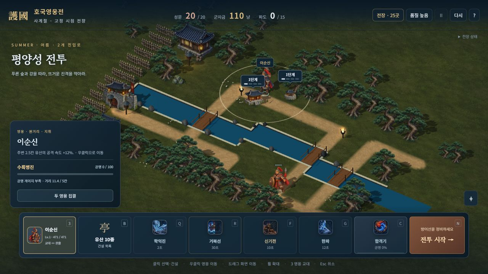
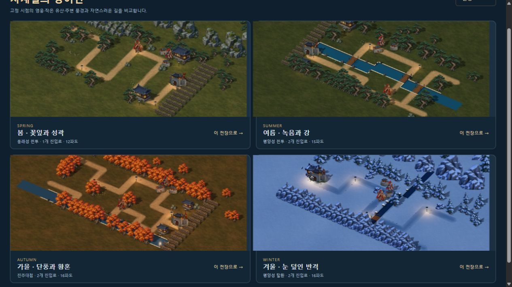

# 길과 지면 다듬기

2026-10-11. 고정 시점 그림 전장의 길 조각 경계와 지면 반복 무늬를 줄였다. 캐릭터 원화·건물 크기·지도·이동·건설·피해 계산은 유지한다.

## 적용

- 경로별 직사각형·원형 조각을 겹치던 방식을 전체 경로의 최소 거리장으로 바꿨다. 합류부에서도 한 번만 그리며, 0.2칸 메시의 가장자리 알파가 주변 지면으로 이어진다. 폭과 색 변화는 경로 순서가 아닌 월드 좌표를 따른다.
- 25전장과 별도 겨울 전장의 실제 경로를 사용한다. 지도 밖에서 들어오는 경로도 보존한다. 물과 원본 지도에서 물이었던 다리 칸에는 도로·눈 표면을 만들지 않는다.
- 모든 건설 셀의 중심과 사방 0.12칸 여백은 도로·눈 알파 0이다. 작은 유산의 배치와 선택 좌표를 유지한다.
- 풀·흙 `ground-v4`, 눈 `snow-ground-v3`, 다져진 길 `road-v3`을 새로 제작했다. 큰 박석과 강한 사선 눈 무늬를 줄이고, 월드 UV·미러 반복·완만한 색 변화를 적용했다. 겨울 길은 푸른 압설과 불규칙한 얇은 눈을 겹친다.
- 길·눈은 정적 풍경 병합 뒤 별도의 RGBA 메시로 추가한다. 깊이 검사는 유지하고 깊이 쓰기와 그림자 투영은 끄며, 전투 개체보다 먼저 그린다. 전장 전용 지오메트리·재질만 해제하고 공용 그림 텍스처는 보존한다.
- 사계절 비교 도구도 실제 전장의 그림 영웅·높이 1.2칸 유산·소품을 표시하도록 바꿨다. 단일 렌더러를 사용하되 계절별 그림 소유자를 분리해 색이 서로 덮어쓰이지 않는다.

원본 PNG와 생성 프롬프트를 보존했다. 배포 그림은 512×512 WebP 3장, 합계 174,418바이트다. 후처리는 리사이즈·압축·검사만 수행했다. 이미지 도구 밖에서 그림을 다시 칠하거나 이음새를 수정하지 않았다.

## 확인

`node tools/test-terrain.mjs --report`의 8개 검사는 26지도에서 경로·지도 불변, 실제 삼각형 보간 알파, 합류·모서리·지도 밖 진입, 물·다리·건설 자리 제외, 유효한 정점·법선·UV, 인접 지면 연속성, 실제 사계절 풍경 병합과 자원 해제를 확인한다. [지오메트리 결과](TERRAIN_GEOMETRY_VALIDATION.json) · [자산 결과](TERRAIN_ASSET_VALIDATION.json).

기존 8검사군 133개와 새 지형 검사 8개, 총 **141개**가 통과했다. 두 빌드와 단일 HTML의 방향 시트 52장·새 지면 3장 단일 포함 검사도 통과했다. 해당 지형 작업의 단일 HTML은 **44,823,927바이트**다. Astra xhigh의 설계·실제 구현 검토에서 필수 수정 사항이 없었다.

브라우저에서는 겨울 부산진 실제 2파도·일시정지, 여름 평양성의 강·다리, 봄 동래성·가을 진주·겨울 평양성 탈환 전환과 재시작, 사계절 비교와 414×896 표시를 확인했다. 경고·오류와 확인한 모바일 가로 넘침은 없었다. 정식 저장·구매·보상을 변경하지 않았다. [브라우저 기록](TERRAIN_BROWSER_VALIDATION.json) · [통합 결과](TERRAIN_REFINEMENT_VALIDATION.json).

## 정확한 범위

실제 경로의 중심선은 기존 직각 이동 경로다. 가장자리와 재질을 다듬은 것으로 자유 곡선 지도나 새로운 고저차 전투를 구현한 것은 아니다. 계절 수목은 후속 [계절 풍경 작업](SEASONAL_SCENERY.md)에서 6개의 새 그림으로 보완했다. 강의 직선 경계와 개별 기술 그림에는 추가 미술 여지가 있다. 모바일 검사는 브라우저의 반응형 표시이며 실제 휴대폰의 발열·메모리·프레임 검증은 남아 있다.
