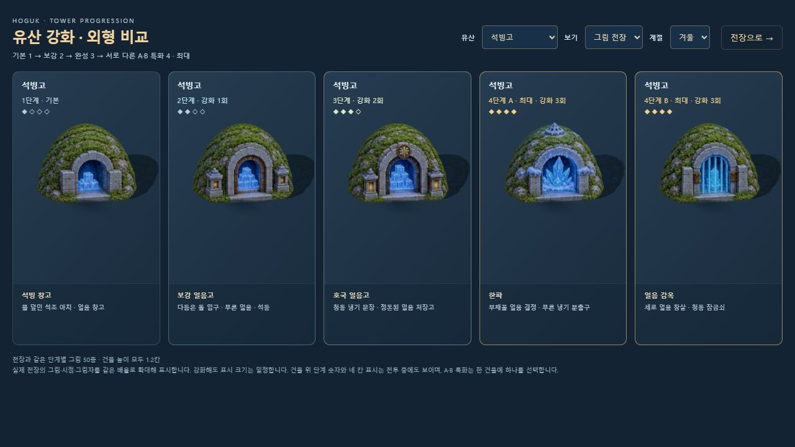

# 유산 단계별 전장 그림

2026-10-10. 남은 유산 8종에 기본·2·3단계와 최종 A·B 특화 그림 40개를 추가했다. 기존 숭례문·수원화성 10개를 합쳐 유산 10종의 50조합이 모두 전용 그림을 사용한다. 정식 캠페인, 자유 전장, 건설 미리보기가 같은 `FixedBattleArt.attachTower`를 사용한다.

표시 높이는 모든 단계에서 **1.2칸**이다. 금빛 장식·등불·장비·깃발이 강화 상태를 보여주며, 최종 특화에는 서로 다른 핵심 장비를 배치했다. 기존 피해량·사거리·비용·해금 조건을 사용한다.

## 새 그림과 최종 프롬프트

**내장 imagegen, stylized-concept 생성 모드**로 두 시트를 제작했다. 승인된 남색 기와·붉은 기둥·오래된 금속·풍화된 돌·따뜻한 등불의 화풍과 고정된 높은 시점을 기준으로 했다. PNG 원본의 투명도를 유지하고 WebP 품질 90으로 인코딩했다. 원본은 생성 결과를 그대로 보존했다.

| 시트 | 위에서부터 행 순서 | 배포 그림 | 최종 생성 프롬프트 |
|---|---|---|---|
| A | 보신각 · 첨성대 · 해인사 · 석굴암 | [landmark-tiers-a-v1.webp](../assets/3d/fixed/landmark-tiers-a-v1.webp) | [A 프롬프트](../assets/3d/fixed/landmark-tiers-a-v1.prompt.json) |
| B | 경복궁 · 남한산성 · 석빙고 · 불국사 | [landmark-tiers-b-v1.webp](../assets/3d/fixed/landmark-tiers-b-v1.webp) | [B 프롬프트](../assets/3d/fixed/landmark-tiers-b-v1.prompt.json) |

두 시트는 각각 1402×1122, 가로 다섯 칸이다. 열 순서는 1·2·3·최종 A·최종 B다. 원본은 `assets/3d/fixed/source/landmark-tiers-a-v1.png`, `landmark-tiers-b-v1.png`에 있다. 건물은 게임을 위한 양식화 그림이며 정밀 문화재 복원 도면이 아니다.

## 특화의 시각적 차이

| 유산 | 최종 A | 최종 B |
|---|---|---|
| 보신각 | 금빛 범종 · 공명판 · 붉은 군기 | 짙은 종 · 시각 북 · 남색 군기 |
| 첨성대 | 황동 혼천의 | 관측기 · 청옥 별지도 |
| 해인사 | 금빛 결계 문장 · 경판 | 청옥 향로 · 의례 장식 |
| 석굴암 | 태양 광배 | 세 불상 · 청옥 아치 |
| 경복궁 | 왕실 휘장 · 금빛 문장 | 열린 국고 · 궤짝 |
| 남한산성 | 청동 갑판 · 정예 군기 | 기도 깃발 · 연꽃 문장 |
| 석빙고 | 얼음 결정 · 냉기 분출구 | 얼음 창살 · 청동 잠금쇠 |
| 불국사 | 삼층 석탑 | 세 개의 연꽃 등 |

## 경계와 축소 표시

생성 시트의 행 간격이 일정하지 않아 등분하면 지붕이나 기단이 잘리는 문제가 있었다. 사용자 요청에 따라 GPT Astra xhigh로 경계를 검토했다. `src/3d/tower-art-data.js`에 알파 11 이상인 그림과 그림자를 침범하지 않는 경계를 명시했다. 메타데이터를 JS 상수로 번들하므로 단일 HTML의 data URI에서도 동일하게 적용된다.

새 그림 40개는 각 경계 안에서 투명도를 검사해 자른 뒤 **사방 12픽셀의 투명 여백**이 있는 캔버스로 분리한다. 각 텍스처의 mipmap에 이웃 건물 그림이 들어가지 않는다. 발 기준점과 투영 그림자는 같은 지오메트리를 사용한다. 새 시트 로딩 실패는 해당 유산만 기존 기본 그림과 보강 표식으로 대체한다.

## 확인 결과

- `node tools/test-fixed-art.mjs`: **11개 통과**. 실제 엔진의 건설·강화·A/B 선택 50조합, 일정한 높이, 선택 대상, 발사 원점, 교체·정리 시 자원 소유권 포함.
- `node tools/test-3d.mjs`: **41개 통과**.
- `node tools/test-campaign.mjs`: **16개 통과**.
- `node tools/test-effects.mjs`: **8개 통과**. 이번 관련 자동 검사 합계 **76개**.
- `node tools/validate-tower-stage-art.mjs`: 배포 WebP의 크기·투명 경계·40개 그림의 기단 기준점 확인. [픽셀 검사 결과](TOWER_STAGE_ASSET_VALIDATION.json).
- `node tools/build-3d.mjs`, `node tools/build.mjs`: 성공. 단일 HTML 19,038,633바이트에 새 WebP 두 장을 각각 포함한다. 새 그림 용량은 합계 1,404,562바이트다.
- 브라우저의 강화 비교 화면에서 10종을 차례로 선택해 50개 모두 전용 단계 그림이 연결된 것을 확인했다. 그림/모델 대체 전환과 계절 선택을 확인했다.
- 자유 전장에서 실제 예산으로 기존 방어시설을 철거하고 보신각을 건설했다. 1→2→3→최종 A 강화, 최종 표시·장식 변화·선택·작은 크기를 확인했다. [1단계](screenshots/tower-stage-battle-1.png), [3단계](screenshots/tower-stage-battle-3.png), [최종 A](screenshots/tower-stage-battle-max-a.png).
- 정식 단일 HTML의 동래성에서 일시정지 중 보신각 건설·2단계 강화를 실행했다. 그림 준비 상태는 `fixedArtStatus=ready`, `landmarkArtStatus=ready`, 콘솔 경고·오류는 없었다. 실제 414×896 화면에서도 확인했다. [정식 작은 화면](screenshots/tower-stages-release-mobile.png).
- 비교 화면은 `dev/tower-responsive-review.html`의 414픽셀 iframe에서도 확인했다. 스크롤바를 제외한 콘텐츠 폭 399픽셀과 scrollWidth가 같아 가로 넘침이 없었다. [작은 화면 기록](screenshots/tower-stages-mobile.png).

전체 검증 요약은 [TOWER_STAGE_ART_VALIDATION.json](TOWER_STAGE_ART_VALIDATION.json)에 있다. 기존 진행 중인 사용자 전장은 유지했고 검증 전투에서는 승패 보상을 발생시키지 않았다. 음악은 `mute=1`로 유지했다.

## 비교 화면

서버 실행 후 [50개 강화 외형 비교](http://localhost:8080/dev/3d-tower-review.html)에서 유산·표현 방식·계절을 선택한다. 그림 전장은 실제 게임 그림을 동일 배율로 확대해 표시한다. 모델 대체 보기는 자산 실패 시 사용하는 기존 입체 모델을 확인하는 용도다.

이 유산 작업 당시에는 이순신 기본 의복만 16포즈를 사용했다. 후속 작업에서 기본 영웅 8명의 128포즈를 연결했다. 최신 적용 범위와 검증은 [HERO_DIRECTIONAL_ART.md](HERO_DIRECTIONAL_ART.md), [프로젝트 리뷰](PROJECT_REVIEW.md)에 있다. 위 검사 수와 빌드 크기는 유산 작업 완료 시점의 기록이다.
