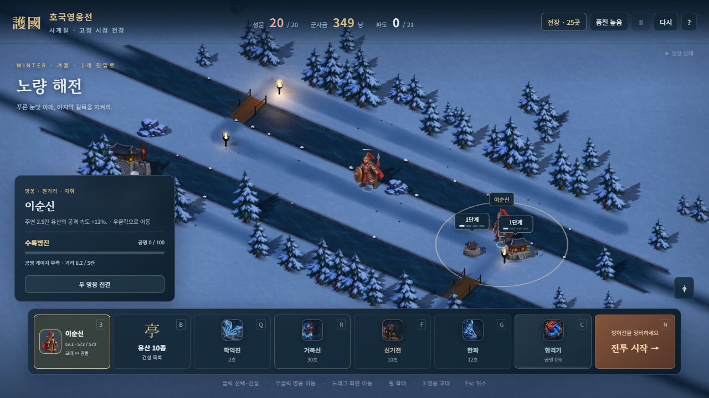
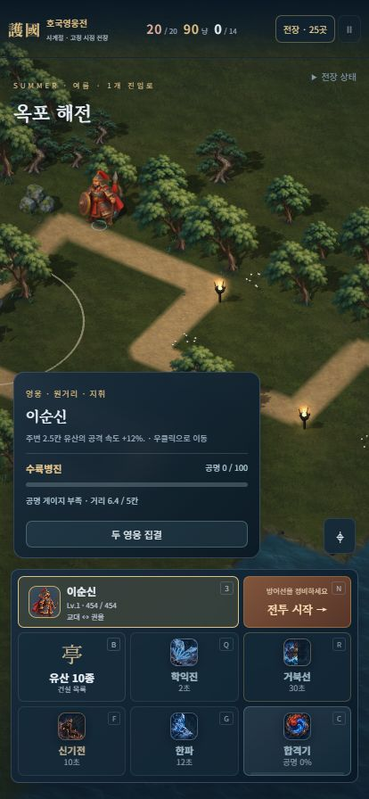

# 연속 물가와 그림 수면

2026-10-11. 기존 지도와 전투 판정을 유지하면서 강·바다의 반복 타일과 높은 사각 테두리를 줄였다. 낮고 옅게 사라지는 물가, 차분한 청록색 잔물결, 화면 밖으로 이어지는 외곽 수면을 실제 고정 시점 전장에 연결했다.

## 적용 범위

- 내장 imagegen으로 전용 잔물결 원본을 제작했다. 원본 PNG와 전체 프롬프트를 `assets/3d/painted/`에 보존하고, 배포 그림은 512×512 WebP 18,812바이트다. 크기 변경과 압축만 수행했다.
- 실제 보드의 물·다리 아래 수면은 .25칸 메시를 사용한다. 월드 UV와 색을 공유해 개별 타일의 반복과 경계를 줄이고, 물가에서 먼 곳은 조금 더 짙게 표시한다.
- 물가의 경계 선분으로 .125칸 메시를 만들고, 좁고 불규칙한 띠가 지면과 물 위에서 투명하게 끝나도록 했다. 기존 높은 돌 벽·밝은 사각 띠를 제거하고 가장자리 작은 돌만 유지했다.
- 보드 밖 수면은 실제 가장자리의 물 칸을 풍경 바닥 범위까지 연장한다. 보드 수면과 겹치지 않으며 동일한 부모 진동을 따른다. 가까운 경계의 색·UV도 일치한다.
- 먼 곳의 색·알파 상수 영역만 4×4칸 면으로 합친다. 먼 페이드 띠는 원래 .25칸 폭을 유지하고, 긴 변의 모든 기존 RGBA가 각각 일정할 때만 합쳐 원래 보간을 보존한다. 전장별 외곽 삼각형은 40,000개 미만으로 검사한다.
- 정적 풍경 병합 뒤 물가를 별도로 넣는다. 투명 외곽 수면 → 물가 → 도로 → 눈 순서이며, 물가의 투명 끝은 가장 높이 움직인 수면보다 위에 있어 움직이는 절단선이 생기지 않는다.
- 물 그림을 읽지 못하면 512×512 대체 수면을 유지한다. 전장 전용 메시·재질을 해제하고 공유 원본 텍스처는 보존한다.

지도 25곳과 별도 겨울 전장의 격자·경로·건설 자리·다리·경제·피해는 바꾸지 않았다. 확정한 영웅 그림과 모든 단계 높이 1.2칸의 작은 유산도 유지한다.

## 검증

새 물가 검사 **11개**, 기존 회귀 **147개**, 합계 **158개**를 통과했다. 26지도의 물 coverage·보드 밖 외곽 면적·중복 면 방지·건설 중심 여백·실제 삼각형 알파·정점/법선/UV·사계절 병합·자원 해제·로딩 실패를 확인했다. 큰 면과 페이드 스트립은 기존 .25칸 정점 및 .125칸 변 중간점의 RGBA 보간 오차가 0.000002보다 작은지도 확인한다.

GPT Astra xhigh 검토에서 발견한 물가가 길을 덮는 렌더 순서와 움직이는 수면 교차 문제를 수정했다. 외곽 수면의 계단형 종료도 브라우저 확인 후 확장·최적화했다. 최종 재검토에서 추가 필수 결함은 없었고 Astra도 11개 검사를 직접 통과했다.

브라우저에서는 봄 옥포·여름 평양성·가을 사천·겨울 평양성과 노량, 실제 여름 첫 파도/일시정지, 사계절 비교, 414×896 표시, 단일 HTML 제목 기동을 확인했다. 최종 10개 확인 항목과 7개 전장 캡처를 기록했고 확인한 탭의 콘솔 경고·오류와 모바일 가로 넘침은 없었다. 정식 사용자 프로필이나 구매·승패 보상은 변경하지 않았다.

서버용 번들과 단일 HTML을 재생성했다. 단일 HTML은 **45,624,044바이트**이고 방향 시트 52장·새 지면 3장·계절 수목 1장·물 그림 1장을 각각 한 번 포함한다. 거부된 이전 그림 여섯 장은 포함하지 않는다.

[통합 결과](WATER_REFINEMENT_VALIDATION.json) · [기하 검사](WATER_GEOMETRY_VALIDATION.json) · [그림 검사](WATER_ASSET_VALIDATION.json) · [브라우저 기록](WATER_BROWSER_VALIDATION.json)

## 남은 범위

물·육지의 기본 모양은 원래 격자를 따른다. 새로운 자유 곡선 지도나 유체 시뮬레이션을 만든 것은 아니다. 긴 보행·공격 연결, 개별 기술 연출, 실제 기기의 메모리·발열·프레임·터치, 외부 네트워크 협동과 사람의 후반 난이도 검증은 별도 범위다. 이번 단일 HTML 확인은 제목 기동과 그림 내장 검증이며 새 정식 캠페인 완주를 뜻하지 않는다.

