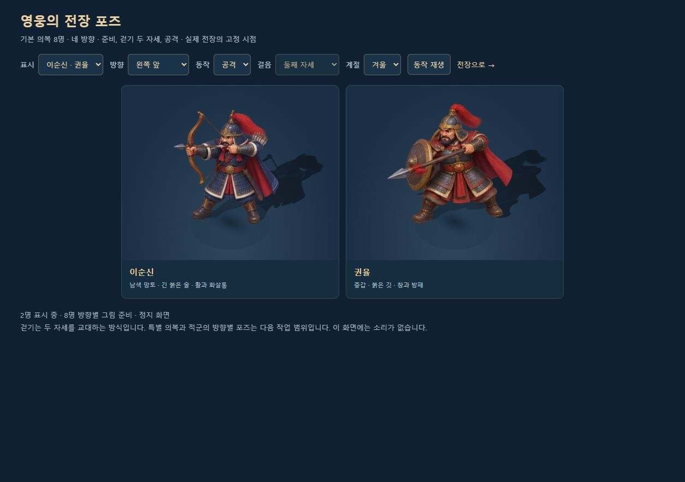
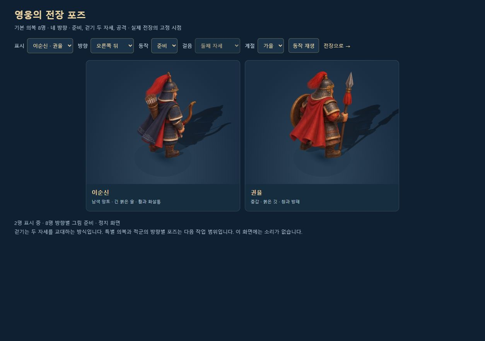

# 이순신 전장 그림의 톤과 구분점

2026-10-10. 이순신만 다른 영웅보다 길고 사실적인 비율, 강한 금속 명암, 작은 금색 장식이 두드러진다는 피드백을 반영했다. **기본 전장용 이순신 16포즈를 v2로 교체**했다. 다른 일곱 영웅의 그림과 포즈 데이터는 유지했다.

## 미술 변경

얼굴과 손의 비율을 키우고 갑주의 잔무늬와 날카로운 금속 대비를 줄였다. 둥근 얼굴 면, 부드러운 옷 주름, 넓은 남색 면과 절제한 황동 테두리를 사용해 다른 영웅의 입체 애니메이션풍 명암에 맞췄다.

| 구분 | 이순신 v2 | 권율 |
|---|---|---|
| 중심 색 | 남색 갑주와 남색 망토, 푸른 하이라이트 | 붉은 망토와 갈색·황동 중갑 |
| 붉은색 배치 | 길게 흐르는 투구 술, 허리띠, 망토 안감 | 넓은 망토, 깃과 갑주 안쪽 |
| 장비와 실루엣 | 활·등 화살통, 비교적 좁은 어깨의 궁수 | 창·둥근 방패, 넓고 묵직한 전열 장수 |
| 뒷모습 | 남색 망토의 물결 문양과 화살통 | 넓은 붉은 망토와 방패 |

## 원본·배포 파일·프롬프트

**내장 imagegen의 `style-transfer + precise-object-edit` 모드**로 제작했다. 기존 이순신은 얼굴·복식·포즈의 수정 대상, 권율과 강감찬은 명암·재질·비율의 참조로 사용했다. 최종 프롬프트는 아래 JSON의 `promptHistory`에 그대로 보존했다. 생성 원본은 Codex 이미지 폴더에 남기고 같은 PNG를 저장소에도 복사했다. Sharp는 WebP 인코딩과 픽셀 검사에 사용했다.

- 배포 그림: [yi-directions-v2.webp](../assets/3d/fixed/yi-directions-v2.webp), **499,880바이트**.
- 원본: [yi-directions-v2.png](../assets/3d/fixed/source/yi-directions-v2.png), **1233×1276**, 실제 투명 배경.
- 최종 프롬프트·참조 역할: [yi-directions-v2.prompt.json](../assets/3d/fixed/yi-directions-v2.prompt.json).
- 런타임 경계·발 기준점: [hero-pose-data.js](../src/3d/hero-pose-data.js).

이순신 v1은 제작 이력으로 보존한다. 현재 기본 전장은 v2만 사용한다. 옛 v1 전용 발 X좌표 보정을 제거하고 v2의 실제 알파 경계로 발 기준점을 다시 계산했다. 포즈마다 같은 픽셀 배율을 적용하고 본체·그림자·건물 뒤 실루엣을 함께 바꾼다.

## 검증과 적용 범위

- `node tools/test-fixed-art.mjs`: **15개 통과**. 실제 영웅 루트의 포즈·크기·그림자·가림 그림 전환과 자원 정리를 포함한다.
- `node tools/hero-pose-assets.mjs`: **8개 시트·128포즈** 통과. 이웃 그림 혼입·누락·중복 0, PNG와 WebP의 알파 차이 0. 여덟 배포 시트 합계 **3,065,178바이트**.
- 나머지 일곱 영웅의 원본·WebP·프롬프트와 포즈 데이터를 이전 커밋과 비교해 동일함을 확인했다.
- 실제 비교 UI에서 이순신·권율의 **16가지 방향/동작 조합**과 사계절을 선택했다. 8명 전체·두 명 비교·이순신 단독 표시도 확인했다. [전체 영웅](screenshots/yi-tone-v2-all-heroes.jpg).
- 자유 전장 부산진에서 이순신·권율을 편성해 이순신 이동 포즈와 3파도 교전을 확인했다. 성문 20/20 상태에서 일시정지했다. [전투 화면](screenshots/yi-tone-v2-battle-yi-gwon.jpg).
- 새 단일 HTML의 정식 동래성에서 이순신·세종대왕을 로딩했다. `fixedArtStatus=ready`, `heroPoseStatus=ready`, `heroPoseCount=8`을 확인하고 첫 파도 전에 일시정지했다. [정식 배포본](screenshots/yi-tone-v2-release-battle.jpg).
- 414×896 비교 화면에서 가로 넘침과 무기 잘림이 없었다. 검사 탭 세 개의 콘솔 경고·오류는 0이었다. 모든 게임 검증은 `?mute=1`로 진행했다. [작은 화면](screenshots/yi-tone-v2-mobile-pair.jpg).
- 서버용 번들과 단일 HTML 빌드 성공. 단일 HTML **22,432,581바이트**에 현재 영웅 포즈 시트 8장을 각각 한 번 포함했다.
- 요청한 **GPT Astra xhigh**가 전체 8명·두 영웅의 준비/공격/후면 화면을 비교했다. 톤 일치와 권율 구분이 해결됐으며 필수 수정은 없다고 판정했다. 투구와 붉은 술에는 공통점이 남지만 장비·실루엣 차이로 충분히 구분된다는 의견이었다.

상세 결과는 [YI_TONE_REFINEMENT_VALIDATION.json](YI_TONE_REFINEMENT_VALIDATION.json), UI 관측은 [YI_TONE_BROWSER_VALIDATION.json](YI_TONE_BROWSER_VALIDATION.json), 픽셀 검사는 [HERO_POSE_ASSET_VALIDATION.json](HERO_POSE_ASSET_VALIDATION.json)에 있다. 앞선 영웅 확장의 94개 검사 기록은 [기존 보고서](HERO_DIRECTIONAL_ART_VALIDATION.json)에 구분해 보존한다.

이번 교체 범위는 **고정 시점 기본 의복의 전장용 16포즈**다. 메뉴 초상화·평면 모드·특별 의복은 기존 시트를 사용한다. 걷기는 두 자세 교대 방식이며 긴 보행·공격 연결은 후속 범위다. 실제 휴대폰과 `file://` 직접 실행은 이번 검증에 포함하지 않았다.

서버 실행 후 [영웅 전장 포즈 비교](http://localhost:8080/dev/3d-hero-pose-review.html)의 **표시 → 이순신·권율**에서 같은 크기로 비교할 수 있다.
